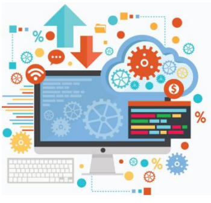

## ***Lezione 1: Necessità di rappresentare l’informazione***

---

### **1. Che cos’è l’informatica**

L’informatica è la **scienza della manipolazione automatica dell’informazione**.  
Non studia semplicemente i computer, ma **il modo in cui l’informazione viene trasformata da una macchina senza intervento umano continuo**.

Il termine stesso lo rivela:

- **INFOR**mazione
    
- **autoMATICA**
    

Automatica significa che la trasformazione dell’informazione:

- parte da **dati grezzi** (input),
    
- produce **risultati utili** (output),
    
- avviene **secondo regole precise**,
    
- senza che l’uomo debba controllare ogni singolo passaggio.
    

Un esempio fuori dall’informatica è la **catena di montaggio automatica**: l’uomo progetta il processo, ma l’esecuzione è affidata interamente alla macchina.

Nell’informatica accade la stessa cosa, ma l’oggetto della trasformazione non è la materia, bensì **l’informazione**.

---

### **2. Che cos’è una macchina**

Una macchina è un sistema capace di:

- modificare **il proprio stato interno**,
    
- agire su **grandezze fisiche misurabili**,
    
- farlo in modo **automatico e controllabile**.
    

Le grandezze fisiche su cui può agire sono, ad esempio:

- posizione e movimento (meccanica),
    
- temperatura (termodinamica),
    
- luce (ottica),
    
- suono (acustica),
    
- **elettricità** (elettronica).
    

Una **macchina informatica** è una macchina che:

- non manipola materiali,
    
- non riscalda ambienti,
    
- non muove oggetti,
    
- ma **elabora informazione**.
    

Ed è qui che nasce il problema centrale:

> **Come può una macchina fisica manipolare qualcosa che è astratto come l’informazione?**

---

### **3. Perché l’informazione deve essere rappresentata**

L’informazione, di per sé, è **astratta**.  
Non ha peso, non ha colore, non occupa spazio fisico.

Esempi di informazioni astratte:

- la temperatura di una stanza,
    
- la velocità di un’auto,
    
- il saldo di un conto,
    
- una parola,
    
- un’immagine,
    
- una password.
    

Una macchina, però, **non può agire su entità astratte**.  
Può agire solo su **grandezze fisiche reali**.

Per rendere possibile l’elaborazione automatica dell’informazione servono **tre passaggi fondamentali**:

1. **Identificare l’informazione da trattare.**
    
2. **Scegliere una grandezza fisica che possa rappresentarla.**
    
3. **Stabilire una corrispondenza univoca tra informazione e grandezza fisica.**
    

Da qui nasce il concetto chiave della rappresentazione.

---

### **4. Il rappresentato e il rappresentante**

#### **Il rappresentato**

È **l’informazione in sé**, cioè ciò che vogliamo trattare.

È:

- concettuale,
    
- astratto,
    
- indipendente dal mezzo fisico.
    

Esempi di rappresentato:

- una temperatura,
    
- un numero,
    
- un testo,
    
- un’immagine,
    
- un suono,
    
- un valore logico vero o falso.
    

#### **Il rappresentante**

È la **grandezza fisica concreta** usata per rappresentare quell’informazione.

Deve possedere due proprietà fondamentali:

- **deve poter essere modificata automaticamente**,
    
- **deve essere controllabile e prevedibile**.
    

Esempi di rappresentanti:

- meccanico: una lancetta che si muove,
    
- termico: il livello del mercurio in un termometro,
    
- chimico: un colore che varia con l’umidità,
    
- **elettrico: una tensione, una corrente, uno stato acceso/spento**.
    

Il legame tra rappresentato e rappresentante è una **convenzione precisa**: a un certo stato fisico corrisponde una certa informazione.

---

### **5. Perché l’informatica sceglie l’elettricità**

Per realizzare macchine informatiche efficaci, servono quattro requisiti fondamentali:

- **dimensioni ridotte**,
    
- **alta velocità di elaborazione**,
    
- **basso costo di produzione**,
    
- **basso consumo energetico**.
    

I rappresentanti elettrici sono quelli che soddisfano **meglio di tutti** questi requisiti.

I motivi sono strutturali:

- gli elettroni si muovono in spazi microscopici → **miniaturizzazione**,
    
- non esistono parti meccaniche in movimento → **velocità elevatissime**,
    
- i materiali sono economici (silicio, rame) → **basso costo**,
    
- servono tensioni e correnti minime → **consumi ridotti**.
    

Per questo l’informatica moderna è, nella pratica, **informatica elettronica**.

---

### **6. Il ruolo dei circuiti integrati**

L’evoluzione decisiva è stata la nascita del **circuito integrato**: milioni di componenti elettronici concentrati in un unico chip di silicio.

Questo ha permesso:

- una miniaturizzazione estrema,
    
- una velocità operativa elevatissima,
    
- un costo unitario bassissimo,
    
- consumi energetici ridottissimi.
    

In pochi millimetri quadrati oggi possono essere presenti:

- milioni di transistori,
    
- migliaia di circuiti logici,
    
- interi sottosistemi di elaborazione.
    

Senza i circuiti integrati **non esisterebbero i computer moderni**.

---

### **7. Legame strutturale tra informatica ed elettronica**

A questo punto il legame è chiaro:

- l’informatica ha bisogno di **un supporto fisico**,
    
- l’elettronica fornisce il **miglior supporto possibile**,
    
- l’integrazione consente di rappresentare **un’enorme quantità di informazioni simultaneamente**
    

Questo rende l’elaborazione automatica:

- **veloce**,
    
- **precisa**,
    
- **economica**,
    
- **industrialmente sostenibile**
    

---

### **8. Significato profondo della rappresentazione**

Ogni computer funziona perché:

> **l’informazione viene trasformata in stati elettrici, e gli stati elettrici vengono trasformati in informazione.**

Tutta l’architettura degli elaboratori nasce da questa catena:

**informazione → rappresentazione fisica → elaborazione → nuova rappresentazione → nuova informazione**

---

### **9. Conclusione concettuale**

L’informatica esiste perché:

- l’informazione può essere **rappresentata fisicamente**,
    
- la rappresentazione può essere **manipolata automaticamente**,
    
- l’elettronica rende questa manipolazione **rapida, stabile ed economica**.
    

Questa lezione è il **fondamento di tutto il resto**:

- prima della codifica,
    
- prima del binario,
    
- prima delle porte logiche,
    
- prima della CPU,
    
- prima del software.
    

---

### **10. Collegamento con le prossime lezioni**

Ora che è chiaro **perché l’informazione deve essere rappresentata**, nelle prossime lezioni vedremo:

- **come funziona la rappresentazione analogica**,
    
- **perché non è sufficiente per i calcolatori moderni**,
    
- **perché la rappresentazione digitale è l’unica veramente affidabile**.
    
