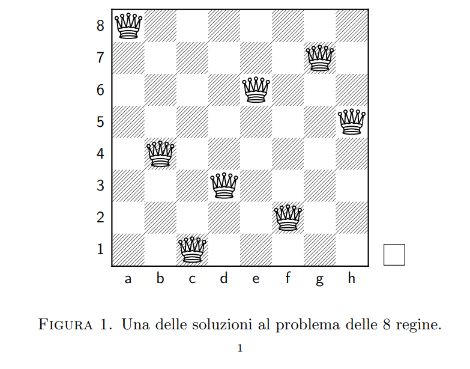
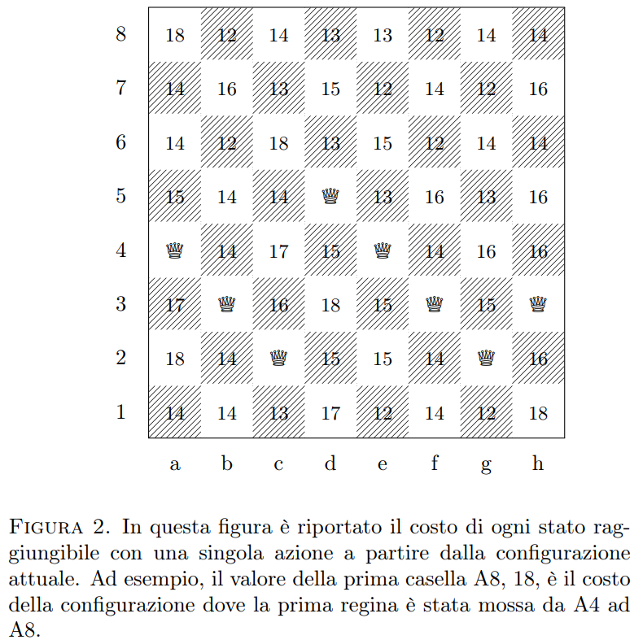

# Eight Queens Problem

Questa cartella svolge progressivamente la traccia dell’appello di Laboratorio di
Programmazione del 26 gennaio 2024. Il testo originale e la soluzione del docente
sono disponibili in [`traccia-e-soluzione.pdf`](./src/0-imgs-and-pdf/traccia-e-soluzione.pdf).

Il problema richiede di collocare otto regine su una scacchiera 8×8 senza coppie
sulla stessa riga, colonna o diagonale. Lo stato usa un array `stato[N]` con una
regina per colonna:

```text
stato[colonna] = riga
```

Nel PDF le righe sono numerate `1..N`. Nei sorgenti della cartella sono memorizzate
come `0..N-1`; pertanto la riga scacchistica `r` diventa `r - 1`. L’indice non
indica la posizione visiva dall’alto: la riga interna `N-1` è la riga superiore.



## Percorso didattico

1. [`stampaConfig`](./src/1-stampaConfig/) visualizza uno stato senza verificarlo.
2. [`verificaConfig`](./src/2-verificaConfig/) conta le coppie in conflitto.
3. [`euristica`](./src/3-euristica/) interpreta quel conteggio come costo.
4. [`caricaConfig`](./src/4-caricaConfig/) carica uno stato da un file di testo.
5. [`cerca`](./src/5-cerca/) valuta una mossa su una copia dello stato.
6. [`main`](./src/6-main/) integra le operazioni in un menu interattivo.



La cartella non implementa un risolutore automatico né enumera le 92 soluzioni:
il main permette di cercare manualmente una soluzione, come richiesto dalla traccia.
L’algoritmo di backtracking è un possibile approfondimento, non parte del codice qui presente.

## Compilazione

Ogni fase è un esempio autonomo o un componente. Il programma completo è già
riunito in `src/6-main/mainV1.c`:

```bash
gcc -std=c17 -Wall -Wextra -Wpedantic src/6-main/mainV1.c -o nregine
```

Si può scegliere una dimensione diversa, fino a 26, al momento della compilazione:

```bash
gcc -std=c17 -Wall -Wextra -Wpedantic -DN=4 src/6-main/mainV1.c -o nregine
```
