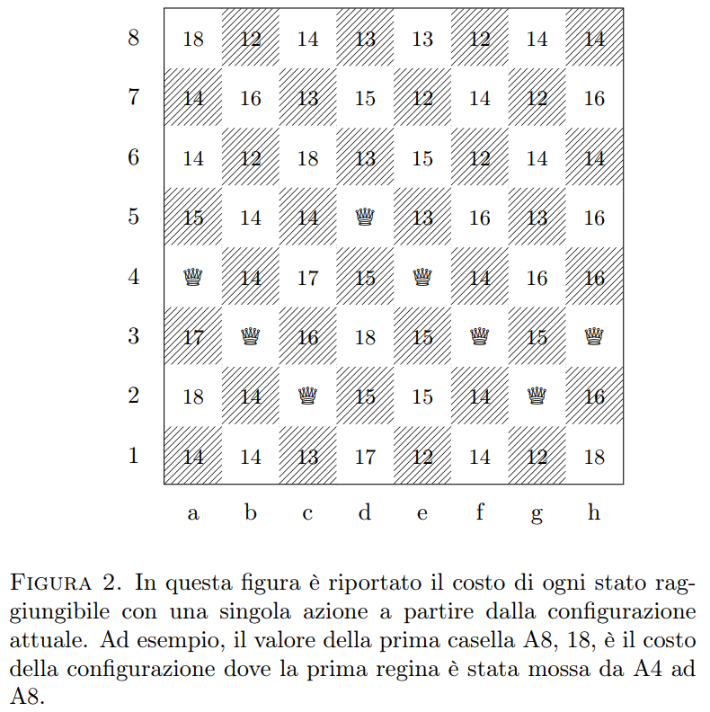

# ♟️ Esercizio 1.3 — Funzione Euristica

## 🎯 Obiettivo
Scrivere una funzione `euristica()` che, ricevuto come input un vettore di 8 interi rappresentante lo **stato corrente** della scacchiera, restituisca un valore numerico che esprime **quanto tale configurazione è vicina o lontana da una soluzione valida** del problema delle otto regine.

---

## 🧩 Idea generale
La funzione `euristica()` è una **funzione di costo**:  
> misura quante **coppie di regine** si trovano in **conflitto** tra loro.

In altre parole:
- se il valore restituito è **0**, la configurazione è **una soluzione valida**;
- più il valore è **alto**, più la configurazione è **lontana dalla soluzione**.



---

## 🧠 Collegamento con gli esercizi precedenti

| Esercizio | Scopo | Funzione principale |
|------------|--------|---------------------|
| **1.1** | Visualizzare lo stato su scacchiera | `stampaConfig()` |
| **1.2** | Verificare la presenza di conflitti | `verifica()` |
| **1.3** | Misurare quanto lo stato è “costoso” | `euristica()` |

Mentre `verifica()` restituisce semplicemente 0 o un numero > 0,  
`euristica()` **quantifica il numero di conflitti totali**, fornendo una metrica utile per strategie di ricerca e ottimizzazione.

---

## ⚙️ Logica di funzionamento

Ogni regina può entrare in conflitto con un’altra se:
1. Sono sulla **stessa riga**
2. Sono sulla **stessa diagonale principale** (↘️)
3. Sono sulla **stessa diagonale secondaria** (↙️)

Poiché c’è sempre **una sola regina per colonna**, non servono controlli sulle colonne.

---

## 🔢 Formula di valutazione
L’euristica viene calcolata contando tutte le **coppie di regine** `(i, j)` con `i < j` che soddisfano almeno una delle condizioni di conflitto:

```c
if (stato[i] == stato[j] || abs(stato[i] - stato[j]) == abs(i - j))
    costo++;
````

Quindi il valore finale `costo` rappresenta **il numero di coppie in conflitto**.

---

## 🧱 Implementazione consigliata — `euristica.c`

```c
#include <stdio.h>
#include <stdlib.h>
#include <math.h>

#define N 8

/**
 * Funzione euristica
 * ------------------
 * Calcola il numero di coppie di regine in conflitto.
 * Restituisce:
 *   0  → se lo stato è soluzione valida
 *   >0 → numero totale di conflitti
 */
int euristica(const int stato[N]) {
    int costo = 0;

    for (int i = 0; i < N; i++) { // Implicitamente stiamo calcolando la combinazione semplice di due elementi
        for (int j = i + 1; j < N; j++) { // ma per tutte ed 8 in un colpo solo ed intuitivo

            if (stato[i] == stato[j]) // Stessa riga
                costo++;

            if (abs(stato[i] - stato[j]) == abs(i - j)) // Diagonale ↘️ o ↙️
                costo++;
        }
    }

    return costo;
}

// Si testerebbe così:
int main(void) {
    int stato_ok[N] = {7, 4, 0, 3, 6, 1, 5, 2};
    int stato_ko[N] = {0, 1, 2, 3, 4, 5, 6, 7};
    int stato_misto[N] = {8, 4, 1, 3, 6, 2, 7, 5}; // quasi valido (1-based)

    printf("\n=== Euristica delle configurazioni ===\n");

    stampaConfig(stato_ok);
    printf("Costo euristico: %d\n\n", euristica(stato_ok));

    stampaConfig(stato_ko);
    printf("Costo euristico: %d\n\n", euristica(stato_ko));

    stampaConfig(stato_misto);
    printf("Costo euristico: %d\n\n", euristica(stato_misto));

    return 0;
}
```

---

## 🧮 Esempio di interpretazione dei valori

| Stato                     | Configurazione      | Costo Euristico | Interpretazione                 |
| ------------------------- | ------------------- | --------------- | ------------------------------- |
| ✅ Soluzione               | `{7,4,0,3,6,1,5,2}` | `0`             | Nessun conflitto                |
| ⚠️ Parzialmente valida    | `{8,4,1,3,6,2,7,5}` | `2`             | 2 coppie di regine in conflitto |
| ❌ Tutte sulla stessa riga | `{0,0,0,0,0,0,0,0}` | `28`            | 8 regine sulla stessa riga      |
| ❌ Sequenza diagonale      | `{0,1,2,3,4,5,6,7}` | `28`            | Tutte in diagonale principale   |

---

## 🧠 Considerazioni euristiche

Questa metrica è alla base di:

* **algoritmi di ricerca locale** (Hill Climbing, Simulated Annealing);
* **ottimizzazioni per backtracking** (ridurre rami “costosi”);
* **strategie IA** (Heuristic Search, Constraint Satisfaction Problems).

L’euristica quindi **non si limita a dire se la soluzione è corretta**,
ma consente di **valutare la distanza dalla perfezione** in termini quantitativi.

---

## 📘 Differenza tra `verifica()` e `euristica()`

| Funzione      | Output                           | Scopo                           |
| ------------- | -------------------------------- | ------------------------------- |
| `verifica()`  | `0` se valida, `>0` se conflitto | Test booleano di correttezza    |
| `euristica()` | Numero di coppie in conflitto    | Misura quantitativa di “errore” |

In realtà, come indicato nella **soluzione ufficiale d’esame**, `verifica()` può essere implementata come una semplice chiamata a `euristica()`:

```c
int verifica(const int stato[N]) {
    return euristica(stato);
}
```

---

> 💡 *“L’euristica è la bussola che guida la ricerca: non ti dice dove sei, ma quanto ti manca per arrivare.”*