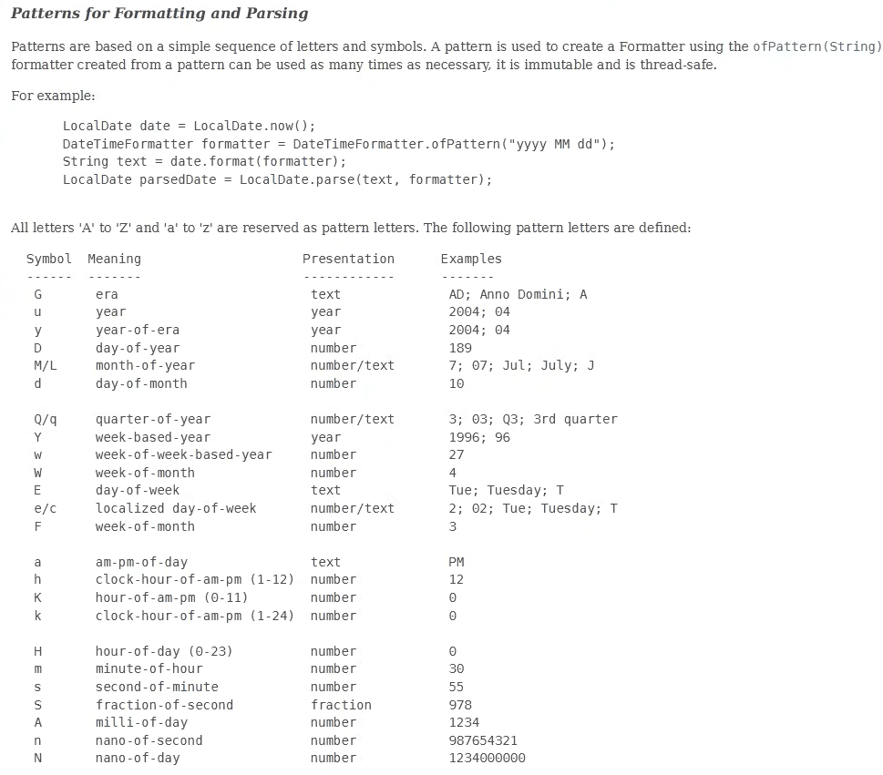

# 🧠 **Cos’è un pattern di formattazione?**

Quando vuoi mostrare una data/ora in un formato preciso, usi una stringa–modello chiamata **pattern**.



Esempi:

* `"dd/MM/yyyy"` → `17/11/2025`
* `"yyyy-MM-dd HH:mm"` → `2025-11-17 16:40`
* `"EEEE, dd MMMM yyyy"` → `Monday, 17 November 2025`

I pattern sono fatti da **lettere speciali**, ognuna con un significato.

---

# 🏆 **Regola chiave:**

> **Quante più lettere metti, più dettagli ottieni**

✔ `M` → mese come numero
✔ `MMM` → nome breve del mese
✔ `MMMM` → nome completo del mese

---

# 🔥 ADESSO TI SPIEGO TUTTI I SIMBOLI IMPORTANTI (solo quelli che ti servono davvero)**

Li divido in categorie: anni, mesi, giorni, ore, minuti…

---

# 📅 **1. YEAR – Anno**

| Pattern | Significato    | Esempio |
| ------- | -------------- | ------- |
| `y`     | anno           | `2025`  |
| `yy`    | anno a 2 cifre | `25`    |
| `yyyy`  | anno a 4 cifre | `2025`  |

👉 **Usa sempre `yyyy`** nei programmi seri.

---

# 📆 **2. MONTH – Mese**

| Pattern | Significato              | Esempio |
| ------- | ------------------------ | ------- |
| `M`     | numero mese (senza zero) | `7`     |
| `MM`    | numero mese con zero     | `07`    |
| `MMM`   | mese abbreviato          | `Jul`   |
| `MMMM`  | mese completo            | `July`  |

---

# 📅 **3. DAY – Giorno**

| Pattern | Significato                     | Esempio  |
| ------- | ------------------------------- | -------- |
| `d`     | giorno del mese                 | `5`      |
| `dd`    | giorno con zero                 | `05`     |
| `E`     | giorno della settimana breve    | `Mon`    |
| `EEEE`  | giorno della settimana completo | `Monday` |

---

# ⏰ **4. HOURS – Ore**

Ci sono *due* sistemi:

### 🔹 **Sistema 24 ore** (preferito)

| Pattern | Significato  | Esempio        |
| ------- | ------------ | -------------- |
| `H`     | ora 0–23     | `0`, `9`, `23` |
| `HH`    | ora con zero | `09`, `23`     |

### 🔹 **Sistema 12 ore** (tipo USA)

| Pattern | Significato  | Esempio          |
| ------- | ------------ | ---------------- |
| `h`     | ora 1–12     | `1`, `9`, `12`   |
| `hh`    | ora con zero | `01`, `09`, `12` |
| `a`     | AM/PM        | `AM`, `PM`       |

---

# ⏱️ **5. MINUTES – Minuti**

| Pattern | Significato     | Esempio |
| ------- | --------------- | ------- |
| `m`     | minuto          | `5`     |
| `mm`    | minuto con zero | `05`    |

---

# ⏱️ **6. SECONDS – Secondi**

| Pattern | Significato      | Esempio |
| ------- | ---------------- | ------- |
| `s`     | secondo          | `7`     |
| `ss`    | secondo con zero | `07`    |

---

# ⚡ 7. FRAZIONI DI SECONDO (millisecondi, microsecondi, nanosecondi)

| Pattern     | Significato        | Esempio     |
| ----------- | ------------------ | ----------- |
| `S`         | decimi o centesimi | `1`, `12`   |
| `SSS`       | millisecondi       | `978`       |
| `SSSSSS`    | microsecondi       | `123456`    |
| `SSSSSSSSS` | nanosecondi        | `987654321` |

---

# 🌍 **8. ERA (quasi mai usata)**

| Pattern | Significato | Esempio             |
| ------- | ----------- | ------------------- |
| `G`     | era         | `AD`, `Anno Domini` |

---

# 🔥 Ora arrivano gli esempi REALI e PERFETTI per sviluppatori

## 📌 Esempio 1 — Formato italiano classico

```java
DateTimeFormatter fmt = DateTimeFormatter.ofPattern("dd/MM/yyyy");
```

Output:

```
17/11/2025
```

## 📌 Esempio 2 — Con ora

```java
DateTimeFormatter fmt = DateTimeFormatter.ofPattern("dd/MM/yyyy HH:mm");
```

Output:

```
17/11/2025 16:45
```

## 📌 Esempio 3 — Stile americano

```java
"MM-dd-yyyy"
```

## 📌 Esempio 4 — Stile log server

```java
"yyyy-MM-dd HH:mm:ss"
```

## 📌 Esempio 5 — Completo con testo

```java
"EEEE dd MMMM yyyy, HH:mm:ss"
```

Output:

```
Monday 17 November 2025, 16:50:12
```

---

# 💣 Riassunto super-compatto (da incollare nei tuoi appunti)

```
yyyy → anno
MM → mese (numero)
MMM → mese (testo)
dd → giorno
EEEE → giorno settimana (testo)
HH → ora (24h)
hh → ora (12h)
mm → minuti
ss → secondi
SSS → millisecondi
a → AM/PM
```

---


