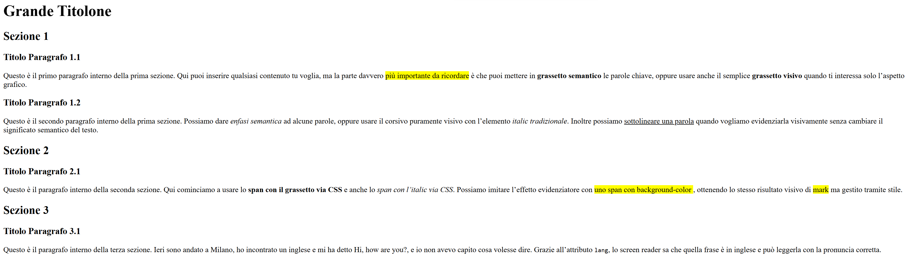

## **Lezione 2: Esercizio 2 – Formattazione del testo sull’Esercizio 1**

---

### **1. Cosa cambia dall’Esercizio 1 all’Esercizio 2**

Nel primo esercizio hai costruito:

- una pagina HTML **ben strutturata**:
  - `<h1>` come grande titolo principale,
  - tre sezioni con `<h2>`,
  - titoletti di paragrafo con `<h3>`,
  - paragrafi `<p>` ben separati;
- un `<head>` serio:
  - `title`, `meta description`, `meta keywords`,
  - `meta robots` con `index, follow`,
  - favicon.

L’Esercizio 2 non aggiunge nuova struttura:  
serve per **sporcarti le mani con la formattazione del testo** usando i tag visti nella lezione precedente:

- `<mark>` (evidenziatore),
- `<strong>` e `<b>` (grassetto),
- `<em>` e `<i>` (corsivo / enfasi),
- `<u>` (sottolineato),
- `<span>` con `style` (grassetto, italic, evidenziatore via CSS),
- opzionale: `<span lang="...">` per la lingua.



---

### **2. Organizzare i file: duplicare l’Esercizio 1**

Per non distruggere l’Esercizio 1, l’idea del prof è:

1. **Creare una cartella dedicata**, ad esempio:

   ```text
   /esercizi/
   ```

2. Spostare dentro il file dell’Esercizio 1 e rinominarlo:

   ```text
   esercizio-1.html
   esercizio-2.html
   ```

3. In `esercizio-2.html` tieni **la stessa struttura** dell’Esercizio 1, ma lavorerai sulla formattazione.

In pratica:

- Esercizio 1 → base strutturale.
- Esercizio 2 → **stessa base**, arricchita con formattazione.

---

### **3. Come aprire la pagina giusta nel browser**

Quando lanci il server (ad esempio con Live Server in VS Code), ti ritrovi su un indirizzo tipo:

```text
http://127.0.0.1:5500/
```

Questa è la **home** del “sito” locale. Per convenzione:

- se non specifichi un file, il browser carica `index.html` nella root.

Se gli esercizi stanno in una cartella `esercizi`, e dentro hai:

```text
/ esrcizi/esercizio-2.html
```

allora l’URL per aprirlo è:

```text
http://127.0.0.1:5500/esercizi/esercizio-2.html
```

Se scrivi solo:

```text
/esercizio-2.html
```

e il file si trova in `/esercizi/`, il browser **non lo trova**: manca il pezzo di percorso.

Questo è già un primo contatto con il concetto di **path** nel mondo web:  
nome file + cartella in cui si trova.

---

### **4. Traccia dell’Esercizio 2**

Partendo dall’HTML dell’Esercizio 1, devi:

1. **Evidenziare** una porzione di testo con `<mark>`.
2. Mettere **testo in grassetto**:

   - una volta con `<strong>`,
   - almeno una volta con `<b>`.

3. Mettere **testo in italic**:

   - una volta con `<em>`,
   - almeno una volta con `<i>`.

4. **Sottolineare** una parola o frase con `<u>`.
5. (Opzionale ma consigliato) usare `<span>` con l’attributo `style` per:

   - creare un grassetto via CSS (`font-weight`),
   - creare un italic via CSS (`font-style`),
   - simulare l’effetto “evidenziatore” con `background-color: yellow;`.

6. (Extra avanzato) usare `<span lang="en">...` per inserire una frase in inglese con lettura corretta da parte degli screen reader.

Non c’è un “giusto/sbagliato” sul **testo**: conta usare correttamente i tag.

---

### **5. Applicare `mark`, `strong`, `b` nell’Esercizio 2**

Parti da un paragrafo normale:

```html
<p>
  Questo è il primo paragrafo interno della prima sezione. Qui puoi inserire
  qualsiasi contenuto tu voglia.
</p>
```

#### **5.1 Evidenziare con `<mark>`**

```html
<p>
  Questo è il primo paragrafo interno della prima sezione.
  <mark>Questa è la parte più importante da ricordare</mark>
  durante l’esercizio.
</p>
```

- Sfondo giallo tipo evidenziatore.
- Utile per simulare “pezzi da studiare”.

#### **5.2 Grassetto con `<strong>` (semantico)**

```html
<p>
  Questo è il primo paragrafo interno della prima sezione.
  <strong>Questa parola è fondamentale</strong> per capire il concetto.
</p>
```

- Visivamente grassetto.
- Semantica: enfasi forte → gli screen reader lo leggono con tono diverso.

#### **5.3 Grassetto con `<b>` (solo visivo)**

```html
<p>
  Questo è un altro esempio di <b>grassetto solo visivo</b>
  senza significato aggiuntivo per gli screen reader.
</p>
```

- Stesso effetto visivo di `<strong>`,
- ma **non** comunica “enfasi” a livello semantico.

---

### **6. Applicare `em`, `i`, `u` nell’Esercizio 2**

Prendiamo il paragrafo della sezione 1, paragrafo 1.2:

```html
<p>
  Questo è il secondo paragrafo interno della prima sezione. Qui puoi inserire
  qualsiasi contenuto tu voglia.
</p>
```

#### **6.1 Corsivo con `<em>` (enfasi semantica)**

```html
<p>
  Questo è il secondo paragrafo interno della prima sezione.
  <em>Qui stiamo mettendo enfasi su questa parte del testo</em>
  per sottolinearne l’importanza.
</p>
```

- Visivamente italic,
- semanticamente: “enfatizza questo pezzo”.

#### **6.2 Corsivo con `<i>` (solo visivo)**

```html
<p>
  A volte si può usare anche il corsivo tradizionale
  <i>solo per stile visivo</i> senza aggiungere significato.
</p>
```

#### **6.3 Sottolineato con `<u>`**

```html
<p>
  Possiamo anche <u>sottolineare una parola</u> quando vogliamo farla risaltare
  graficamente.
</p>
```

`<u>`:

- non è semantico,
- serve solo a creare una riga sotto il testo.

---

### **7. Usare `span` + `style` per grassetto, italic, evidenziatore**

Ora passiamo alla parte “avventurosa”: usare `<span>` come contenitore generico e applicare lo stile via `style`.

Immagina il paragrafo della Sezione 2:

```html
<p>
  Questo è il paragrafo interno della seconda sezione. Qui puoi inserire
  qualsiasi contenuto tu voglia.
</p>
```

#### **7.1 Grassetto via `span` + `font-weight`**

```html
<p>
  Questo è il paragrafo interno della seconda sezione. Qui puoi inserire
  qualsiasi contenuto tu voglia, ma
  <span style="font-weight: 600;">questa parte sarà in grassetto via CSS</span>.
</p>
```

- `font-weight: 600;` → grassetto abbastanza marcato (puoi usare anche `bold`).

#### **7.2 Italic via `span` + `font-style`**

```html
<p>
  Possiamo anche usare
  <span style="font-style: italic;">l'italic gestito tramite CSS</span>
  invece dei tag `<em>` o `<i>`.
</p>
```

#### **7.3 Evidenziatore via `span` + `background-color`**

```html
<p>
  E infine possiamo simulare l’evidenziatore con
  <span style="background-color: yellow;">uno span con sfondo giallo</span>,
  ottenendo un effetto molto simile a <mark>mark</mark>.
</p>
```

Questo dimostra che:

- con CSS puoi replicare quasi tutti gli effetti grafici dei tag HTML,
- ma **non** ottieni automaticamente la parte semantica (enfasi, importanza, ecc.).

---

### **8. `span` e accessibilità: perché “non significa niente”**

Gli strumenti di accessibilità (come l’estensione di Microsoft Edge) ti ricordano:

> “L’elemento `span` non significa niente di per sé, ma può diventare utile se combinato con attributi globali come `class`, `lang`, ecc.”

Tradotto:

- `<strong>`, `<em>`, `<mark>` hanno un **significato**;
- `<span>` è una **scatola vuota**:
  - non dice se il testo è importante,
  - non dice se è una citazione,
  - non dice nulla.

Per chi usa uno screen reader, solo cambiare colore o peso del font con `span` **non cambia nulla** nella lettura.  
Per questo, quando vuoi comunicare enfasi o importanza, è meglio usare:

- `<strong>` e `<em>`.

---

### **9. Extra: usare `span lang="en"` per una frase in inglese**

Riappariamo l’esempio:

```html
<p>
  Ieri sono andato a Milano, ho incontrato un inglese e mi ha detto
  <span lang="en">Hi, how are you?</span>, ma io non avevo capito cosa volesse
  dire.
</p>
```

Qui lo span non serve per lo stile, ma come **contenitore linguistico**:

- `lang="en"` dice allo screen reader:
  - “Questa parte va letta in inglese”.
- Il lettore di schermo cambierà voce/pronuncia solo per quel tratto, poi tornerà all’italiano.

È esattamente l’uso “virtuoso” che l’estensione suggerisce:  
`span` + attributo globale (`lang`) = contenitore semantico specifico.

---

### **10. Cosa porti a casa da questo esercizio**

Con l’Esercizio 2 hai:

- consolidato l’uso di:
  - `<mark>`, `<strong>`, `<em>`, `<u>`, `<b>`, `<i>`;
- sperimentato `<span>` con:
  - `font-weight`,
  - `font-style`,
  - `background-color`,
  - `lang` per le frasi in lingua diversa;
- imparato a:
  - duplicare un file HTML e riutilizzarlo come base,
  - accedere alle pagine tramite path (`/esercizi/esercizio-2.html`),
  - capire la differenza tra:
    - **formattazione solo visiva**,
    - **formattazione semantica** utile per accessibilità e screen reader.

Nel prossimo passo, introdurremo i **commenti HTML**, che servono per lasciare note nel codice senza farle comparire nella pagina.
