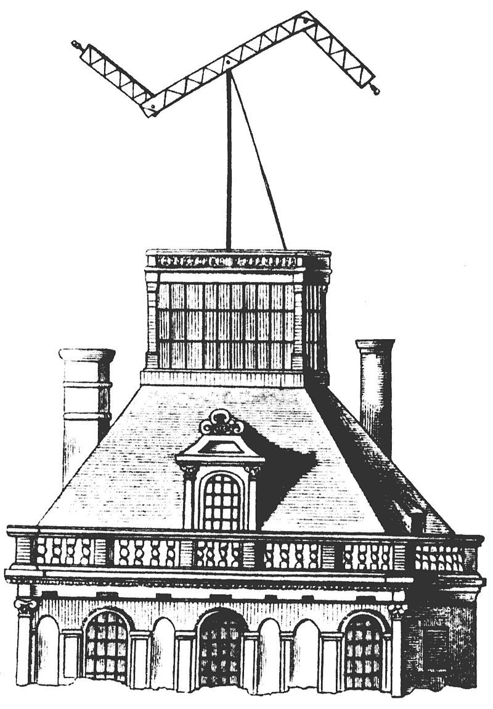
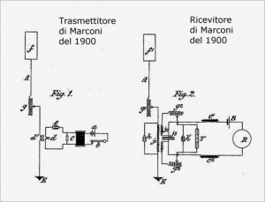

# Introduzione al corso e alla prima lezione

Il corso di **Aspetti Organizzativi e Gestionali della Cybersecurity** ci accompagna a capire non solo come funzionano le tecnologie digitali, ma soprattutto come vengono **gestite e organizzate** all’interno delle aziende e della società. Per non partire nel vuoto, iniziamo con un viaggio nelle **origini della comunicazione a distanza**, perché la sicurezza nasce sempre quando qualcuno vuole **proteggere un messaggio** e qualcun altro vuole **intercettarlo**.

In questa prima lezione ripercorriamo alcune tappe fondamentali: i **segnali a distanza** (dal fuoco al fumo), il **telegrafo elettrico di Morse**, le prime trasmissioni **radio di Marconi**, i primi esempi di “attacchi” come quello di Maskelyne, fino alla macchina **Enigma** e ai lavori di **Turing** a Bletchley Park.

L’idea è semplice: prima l’uomo ha inventato modi sempre più rapidi per **parlare da lontano**. Subito dopo, altri hanno cercato di **spiare, ingannare o nascondere** quei messaggi. È la stessa logica che oggi troviamo nei sistemi informatici: comunicazione e sicurezza viaggiano sempre insieme.

---

### Le origini della comunicazione a distanza

Sin dai tempi più remoti l’essere umano ha cercato di superare i limiti dello spazio e del tempo comunicando a distanza. Le prime soluzioni furono estremamente **rudimentali**: segnali di fumo, fuochi notturni, suoni di tamburi o sistemi ottici basati su torri telegrafiche con bracci mobili. Tutte queste tecniche avevano un obiettivo chiaro: trasmettere un messaggio in modo che fosse **riconosciuto da chi era lontano**.

Questi sistemi erano però limitati dalla **linea di vista**: funzionavano solo se il messaggio poteva essere osservato direttamente, senza ostacoli o montagne nel mezzo. Per questo, con lo sviluppo della scienza e della tecnica, si passò progressivamente a metodi più sofisticati: prima la trasmissione **elettrica** tramite fili (telegrafo), poi la trasmissione **senza fili** attraverso le onde radio.

Accanto alla necessità di comunicare, comparve subito la necessità opposta: **intercettare** i messaggi altrui. Fin dall’antichità, chi riusciva a captare le informazioni del “vicino” aveva un vantaggio strategico, sia in ambito bellico sia in ambito competitivo. La storia delle telecomunicazioni nasce quindi insieme alla storia della **sicurezza delle comunicazioni**: ogni nuova invenzione per trasmettere portava con sé nuove sfide per difendere o attaccare il flusso informativo.

---

## La torre telegrafica ottica

Prima dell’elettricità e della radio, l’uomo aveva già trovato un modo per inviare messaggi oltre l’orizzonte visivo: le **torri telegrafiche ottiche**.
Telegrafo dei fratelli Chappe presso il Louvre:

Immagina una torre alta, ben visibile da lontano, con in cima un grande **braccio mobile** (a volte con altri bracci più piccoli alle estremità). Muovendo questi bracci secondo posizioni convenute si potevano rappresentare **lettere, numeri o simboli**. Ogni configurazione corrispondeva a un segnale preciso.

Le torri erano disposte in catene: ogni torre “leggeva” il segnale della torre precedente e lo **riproduceva** verso la successiva, fino a trasmettere il messaggio su grandi distanze. Era un sistema relativamente veloce per l’epoca, molto più affidabile di segnali di fumo o fuochi.

⚠️ Limiti principali:

- funzionava solo **di giorno e con buona visibilità** (niente nebbia o pioggia);
- richiedeva **linea visiva diretta** tra le torri;
- era **lento** e costoso da mantenere, perché servivano operatori in ogni stazione.

🔑 Importanza storica:  
Le torri telegrafiche ottiche sono un primo esempio di **codifica artificiale del messaggio**: non ci si affidava più a segni “naturali” come il fuoco, ma a un vero **alfabeto simbolico**, gestito da un apparato tecnico. In un certo senso, sono gli “antenati” dei protocolli di comunicazione moderni.

---
## Samuel Morse e l’invenzione del telegrafo elettrico

La vera svolta avvenne qualche secolo più tardi... Nel XIX secolo cresceva il bisogno di comunicare **rapidamente su lunghe distanze**. I sistemi ottici erano lenti e dipendevano dal meteo. L’idea di Morse (insieme ad Alfred Vail) fu semplice e rivoluzionaria: **usare l’elettricità** per trasmettere segnali attraverso un filo.

---
### Come funziona il telegrafo

Un impianto base era formato da:

- **Batteria** → fornisce la corrente elettrica.
    
- **Manipolatore** → un interruttore che l’operatore apre e chiude a colpi brevi o lunghi.
    
- **Linea di trasmissione (filo metallico)** → trasporta la corrente a distanza.
    
- **Elettrocalamita (bobina di filo attorno a un nucleo di ferro)** → si magnetizza quando passa corrente.
    
- **Punzone con striscia di carta** → spostato dall’elettrocalamita, lascia un segno breve o lungo sul nastro.
    

➡️ Il manipolatore manda impulsi elettrici brevi (**punti**) o lunghi (**linee**) → questi vengono registrati come segni sulla carta.  
➡️ Ogni combinazione di punti e linee rappresenta una **lettera o un numero** → questo è il famoso **alfabeto Morse**.

---

### Perché fu una rivoluzione

1. **Velocità**: un messaggio poteva arrivare in minuti, non in giorni.
    
2. **Affidabilità**: il segnale elettrico viaggia anche con pioggia, nebbia e notte (problema insormontabile per i sistemi ottici).
    
3. **Universalità**: con un alfabeto semplice, persone in paesi diversi potevano comunicare.
    
4. **Primo vero “digitale”**: il codice Morse è una sequenza discreta di simboli (punto/linea), un po’ come oggi i computer usano 0 e 1.
    

---

### Legame con la sicurezza

- Subito dopo la sua diffusione, nacque l’interesse per **intercettare** i messaggi sul filo.
    
- Da qui l’esigenza di proteggere la riservatezza → primo accenno all’idea di **crittografia moderna**.
    

---

📌 **Takeaway da 30 e lode**:  
Il telegrafo di Morse non è solo un’invenzione tecnica, ma il primo sistema che introduce:

- una **codifica formale di simboli** → proto-linguaggio digitale;
    
- una **rete di comunicazione elettrica** → antenata di Internet;
    
- la consapevolezza che ogni canale può essere **intercettato** → antenata della cybersecurity.

---
## Il dilemma di Morse: la cablatura

Il telegrafo di Morse funzionava alla grande… ma aveva un **problema enorme**:

- servivano **chilometri e chilometri di filo** di rame per collegare due città.
    
- Più aumentava la distanza, più servivano **pali, isolatori, scavi** → costi altissimi.
    
- Gli oceani erano quasi impossibili da attraversare (il primo cavo transatlantico arrivò solo nel 1858, dopo mille tentativi).
    

In pratica, il telegrafo di Morse era perfetto per collegare regioni o nazioni vicine, ma rimaneva **vincolato al filo**: non poteva diventare un sistema universale senza una cablatura mastodontica.  
➡️ Questo è il **dilemma di Morse**: invenzione geniale ma “incatenata” al filo di rame.

---

## L’Italia e Guglielmo Marconi

Qui entra in scena un giovane bolognese, **Guglielmo Marconi** (1874–1937).  
Da ragazzo era appassionatissimo di fisica e, in particolare, delle scoperte di **Heinrich Hertz**: le **onde elettromagnetiche** possono viaggiare nello spazio senza bisogno di fili.

Marconi si fece una domanda semplice:  
👉 _Se la corrente elettrica serve a trasmettere segnali dentro un filo… non potrei usare le onde elettromagnetiche per trasmettere segnali **nell’aria**_?

Nel **1894** cominciò a fare esperimenti nella villa di famiglia a Pontecchio (vicino Bologna). Usava:

- un **generatore ad alta tensione** che faceva scintille → produceva onde radio;
    
- un’**antenna** che irradiava il segnale;
    
- un **coherer** (piccolo tubicino con limatura di ferro) come rivelatore → si “bloccava” quando riceveva l’onda e faceva scattare un campanello o una penna.

Lo schema originale dell'inventore:

Alla fine del **1895** riuscì a trasmettere un segnale radio a più di **un miglio di distanza** senza fili.  
Era nato il telegrafo senza fili, o come lo chiamavano allora: **wireless**.

---

### Perché è fondamentale

- Marconi risolve il dilemma di Morse: niente più chilometri di cablaggi → i messaggi possono volare **nell’aria**.
    
- Nasce una nuova era: la **radio** → madre di tutte le telecomunicazioni moderne (telefono, TV, Wi-Fi).
    
- E con essa, nascono anche nuove paure: se il messaggio viaggia nell’aria, **chiunque con un ricevitore può ascoltarlo**.
    

---

📌 **Takeaway**:  
Morse insegna a “parlare col filo”, Marconi insegna a “parlare nell’aria”. Ma in entrambi i casi il problema della **sicurezza** rimane: i messaggi possono essere captati da altri.

---

## Cosa sono le onde elettromagnetiche

Un’**onda elettromagnetica (EM)** è una “increspatura” invisibile nello spazio, formata da due campi che si muovono insieme:

- **campo elettrico** (E), misurato in **volt/metro (V/m)**
    
- **campo magnetico** (B), misurato in **tesla (T)**
    

⚡ Questi due campi sono **perpendicolari** tra loro e oscillano in sincronia.

L’onda viaggia alla velocità della luce:

$c=299 792 458 m/s ≈3×108 m/s$

Ogni onda ha due caratteristiche fondamentali:

- **Lunghezza d’onda (λ)** → distanza tra due “creste”, misurata in **metri (m)**.
    
- **Frequenza (f)** → quante oscillazioni fa in un secondo, misurata in **hertz (Hz)**, cioè **1/s**.
    

Sono collegate dalla formula:

$c=λ⋅f$

Esempi per capirci:

- Onde radio (lunghezza d’onda = metri-km, frequenza = kHz-MHz).
    
- Luce visibile (lunghezza d’onda = centinaia di nanometri, frequenza = centinaia di THz).
    
- Raggi X (lunghezza d’onda piccolissima, frequenza altissima).
    

📌 Quindi: la radio non è altro che “luce invisibile” con lunghezza d’onda molto grande.

---

## Marconi e il primo grande passo (1895)

Guglielmo Marconi, partendo dagli studi di Hertz e Tesla, capì che le onde EM potevano essere usate per trasmettere segnali **senza fili**.

Nel **1895**, a Pontecchio, riuscì a inviare un segnale radio a **più di un miglio** (circa 1,6 km).

- Trasmettitore: generatore ad alta tensione + antenna.
    
- Ricevitore: coherer (tubetto con limatura di ferro che diventava conduttivo quando riceveva l’onda).
    

👉 Questo fu il primo vero salto dalle **reti cablate** (Morse) alla **wireless communication**.

---

## Il primo “hacker” della storia: Nevil Maskelyne (1903)

Marconi, orgoglioso della sua invenzione, organizzò nel **1903** a Londra una dimostrazione pubblica del telegrafo senza fili. L’idea era far vedere che i suoi segnali radio erano sicuri e non intercettabili.

Ma un inventore e illusionista inglese, **Nevil Maskelyne**, decise di dimostrare il contrario. Con un suo ricevitore e un trasmettitore nascosto, si **introdusse nella dimostrazione** e inviò messaggi scherzosi e versi di poesie attraverso il canale di Marconi.

📌 Risultato: la platea rise, Marconi fu sbeffeggiato e il mondo capì che le onde radio **non erano affatto private**. Bastava avere un ricevitore e sintonizzarsi.

---

### Contesto storico

- 1837: Morse inventa il telegrafo → comunicazioni veloci, ma legate ai fili.
    
- 1895: Marconi libera i messaggi nell’aria → comunicazioni a distanza senza cavi.
    
- 1903: Maskelyne mostra che ogni innovazione porta anche nuove **vulnerabilità** → primo caso documentato di “hackeraggio” pubblico.

---
## La parola **hack**

- In inglese, il verbo _to hack_ significa originariamente **tagliare grossolanamente, fare a pezzi, intaccare**.
    
- Da qui il termine è passato a indicare l’atto di **entrare, modificare o manipolare** qualcosa in modo non previsto.
    

📌 **Nel contesto storico (Maskelyne, 1903)**  
“Hackerare” significava **interferire con un sistema di comunicazione** (in questo caso, la radio di Marconi) per dimostrare che non era sicuro. Maskelyne non rubò dati sensibili, ma **dimostrò la vulnerabilità** pubblicamente → primo esempio documentato di “hack” delle telecomunicazioni.

📌 **Nel contesto moderno**

- _Hack_ può significare **soluzione creativa** (es. _life hack_ = trucco intelligente per risolvere un problema).
    
- In informatica, _hack_ è l’**accesso non autorizzato** o la modifica di un sistema.

---
## Arthur Scherbius: l’uomo dietro Enigma

Arthur Scherbius (1878-1929) fu un **ingegnere elettrico e imprenditore tedesco**, vissuto in un periodo in cui la Germania stava puntando molto sulla tecnologia e sulle applicazioni militari.

- **Formazione**: studiò ingegneria elettrotecnica a Monaco e Hannover, laureandosi nel 1903.
    
- **Carriera**: lavorò nel campo dell’elettrotecnica applicata, brevettando diversi dispositivi (tra cui una sedia a rotelle motorizzata e sistemi di trasmissione per turbine).
    
- **Il brevetto cruciale**: nel **1918**, subito dopo la Prima guerra mondiale, depositò il brevetto della **macchina Enigma**, un dispositivo elettromeccanico di cifratura che voleva vendere a banche e industrie per proteggere la riservatezza delle comunicazioni.
    
- **Destino dell’invenzione**: inizialmente fu un flop commerciale. Solo qualche anno più tardi le **forze armate tedesche** capirono il potenziale della macchina e la adottarono su larga scala.
    

---

### “Sembra uscito da COD Zombies” 🧟‍♂️

Se pensi all’immaginario:

- Germania del primo ’900, scienza, macchinari con rotori e lampadine, ingegneri un po’ visionari → sembra proprio l’atmosfera che i videogiochi amano usare per scenari steampunk/militari.
    
- Scherbius in questo senso incarna il cliché dell’ingegnere che, quasi “in laboratorio segreto”, inventa una macchina che può cambiare la guerra.
    

---

### L’importanza di Scherbius

- Non inventò la crittografia (quella esiste da millenni), ma creò **un dispositivo meccanico pratico** per usarla su larga scala.
    
- Anticipò il problema moderno: come **automatizzare la cifratura** in modo che fosse veloce, continua e difficile da rompere.
    
- Anche se non visse abbastanza per vedere la Seconda guerra mondiale (morì nel 1929 in un incidente con una carrozza trainata da cavalli!), la sua invenzione divenne uno degli elementi centrali del conflitto.
    

---

📌 **Takeaway**: Scherbius non è solo un nome tecnico legato a Enigma, ma un esempio di come la crittografia passò dall’essere un concetto “di carta e penna” a una vera **tecnologia industriale e militare**, con effetti diretti sulla storia del Novecento.

---
## Formalizzazione accademica: Telecomunicazione & Crittografia

### 1. Telecomunicazione

La **telecomunicazione** è l’attività di trasmissione di segnali, parole, dati o immagini tra due o più soggetti (sorgente e destinazione), mediante dispositivi elettronici (trasmettitore e ricevitore), attraverso un **canale di comunicazione**.  
È un processo che si sviluppa secondo un modello base:

`Sorgente → Trasmettitore → Canale (può introdurre errori) → Ricevitore → Destinazione`

In parole semplici, è come passare un messaggio attraverso un tubo che può un po’ “sovrapporsi o inciampare” lungo il percorso, rendendo possibile l’**errore di trasmissione**.  
Principi chiave:

- **Entropia (rumore)** e **distorsione** sono parte del canale.
    
- Si cerca sempre di mantenere **integrità** del messaggio, minimizzando l’errore.  
    Nell’ambito della sicurezza (COMSEC, communications security), si applicano controlli e codifiche per proteggere il messaggio da accessi non autorizzati e per garantire che provenga davvero da chi dichiara di mandarlo [NIST CSRC](https://csrc.nist.gov/glossary/term/communications_security?utm_source=chatgpt.com)
    

---

### 2. Crittografia

La **crittografia** (cryptography) è la tecnica – e allo stesso tempo la disciplina scientifica – di trasformazione del messaggio in una forma tale che solo il **destinatario autorizzato** possa comprenderlo.  
Questa trasformazione è eseguita da algoritmi matematici, spesso sostenuti da **chiavi segrete** (keys), e si attua attraverso due fasi principali:

1. **Cifratura (Encryption)**: il messaggio originale (plaintext) diventa **cifrato (ciphertext)**.
    
2. **Decifratura (Decryption)**: il destinatario, usando la chiave corretta, ricostruisce il testo originario.
    

Formalmente, un **cryptosystem** è un insieme (tuple) di algoritmi e insiemi matematici:

$(\mathcal{P}, \mathcal{C}, \mathcal{K}, \mathcal{E}, \mathcal{D})$

dove:

- $\mathcal{P}$: insieme dei plaintext (messaggi originari),
    
- $\mathcal{C}$: insieme dei ciphertext (messaggi cifrati),
    
- $\mathcal{K}$: insieme delle chiavi (segrete o pubbliche),
    
- $\mathcal{E}$: funzione di cifratura,
    
- $\mathcal{D}$: funzione di decifratura [Wikipedia](https://en.wikipedia.org/wiki/Cryptosystem?utm_source=chatgpt.com).
    

Esistono moltissimi tipi di codifica che tengono conto di vari fattori tra cui: la tipologia del dato o del segnale da trasmettere, il mezzo trasmissivo (cavo o radio), la tipologia della sorgente e della destinazione.

La crittografia lavora su tre pilastri fondamentali della sicurezza informatica:

- **Riservatezza (Confidentiality)**
    
- **Integrità (Integrity)**
    
- **Autenticità / Non-ripudio (Authentication / Non-repudiation)** [Wikipedia+1](https://en.wikipedia.org/wiki/Cryptography?utm_source=chatgpt.com)[TechTarget](https://www.techtarget.com/searchsecurity/definition/cryptography?utm_source=chatgpt.com).
    

Nel corso della storia, la crittografia non è solo arte della segretezza, ma è divenuta una **scienza** moderna: Claude Shannon, con il suo articolo “Communication Theory of Secrecy Systems” (1949), ha gettato le basi teoriche per modelle forme cifrate perfette e per trasformare la crittografia da un’arte ad una **scienza rigorosa** [Wikipedia](https://en.wikipedia.org/wiki/Communication_Theory_of_Secrecy_Systems?utm_source=chatgpt.com).

---

### Box Riassuntivo (Stile “Feynman avanzato”)

- **Telecomunicazione** = spostare messaggi da A a B → con canale che può modificare o perdere il messaggio.
    
- **Crittografia** = trasformare il messaggio in un codice che solo A e B (con chiave) possono comprendere.
    
- **Protocollo + Modello matematico** = garantire riservatezza, integrità, autenticità.
    
- La sicurezza oggi si fonda su modelli formali, non solo su “trucchi di penna e carta”.

---
## Il Cifrario di Cesare come primo esempio di crittografia

Uno dei più antichi e semplici metodi di cifratura è il cosiddetto **Cifrario di Cesare**, attribuito a Giulio Cesare, che secondo le fonti lo usava per comunicare con i propri generali. L’idea alla base è estremamente lineare: ogni lettera dell’alfabeto viene **traslata** di un numero fisso di posizioni.

### Formalizzazione

Sia $\mathcal{A}$ l’alfabeto di riferimento (ad esempio quello latino, con 26 lettere). Il cifrario di Cesare applica una funzione di traslazione:

$Ek(x)=(x+k)mod  m$

dove:

- $x$ è la posizione numerica della lettera nel messaggio in chiaro,
    
- $k$ è la chiave di cifratura (numero di posizioni di traslazione),
    
- $m$ è la dimensione dell’alfabeto (nel nostro caso m=26m=26m=26),
    
- $Ek(x)$ è il carattere cifrato corrispondente.
    

La decifratura è semplicemente l’operazione inversa:

$Dk(y)=(y−k)mod  m$

---

### Applicazione pratica (esempio con chiave $k=4$)

Messaggio in chiaro: **CIAO**

- C → F
    
- I → N
    
- A → D
    
- O → R
    

Messaggio cifrato: **FNDR**

La destinazione, conoscendo la chiave k=4k=4k=4, applicherà la funzione inversa e ricostruirà il testo originale **CIAO**.

---

### Analisi di sicurezza

Dal punto di vista della crittografia moderna, il Cifrario di Cesare è **estremamente debole**. Infatti:

- Lo spazio delle chiavi è limitato a $m=26$ → significa che esistono solo 25 traslazioni possibili (esclusa la traslazione nulla).
    
- È quindi soggetto a **attacco a forza bruta**: provando tutte le chiavi, il messaggio viene decifrato in tempi trascurabili.
    
- Inoltre, la distribuzione delle lettere (frequenza delle vocali, consonanti comuni, ecc.) consente di individuare la chiave persino senza provare tutte le traslazioni, attraverso un’analisi di frequenza.
    

---

### Valore didattico

Nonostante la sua semplicità, il Cifrario di Cesare è un **passaggio fondamentale** nella storia della crittografia. Permette infatti di introdurre concetti chiave che ritroveremo in sistemi molto più complessi:

1. **Trasformazione del messaggio** → da testo leggibile a testo cifrato.
    
2. **Dipendenza da una chiave** → senza la chiave, il messaggio è incomprensibile.
    
3. **Dualità cifratura/decifratura** → due funzioni inverse legate alla stessa chiave.
    
4. **Necessità di protezione del canale** → la sicurezza non dipende solo dall’algoritmo, ma anche dalla riservatezza della chiave.
    

---

📌 **Takeaway accademico**  
Il Cifrario di Cesare rappresenta la nascita della crittografia come disciplina sistematica: dall’intuizione empirica di Cesare si passa a un modello matematico preciso, che evidenzia immediatamente la necessità di sistemi con spazi di chiavi molto più grandi e algoritmi più sofisticati.

---

# La macchina Enigma: come funziona davvero

### 1. Aspetto esterno

Enigma sembra una **macchina da scrivere portatile**.

- Nella parte inferiore: **tastiera** con le 26 lettere.
    
- Nella parte superiore: un **pannello luminoso** con altre 26 lettere, che si accendono per mostrare il risultato della cifratura.
    
- Dietro: i **rotori** intercambiabili (dischi metallici con cablaggi interni).
    
- In basso: un **plugboard (pannello con cavi)** che permette di scambiare ulteriormente le lettere.
    

---

### 2. I rotori: il cuore del sistema

Ogni rotore è un disco con 26 contatti su ciascun lato:

- lato **L (Links, sinistra)** = ingressi,
    
- lato **R (Rechts, sinistra)** = uscite.
    

All’interno, i contatti sono collegati con cablaggi fissi ma diversi per ogni rotore: quindi **una lettera in ingresso diventa un’altra in uscita**.  

Esempio semplificato:

- se premi la **A**, il cablaggio del primo rotore la trasforma in **M**,
    
- il secondo rotore trasforma **M** in **Q**,
    
- il terzo rotore trasforma **Q** in **F**, e così via.
    

👉 Ogni pressione di tasto **fa ruotare il primo rotore di una posizione** (meccanismo a scatto).

- Quando il primo rotore compie un giro, avanza il secondo.
    
- Quando il secondo completa un giro, avanza il terzo.
    

Quindi la **mappa cambia a ogni lettera digitata**: se scrivi “AAA”, ogni “A” sarà cifrata in una lettera diversa.

---

### 3. Il riflettore

Dopo essere passata attraverso i rotori, la corrente incontra un **riflettore**: un disco che rimanda il segnale indietro attraverso i rotori, ma su percorsi diversi.  
Questo fa sì che la macchina sia **simmetrica**: lo stesso settaggio serve sia per cifrare sia per decifrare.

---

### 4. Il plugboard (pannello di scambio)

Prima di entrare nel primo rotore e dopo essere uscita dall’ultimo, la corrente passa per un pannello di cavi chiamato **Steckerbrett (plugboard)**.  
Qui l’operatore collegava **coppie di lettere** con dei cavi. Esempio: se collego A↔G, ogni volta che il segnale incontra una “A” diventa “G” e viceversa.  
Questo aggiungeva ulteriore complessità.

---

### 5. Esempio di cifratura

Supponiamo di digitare la lettera **C**:

1. La corrente parte dal tasto “C”.
    
2. Passa per il **plugboard** (magari scambia “C” con “Z”).
    
3. Entra nel primo rotore → trasformata in un’altra lettera.
    
4. Passa nel secondo rotore → trasformata ancora.
    
5. Passa nel terzo rotore → nuova trasformazione.
    
6. Arriva al **riflettore**, che rimanda indietro la corrente.
    
7. La corrente ripercorre i rotori in senso inverso (ma su collegamenti diversi).
    
8. Esce di nuovo dal plugboard.
    
9. Si accende una lampadina (es. la “P”), che è la **lettera cifrata**.
    

👉 Se ora un altro operatore con la stessa configurazione digita “P”, la macchina farà il percorso inverso e restituirà “C”: la cifratura è **bidirezionale**.

---

### 6. Perché sembrava invincibile

- Ogni lettera era cifrata in modo **dinamico**, non fisso.
    
- Migliaia di possibili settaggi dei rotori e del plugboard.
    
- Meccanismo bidirezionale → stessa macchina per cifrare e decifrare.
    

La combinazione di rotori, riflettore e plugboard rese Enigma **molto più complessa** di qualsiasi cifrario manuale (come quello di Cesare).

---

📌 **Takeaway accademico**  
La macchina Enigma non era solo un cifrario: era un **sistema elettromeccanico dinamico**.

- Rotori = trasformazioni variabili.
    
- Riflettore = simmetria cifratura/decifratura.
    
- Plugboard = livello extra di confusione.
    

Capire Enigma significa comprendere la transizione storica dalla **crittografia manuale** alla **crittografia meccanizzata-industriale**, una rivoluzione che ha anticipato l’informatica.

---

Tieniti pronto, perché qui c’è un po’ di combinatoria e fattoriali — ma lo facciamo in stile Feynman: chiaro e senza dare nulla per scontato.

---

## 1. Scelta dei rotori

La macchina Enigma nella versione “classica” prevedeva **5 rotori disponibili**, ma solo **3** da inserire contemporaneamente nella macchina.  
L’ordine conta (perché un rotore in prima posizione non equivale a uno in terza).  
Quindi non è una combinazione, ma una **permutazione di 5 elementi presi 3 a 3**:

$P(5,3) = 5 \times 4 \times 3 = 60$

📌 Primo fattore: **60 configurazioni possibili solo nella scelta e disposizione dei rotori**.

---

## 2. Posizioni iniziali dei rotori

Ogni rotore ha **26 possibili posizioni di partenza** (una per ogni lettera dell’alfabeto).  
Con 3 rotori:

$263=17.576$

📌 Secondo fattore: **17.576 possibili posizioni iniziali** dei rotori.

---

## 3. Plugboard (Steckerbrett)

Ed ecco la parte più complicata.  
Il plugboard permetteva di collegare tra loro le lettere a coppie tramite **10 cavi** (su un massimo di 13 possibili).

### Passo a passo

- Abbiamo 26 lettere.
    
- Scegliamo **20 lettere da collegare** (le altre 6 restano libere).
    
- Queste 20 lettere devono essere divise in **10 coppie**.
    

Il numero di modi per farlo è dato dalla formula:

$$\frac{26!}{6! \cdot 10! \cdot 2^{10}}$$​

Perché?

- $26!$ = tutti i modi per disporre le lettere.
    
- $6!$ = rimuoviamo le lettere lasciate libere.
    
- $10!$ = non ci interessa l’ordine delle coppie (A-B, C-D è uguale a C-D, A-B).
    
- $2^{10}$ = non ci interessa l’ordine dentro ogni coppia (A-B = B-A).
    

Questo numero enorme vale:

$$150.738.274.937.250$$

📌 Terzo fattore: **150.738 miliardi di miliardi di configurazioni solo per il plugboard**.

---

## 4. Moltiplicazione finale

Ora si moltiplicano i tre fattori:

$$60 \times 17.576 \times 150.738.274.937.250$$

Risultato:

$$\approx 158.962.555.217.826.350.000$$

cioè circa **1,59 × 10^20 combinazioni possibili**.

---

## 5. Perché è spaventoso

Per capire quanto sia grande questo numero:

- se un operatore potesse testare **1 milione di configurazioni al secondo**, servirebbero più di **5 miliardi di anni** per provare tutte le possibilità.
    
- Ecco perché, senza falle operative (errori umani dei tedeschi), Enigma sarebbe stata **praticamente indecifrabile** con le tecnologie dell’epoca.
    

---

📌 **Takeaway accademico**

- La complessità di Enigma deriva dalla moltiplicazione di scelte diverse: **rotori × posizioni × plugboard**.
    
- Il plugboard è ciò che rende il numero astronomico, molto più che i rotori stessi.
    
- Dal punto di vista matematico, Enigma è un **sistema polialfabetico dinamico**, che cambia cifratura a ogni lettera digitata.

---

# 📑 Scheda di riepilogo – L1

## 1. Origini della comunicazione

- **Segnali ottici/sonori**: fumo, fuochi, tamburi.
    
- **Torri ottiche**: alfabeti simbolici trasmessi per linea di vista → limiti meteo/visibilità.  
    👉 Prima idea di **codifica artificiale**.
    

---

## 2. Il telegrafo di Morse (1837)

- **Componenti**: batteria, tasto, filo, elettrocalamita, punzone.
    
- **Codice Morse**: punti/linee = primo “digitale” (discreto, robusto).
    
- **Limite**: cablatura chilometrica, costi altissimi → dilemma di Morse.
    

---

## 3. Marconi e la radio (1895)

- **Onde elettromagnetiche** = oscillazioni di campo elettrico (V/m) e magnetico (T).
    
- **Caratteristiche**:
    
    - Lunghezza d’onda (m)
        
    - Frequenza (Hz)
        
    - Relazione: c=λ⋅fc = \lambda \cdot fc=λ⋅f
        
- **Esperimento Pontecchio**: trasmissione > 1 miglio → inizio del wireless.  
    👉 Dilemma risolto: niente più fili.
    

---

## 4. Primo “hacker”: Nevil Maskelyne (1903)

- Durante demo di Marconi a Londra → interferisce con versi e messaggi ironici.
    
- Dimostra che il wireless è **intercettabile** → prima vulnerabilità pubblica.  
    👉 Origine del termine _hack_ = tagliare, intaccare, manipolare.
    

---

## 5. Arthur Scherbius e Enigma (1918)

- Ingegnere tedesco, brevetta **macchina di cifratura elettromeccanica**.
    
- Struttura: tastiera, lampade, rotori, riflettore, plugboard.
    
- Meccanismo: rotori che avanzano a ogni tasto → cifratura dinamica e simmetrica.
    

---

## **6. Formalizzazione dei concetti chiave**

- **Telecomunicazione**: trasmissione di messaggi attraverso un canale, con rischio di errore.
    
- **Crittografia**: trasformazione del messaggio in forma segreta; la sicurezza dipende da una **chiave**.
    
- **Cifrario di Cesare**: cifratura per traslazione, definita come  
    $E_k(x) = (x + k) \bmod m$.  
    Schema debole ma utile per fini didattici.
    

---

## **7. Enigma – combinazioni possibili**

- **Scelta dei rotori**:  
    $P(5,3) = 60$
    
- **Posizioni iniziali dei rotori**:  
    $26^3 = 17{,}576$
    
- **Plugboard (10 coppie di lettere)**:  
    $\displaystyle \frac{26!}{6! , 10! , 2^{10}} \approx 1{,}5 \times 10^{14}$
    
- **Totale configurazioni**:  
    $\displaystyle \approx 1{,}59 \times 10^{20}$
    

👉 Di fatto **impossibile da forzare** senza errori umani o informazioni aggiuntive.

---

## 🔑 Takeaways

- Ogni innovazione di comunicazione genera anche nuove vulnerabilità.
    
- Dalla codifica (Morse) si passa alla crittografia (Cesare → Enigma).
    
- Enigma è la prima **tecnologia industriale della crittografia**.