# **M2 UD1 Lezione 1 - Liste**

---

### **1. Introduzione**

Con questa lezione inizia il nostro viaggio nel primo tipo di dato concreto del corso: **la lista**.  
Dopo aver studiato nel Modulo 1 i formalismi astratti e le basi logiche, ora passiamo a una struttura che **mette in pratica quei concetti**.

Le liste rappresentano sequenze di elementi dello stesso tipo, nelle quali è sempre possibile **aggiungere o togliere elementi**.  
Sono fondamentali perché:

- permettono di memorizzare dati in modo **dinamico**;
- consentono **inserimenti e cancellazioni** ovunque nella sequenza;
- rendono esplicita la relazione di **successione** tra elementi.

#### **Caratteristiche principali**

- Accesso diretto solo al **primo** o **ultimo** elemento
- Accesso agli altri elementi solo tramite **scansione sequenziale**

In altre parole, la lista è come una **catena**: per raggiungere un nodo, bisogna percorrere quelli precedenti.

---

### **2. Specifica sintattica del tipo di dato lista**

Definiamo ora formalmente le operazioni fondamentali della lista in linguaggio astratto.

N.B.: quando la funzione restituisce un booleano, per noi umani è meglio mettere il prefisso is, a simulare l'interrogativa inglese: isListaVuota? Semanticamente è più potente, perché un umano risponderebbe solo sì/no, ergo si può subito dedurre che ritorna un booleano.

```text
crealista:           () → lista

listavuota:          (lista) → booleano


Operatori di Navigazione:

primolista:          (lista) → posizione_head
ultimolista:         (lista) → posizione_tail
succlista:           (posizione, lista) → posizione_next
predlista:           (posizione, lista) → posizione_prev


finelista:           (posizione, lista) → booleano

leggilista:          (posizione, lista) → tipoelem

scrivilista:         (tipoelem, posizione, lista) → lista

inslista:            (tipoelem, posizione, lista) → lista

canclista:           (posizione, lista) → lista
```

**Notazione:**

- `L` = lista di elementi $a_i$ di tipo `tipoelem`
- `p`, `q` = posizioni relative agli elementi $a_i$ e $a_j$
- `b` = valore booleano
- `Λ` = lista vuota

---

### **3. Specifica semantica**

La semantica definisce cosa fa ogni operazione, indicando **precondizioni** e **postcondizioni**.

Possiamo classificare le varie procedure in categorie:

- **Creazione e controllo dello stato**: `crealista`, `listavuota`
- **Navigazione**: `primolista`, `ultimolista`, `succlista`, `predlista`, `finelista`
- **Accesso e modifica**: `leggilista`, `scrivilista`, per leggere o sovrascrivere un elemento
- **Modifica della struttura**: `inslista`, `canclista`, per aggiungere o eliminare un nodo

```text
crealista() = L'
post: L' = Λ
```

```text
listavuota(L) = b
post: b è vero sse L = Λ
```

```text
primolista(L) = p
post: p = pos₁
```

```text
ultimolista(L) = p
post: p = posₙ
```

```text
succlista(p, L) = q
pre: L = a₁, …, aₙ; p = posᵢ, 1 ≤ i ≤ n
post: q = posᵢ₊₁
```

```text
predlista(p, L) = q
pre: L = a₁, …, aₙ; p = posᵢ, 1 ≤ i ≤ n
post: q = posᵢ₋₁
```

```text
finelista(p, L) = b
pre: L = a₁, …, aₙ; p = posᵢ, 0 ≤ i ≤ n + 1
post: b è vero sse p = pos₀ o posₙ₊₁ /* ovvero se siamo oltre la posizione di primo o n-esimo (ultimo) elemento */
```

```text
leggilista(p, L) = a
pre: L = a₁, …, aₙ; p = posᵢ, 1 ≤ i ≤ n
post: a = aᵢ
```

```text
scrivilista(a, p, L) = L'
pre: L = a₁, …, aₙ; p = posᵢ, 1 ≤ i ≤ n
post: L' = a₁, …, aᵢ₋₁, a, aᵢ₊₁, …, aₙ
```

Concentriamoci sugli ultimi due:

```text

inslista(a, p, L) = L'

pre: L = a₁, …, aₙ;
	p = posᵢ, 0 ≤ i ≤ n + 1

```

Il nuovo nodo da aggiungere si può inserire sia all'inizio, sia in mezzo, che alla fine della lista, quindi la posizione passata non è più tra $1$ ed $n$, ma tra $0$ ed $n+1$

Per le postcondizioni andiamo dunque a distinguere i casi e inseriamo il nodo coerentemente:

$$
\begin{cases}
    se \ 1 ≤ i ≤ n    \ \ \  → L' = a₁, …, aᵢ₋₁, a, aᵢ, …, aₙ \\\\
    se \ i = 0        \ \ \ \ \ \ \ \ \ \ \  →  L' = a, a₁, …, aₙ \\\\
    se \ i = n + 1    \ \ \ \  → L' = a₁, …, aₙ, a
\end{cases}
$$

Nella teoria delle liste, e poi anche quando passeremo all’implementazione in C, l’operazione `inslista(a, p, L)` è definita in modo standard: il nuovo elemento viene inserito **prima della posizione i-esima**. Il nome della funzione resta volutamente sintetico (inslista) e non esplicita tutto il comportamento, quindi il significato va dedotto dalla specifica semantica. Di conseguenza, bisogna ragionare caso per caso. Se si inserisce in testa, tutti gli elementi già presenti vengono “spostati in avanti” (concettualmente a destra); se si inserisce in mezzo, vengono spostati solo quelli dalla posizione i in poi; se invece si inserisce in coda, non si sposta nulla e si aggiunge semplicemente l’elemento alla fine.

Attenzione però: il termine “shift” o “spostamento a destra” è solo **un modello mentale utile**, non sempre un’operazione reale. Negli array (memoria contigua) lo shift comporta davvero lo spostamento dei dati in memoria; tuttavia, negli array “built-in” di C la dimensione è fissa, quindi l’inserimento è possibile solo se c’è spazio libero, altrimenti non si può effettuare senza riallocare la struttura. Negli array dinamici (heap), invece, è possibile ottenere più spazio (ad esempio tramite `realloc`), ma questo può comportare anche la copia dell’intero array in una nuova area di memoria. Nelle liste collegate, invece, **non esiste alcuno spostamento fisico**: si crea un nuovo nodo e si aggiornano i puntatori. Inoltre, una lista collegata **non è memoria contigua**, ma un insieme di nodi sparsi in memoria collegati tra loro. Il “destra/sinistra” è quindi solo una rappresentazione visiva legata al modo in cui leggiamo la sequenza, non alla struttura fisica in memoria.

---

```text
canclista(p, L) = L'
pre: L = a₁, …, aₙ; p = posᵢ, 1 ≤ i ≤ n
post: L' = a₁, …, aᵢ₋₁, aᵢ₊₁, …, aₙ
```

Analogamente, cancellando un elemento, lo “shift” avviene in senso opposto: se si elimina il primo elemento, tutti gli altri vengono concettualmente spostati a sinistra di una posizione; se si elimina un elemento in posizione intermedia, vengono spostati a sinistra solo quelli successivi; se si elimina l’ultimo elemento, invece, non è necessario alcuno spostamento. Anche in questo caso, tuttavia, si tratta di uno spostamento puramente concettuale: negli array (memoria contigua) ciò si traduce effettivamente in uno shift dei valori in memoria, mentre nelle liste collegate non avviene alcuno spostamento fisico dei dati. L’operazione consiste semplicemente nel modificare i puntatori, scollegando il nodo da eliminare e collegando direttamente tra loro il precedente e il successivo. Di conseguenza, come per l’inserimento, il concetto di “sinistra/destra” rimane solo una rappresentazione visiva utile per comprendere l’ordine degli elementi, ma non riflette la reale disposizione in memoria nel caso delle liste.

> In sintesi, la specifica formale ci dice **cosa deve accadere** logicamente ogni volta che la lista viene modificata.

---

### **4. Realizzazione con puntatori**

#### **Idea di base**

Ogni elemento della lista è memorizzato in una **cella** (record) che contiene:

1. il **valore** dell’elemento;
2. l’**indirizzo (puntatore)** della cella successiva.

La prima cella è puntata da una variabile `L` di tipo puntatore, mentre l’ultima contiene un valore speciale `NULL`.

#### **Estensioni possibili**

- **Sentinella:** una cella aggiuntiva che delimita gli estremi.
- **Bidirezionalità:** ogni cella punta sia alla successiva che alla precedente.
- **Circolarità:** l’ultima cella punta direttamente alla prima.

---

#### **Esempi grafici**

##### **Lista monodirezionale**

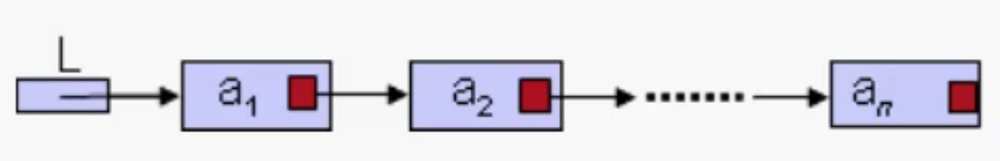

$$
L \longrightarrow a_1 \longrightarrow a_2 \longrightarrow \dots \longrightarrow a_n \longrightarrow \text{NULL}
$$

---

##### **Lista bidirezionale**

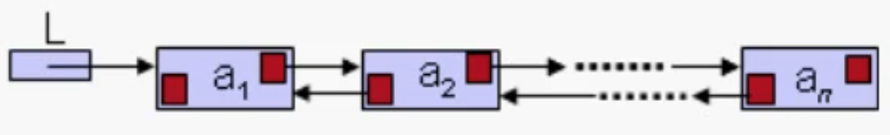

$$
a_1 \longleftrightarrow a_2 \longleftrightarrow \dots \longleftrightarrow a_n
$$

Attenzione: il puntatore al nodo precedente del primo è vuoto, così come il puntatore al nodo successivo dell'ultimo!

---

##### **Lista bidirezionale circolare**


$$
a_1 \longleftrightarrow a_2 \longleftrightarrow \dots \longleftrightarrow a_n \circlearrowleft
$$

---

##### **Lista monodirezionale con sentinella**


Viene essenzialmente aggiunta una cella vuota che ci permette di utilizzarla come sentinella per capire quando una lista, ad esempio, è vuota;

Nel seguito, a meno che non sia specificato diversamente, useremo sempre la cosiddetta:

#### **Lista bidirezionale con sentinella**


Quando si parla di **lista bidirezionale con sentinella circolare**, si sta descrivendo una struttura dati composta da nodi (detti anche _record_), dove ogni nodo contiene un elemento e due puntatori: uno al nodo successivo (`next`) e uno al precedente (`prev`). Il termine _record_ indica semplicemente una struttura dati composta da più campi (nel nostro caso: `elemento`, `next`, `prev`), quindi è sinonimo di `struct` in C.

La particolarità di questa lista è la presenza di una **sentinella**, cioè un nodo speciale che **non contiene un dato utile**, ma serve solo per semplificare la gestione della lista. Questa sentinella è collegata in modo tale da chiudere la struttura: il suo `next` punta al primo elemento e il suo `prev` all’ultimo. Inoltre, quando la lista è vuota, la sentinella punta a sé stessa sia in avanti che indietro. Per questo motivo si dice che la struttura è **circolare**, ma attenzione: non è una lista circolare “classica”.

Nella **lista circolare classica**, infatti, sono i nodi reali a collegarsi tra loro formando un ciclo diretto (l’ultimo nodo punta al primo), senza alcun nodo speciale. Qui invece il ciclo passa sempre attraverso la sentinella: il primo e l’ultimo nodo **non si puntano direttamente**, ma sono entrambi collegati alla sentinella. Questa differenza è fondamentale perché permette di eliminare i casi particolari (lista vuota, inserimento in testa, inserimento in coda), rendendo il codice più uniforme.

Ed è proprio questo il motivo per cui si dice che la **complessità degli operatori è $O(1)$**. Operazioni come inserimento o cancellazione di un nodo, se si conosce già la posizione (`posizione p`), richiedono sempre un numero costante di operazioni: basta aggiornare un numero fisso di puntatori (tipicamente 2 o 4), indipendentemente dalla dimensione della lista. Non serve scorrere la lista, non ci sono casi speciali da trattare separatamente, quindi il costo non cresce con il numero di elementi.

ATTENZIONE: la complessità $O(1)$ si riferisce agli operatori che, dato un puntatore a una posizione, modificano o accedono localmente alla lista aggiornando un numero costante di puntatori. Le operazioni che richiedono l’individuazione della posizione (come la ricerca) restano $O(n)$.

Questa semplificazione ha però un piccolo costo: la presenza della sentinella introduce uno **spreco minimo di memoria**, pari a un nodo in più. Questo è ciò che si intende con “un record in più”: si alloca una struttura aggiuntiva che non contiene dati utili, ma serve solo a semplificare la logica del programma.

Infine, il concetto di **posizione (`posᵢ`)** viene concretizzato nell’implementazione come **indirizzo di memoria del nodo**. Quindi `posᵢ` è il puntatore alla cella che contiene l’i-esimo elemento (`aᵢ`). In modo coerente con la teoria, anche `pos₀` e `posₙ₊₁` non sono posizioni “fuori dalla memoria”, ma coincidono con l’indirizzo della sentinella. Questo chiude perfettamente il modello teorico: le posizioni fuori dai limiti della lista vengono rappresentate concretamente dallo stesso nodo speciale.

---

**Definizione in C:**

```c
typedef struct _cella {
  tipoelem elemento;
  struct _cella *next, *prev;
} cella;

typedef cella posizione, lista;
typedef short boolean; // oppure usiamo la libreria stdbool, ma a quanto pare al docente piaceva il C prima del 1999...
```

NB: cella è un sinonimo di nodo, io seguo quel che scrisse il prof nelle slide...


---

##### **Esempio: inserimento**

PROMEMORIA: inseriamo sempre prima della posizione del nodo passato, se non specificato diversamente!

```c
void inslista(tipoelem a, posizione *p) {

  posizione *q;
  q = malloc(sizeof(cella));
  q->elemento = a; // popolo la cella col dato passato

  q->prev = p->prev; // step 1: il nuovo nodo inserito ha come precedente quello che precedeva il nodo in posizione p

  q->next = p; // step 2: visto che inseriamo il nuovo nodo prima di quello in posizione p, quest'ultimo diventa il suo successivo

  p->prev->next = q; // step 3: ora dobbiamo re-linkare il nodo precedente a quello inserito, di modo che il suo successivo sia proprio quello appena inserito

  p->prev = q; // step 4: e infine il precedente al p è effettivamente quello nuovo
}
```

A una prima occhiata, il codice proposto non è semanticamente leggibile (e la colpa di chi è? Del prof...) - Vi propongo la versione SEMANTICAMENTE CHIARA:

```c
void inslista(tipoelem a, posizione *p) {

  posizione *nuovo;
  nuovo = malloc(sizeof(cella));
  nuovo->elemento = a; // popolo la cella col dato passato

  nuovo->prev = p->prev;
  // step 1: il nuovo nodo ha come precedente quello che precedeva p

  nuovo->next = p;
  // step 2: il nuovo nodo punta a p come successivo

  p->prev->next = nuovo;
  // step 3: il nodo precedente ora deve puntare al nuovo

  p->prev = nuovo;
  // step 4: p ora ha come precedente il nuovo nodo
}
```

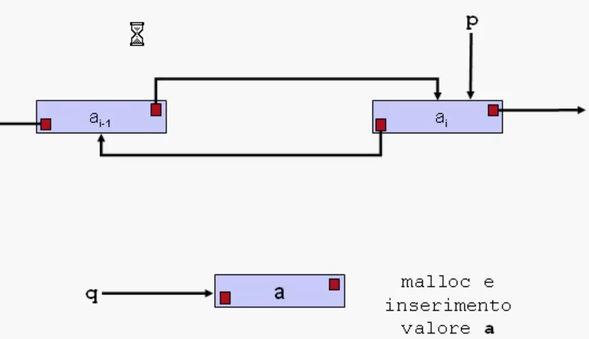

Prima dello step 1 siamo nella situazione sopra illustrata.

Ora, per concretizzare l'inserimento della cella così inizializzata, dobbiamo fare collimare (Coincidere, corrispondere, combaciare esattamente) tutti i puntatori che risentono dell'inserimento.
Tali puntatori sono, in ordine da sx a dx:

a) Il puntatore a next della cella precedente;
b) Entrambi quelli della cella da inserire;
c) Il puntatore a prev della cella in posizione i/p che dir si voglia che a fine inserimento diventa "la successiva";

Innanzitutto facciamo collimare i due puntatori della nuova cella, ovvero Step 1 e 2:


Dopodiché aggiorniamo il next del precedente, ovvero Step 3, e il precedente del nodo puntato da p, ovvero Step 4:


IN SINTESI:
Questo frammento mostra l’inserimento di un nuovo nodo _prima_ della posizione `p`.  
L’uso della sentinella elimina la necessità di gestire casi speciali per l’inizio e la fine della lista.

---

##### **Esempio: cancellazione**

Per poter cancellare con successo un nodo della lista, bisogna prendere delle accortezze, in quanto la nostra specifica semantica vuole che dopo la cancellazione la posizione p vada a puntare verso la nuova posizione relativa i-esima. Tale posizione è dunque la ex i+1-esima.
**Vogliamo modificare il puntatore che ci è stato passato** (non solo il contenuto che punta).
Quindi serve un doppio puntatore.
In C:

- se passiamo un puntatore semplice (`posizione *p`), possiamo modificare il **nodo a cui punta**,  
   ma **non possiamo cambiare dove punta `p`** stesso nel chiamante.
- se passiamo un **puntatore a puntatore (`posizione **p`)**, possiamo anche cambiare _il valore di `p` nel chiamante\_, cioè farlo puntare altrove.

Allora in questo caso, dereferenziamo p, ovvero vi accediamo e tutte le info di quella cella vengono memorizzate in q, così che p possa essere aggiornata post-cancellazione e q possa venire rimossa in quanto ausiliaria.

```c
void canclista(posizione **p) {
  posizione *q;
  q = *p;                   // 0: q diventa il nodo da cancellare
  q->prev->next = q->next;  // 1: collega il precedente col successivo
  q->next->prev = q->prev;  // 2: collega il successivo col precedente
  *p = q->next;             // 3: sposta *p (nel chiamante!) al nodo successivo
  free(q);                  // libera la memoria
}
```

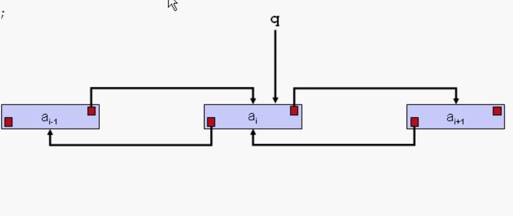
La figura soprastante è la situazione iniziale.
Lo Step 1 e 2 comportano la modifica dei collegamenti:

1.  Facciamo puntare il successivo del nodo precedente al nodo successivo:


2. E poi facciamo puntare il precedente del nodo successivo al nodo precedente:


Con lo Step 3 aggiorniamo il nodo puntato da p, che non è più quello centrale ma quello a dx, ovvero il next di q.
Infine possiamo liberare la memoria con una free...

Fatto sta, che alla fine:
L’elemento puntato viene eliminato e i collegamenti aggiornati in modo costante ($O(1)$).

---

### **5. Realizzazione con cursori**

#### **Motivazione**

Quando il linguaggio di programmazione **non fornisce il tipo puntatore**, possiamo simularlo tramite **cursori**, ossia indici interi che rappresentano la posizione in un vettore.

Tale vettore assolve il ruolo di simulatore della memoria disponibile per i puntatori.
Ergo, un cursore emula un puntatore.

Il vettore, chiamato **_spazio_**, è tale che:
– contiene tutte le liste, ciascuna individuata da un proprio cursore iniziale;
– contiene tutte le celle libere, organizzate anch’esse in una lista, detta **_listalibera_**.

---

Supponiamo ad esempio che il vettore contenga una prima lista, come indicata in figura, che ha origine nel cursore 1, e che quindi funge da sentinella non contenente alcun elemento:

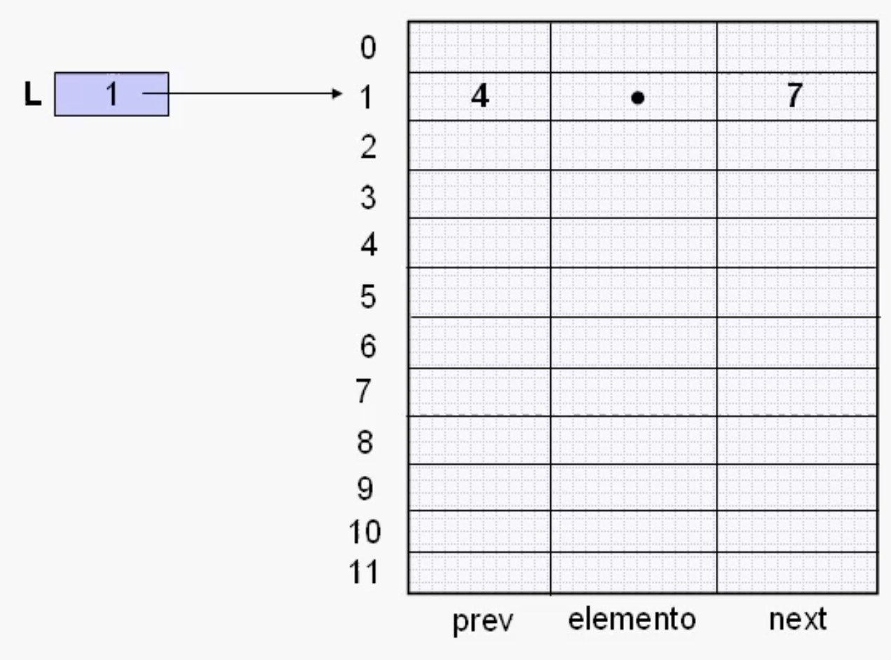

Guardiamo poi la "cella" successiva, ovvero quella con cursore 7:

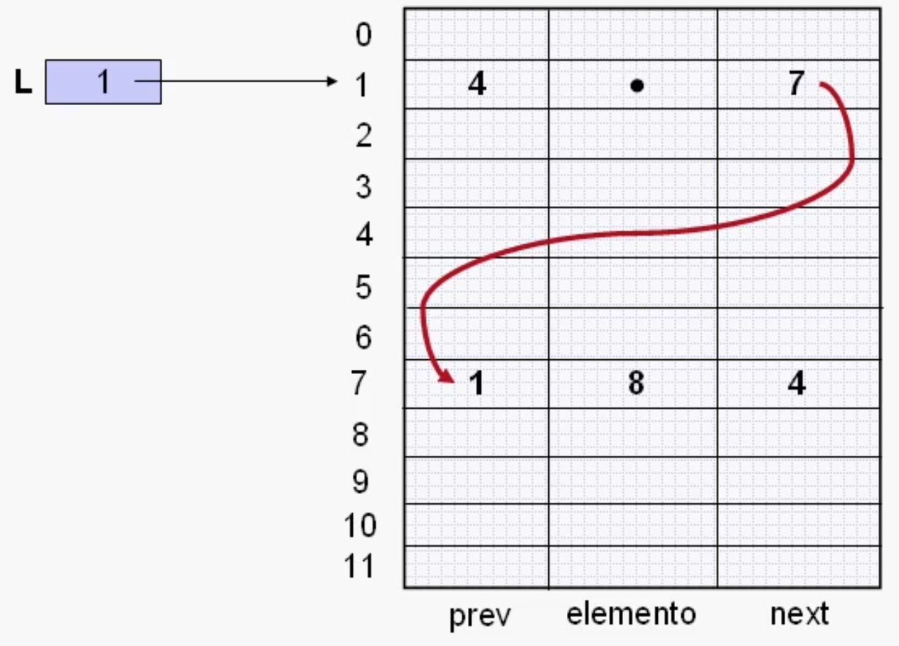

E procediamo guardando al cursore in posizione 4:


Se procediamo, torniamo all'inizio della lista.
Da qui si evince che la lista L è così composta:

$L = 8, 5$

Andiamo oltre, vedendo un'altra lista di nome $M$ contenuta nel vettore $spazio$ e che è indicata/ha sentinella nel $cursore \ 3$.

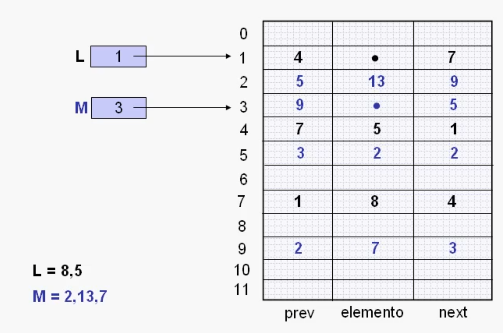

Infine possiamo osservare che le celle libere del vettore sono organizzabili nella già anticipata lista libera:


Detto ciò, è buona prassi tentare di implementare in C quanto detto...

---

#### **Implementazione in linguaggio C**

Partiamo col definire il $vettore \ spazio$:

Si noti che la struttura rimane invariata: a cambiare è il tipo di prev e next, che essendo cursori saranno alias di int.

```c
#define MAXL 10
typedef int lista, posizione;

typedef struct _cella {
  posizione prev, next; // non più puntatori ma indici ergo interi!
  tipoelem elemento;
} cella;

lista listalibera;
cella spazio[MAXL];
```

#### **Funzione di inizializzazione**

Per gestire lo spazio di memoria dei cursori, inizializziamo tutto lo spazio ad una lista puntata da listalibera composta da tutti gli elementi, a partire dalla posizione 0.

```c
void inizializza() {

  listalibera = 0; // la lista libera inizia dalla cella 0
  spazio[0].next = 1; // il successivo di 0 è 1
  spazio[0].prev = MAXL - 1; // il precedente di 0 è l'ultimo elemento
 
  for (int i = 1; i < MAXL; i++) { // per ogni cella dello spazio
    // che non sia la prima o l'ultima, otteniamo:
    spazio[i].next = (i + 1) % MAXL; // il successivo è (i+1) mod MAXL. Il modulo      serve per far sì che l'ultimo elemento punti a 0 e che dunque non ci siano né      buchi né sforamenti dell'array.
    spazio[i].prev = (i - 1) % MAXL; // Viceversa per il precedente
  }
}
```

Ora vogliamo anche definire una funzione in grado di trasferire la cella puntata da p nella cella PRIMA di quella puntata da q, aggiornando anche i cursori p e q nel chiamante, così da poter continuare a scorrere la lista se necessario. In soldoni, si può spostare una cella da una lista all'altra, o anche all'interno della stessa lista, in modo efficiente, senza dover fare shift di elementi come negli array contigui. O ancora, mentre cancello una posizione da una lista, posso mettere tale posizione nella lista libera. Infine, posso anche fare il viceversa, dunque trasferire una cella dalla lista libera a quella di mio interesse!

```c
void sposta (posizione *p, posizione *q) {
  posizione t;
  t = spazio[*p].next; // salvo il successivo di *p in t, così da poter aggiornare p alla fine della funzione
  spazio[spazio[*p].prev].next = spazio[*p].next; // stacco *p dalla sua posizione attuale, facendo puntare il precedente al successivo
  spazio[spazio[*p].next].prev = spazio[*p].prev; // stacco *p dalla sua posizione attuale, facendo puntare il successivo al precedente
  spazio[*p].prev = spazio[*q].prev; // ora *p deve essere inserito prima di *q, quindi il suo precedente diventa quello che precedeva *q
  spazio[spazio[*q].prev].next = *p; // il nodo che precedeva *q ora deve puntare a *p
  spazio[*p].next = *q; // *p ora punta a *q come successivo
  spazio[*q].prev = *p; // *q ora ha come precedente *p
  *q = *p; // aggiorno *q al nodo appena spostato, così da poter continuare a scorrere la lista se necessario
  *p = t; // aggiorno *p al vecchio successivo, così da poter continuare a scorrere la lista se necessario
}
```

---

#### **Lo stesso codice in Pascal — perché i cursori hanno senso**

In C siamo stati costretti a usare `posizione *p` e `*p` per il passaggio per riferimento, il che ha creato confusione: sembrava che stessimo usando puntatori anche nella logica della lista.

In Pascal, linguaggio **senza aritmetica dei puntatori** e in cui il passaggio per riferimento si fa con `var`, il codice risulta molto più pulito e coerente con l'idea dei cursori: **`*` non compare mai**, eppure la lista funziona esattamente allo stesso modo.

Definizione delle strutture:

```pascal
const MAXL = 10;

type
  posizione = integer;
  lista     = integer;

  cella = record
    prev, next : posizione; { cursori: semplici interi, zero puntatori }
    elemento   : integer;
  end;

var
  spazio      : array[0..MAXL-1] of cella;
  listalibera : lista;
```

Procedura di inizializzazione:

```pascal
procedure inizializza;
var i : integer;
begin
  listalibera    := 0;
  spazio[0].next := 1;
  spazio[0].prev := MAXL - 1;
  for i := 1 to MAXL - 1 do
  begin
    spazio[i].next := (i + 1) mod MAXL;
    spazio[i].prev := (i - 1 + MAXL) mod MAXL;
  end;
end;
```

Procedura `sposta`:

```pascal
procedure sposta(var p : posizione; var q : posizione);
{ "var" = passaggio per riferimento, come posizione* in C — ma senza asterischi }
var t : posizione;
begin
  t := spazio[p].next;                     { p è già l'indice: nessun * necessario }
  spazio[spazio[p].prev].next := spazio[p].next;
  spazio[spazio[p].next].prev := spazio[p].prev;
  spazio[p].prev               := spazio[q].prev;
  spazio[spazio[q].prev].next  := p;
  spazio[p].next               := q;
  spazio[q].prev               := p;
  q := p;
  p := t;
end;
```

Come si vede: la logica è identica a quella C, ma `p` e `q` sono **direttamente** gli interi-cursore — non servono né `*p` per dereferenziare né cast di alcun tipo. Questo è esattamente il punto di forza dei cursori in un linguaggio senza puntatori.

Osservazioni finali: notiamo l'equivalenza:


---

A livello di teoria abbiamo finito. Vi lascio un'appendice che può sembrare ridondante ma vi darà un'idea visiva oltre che esaustiva di quanto detto finora (niente Pascal, non temete!)

---

### **6. Esempio finale

Dopo l'inizializzazione, supponiamo di riempire i vari campi elemento a piacimento. Otterremo qualcosa di simile come in figura, e siamo pronti a procedere con la prossima funzione implementativa:

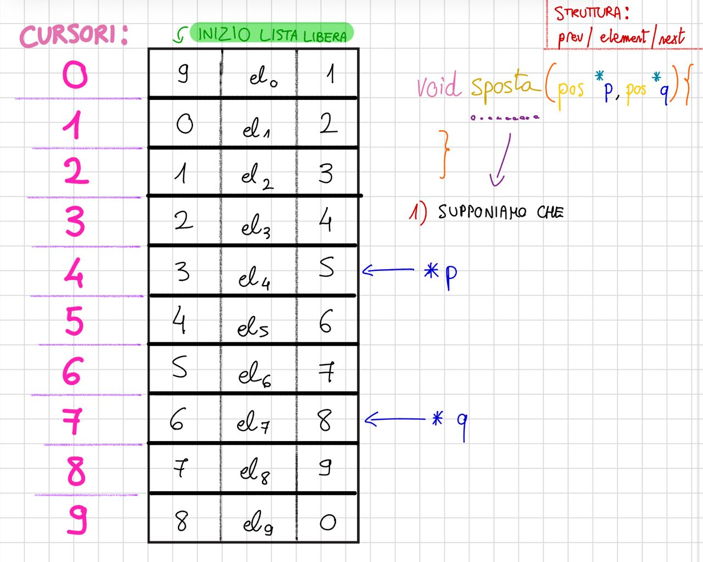

#### **Procedura di spostamento**

Obiettivo: **togliere la cella `*p` dalla sua posizione** e **reinserirla subito prima di `*q`**, aggiornando anche i due cursori nel chiamante.
Ci aspettiamo, come situazione finale dunque:

```c

void sposta(posizione *p, posizione *q) {
  posizione t;
  t = spazio[*p].next;


  spazio[spazio[*p].prev].next = spazio[*p].next;
  spazio[spazio[*p].next].prev = spazio[*p].prev;
  spazio[*p].prev = spazio[*q].prev;
  spazio[spazio[*q].prev].next = *p;
  spazio[*p].next = *q;
  spazio[*q].prev = *p;

  *q = *p;
  *p = t;
}
```

Di seguito una spiegazione dettagliata riga per riga:


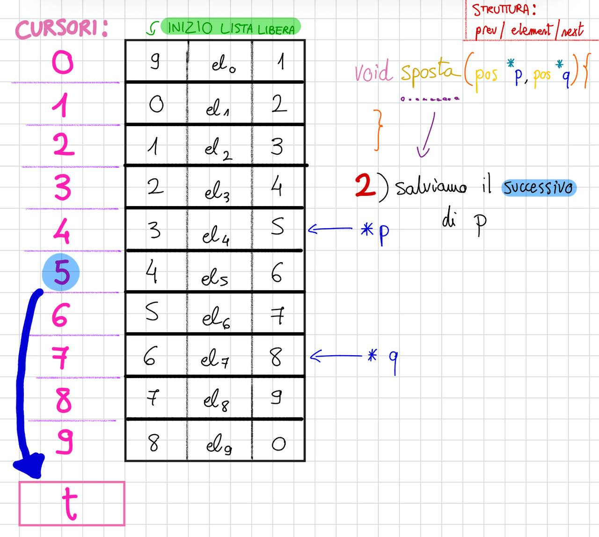

---

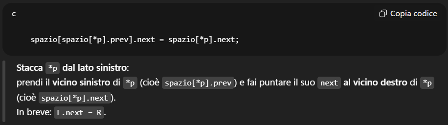

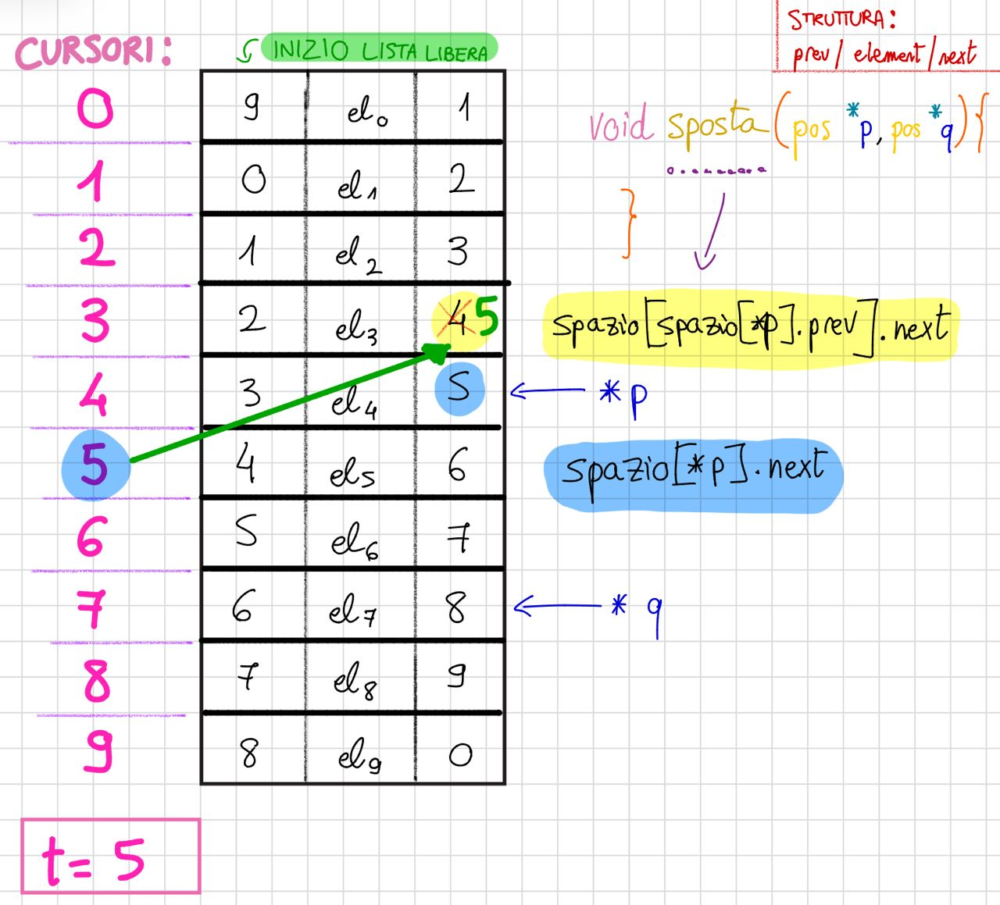

---


Avendo isolato la cella puntata da p, infatti, ora passiamo alla fase 2 del piano: inserirlo davvero prima della cella puntata da q.

---


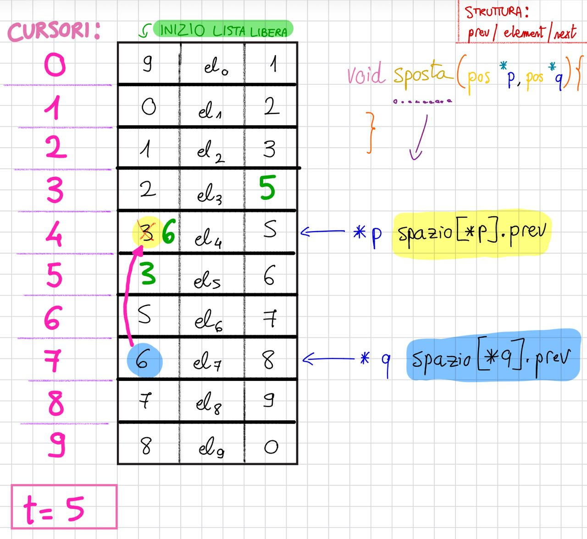

---

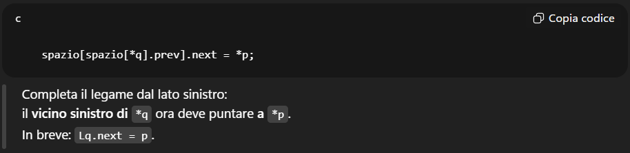

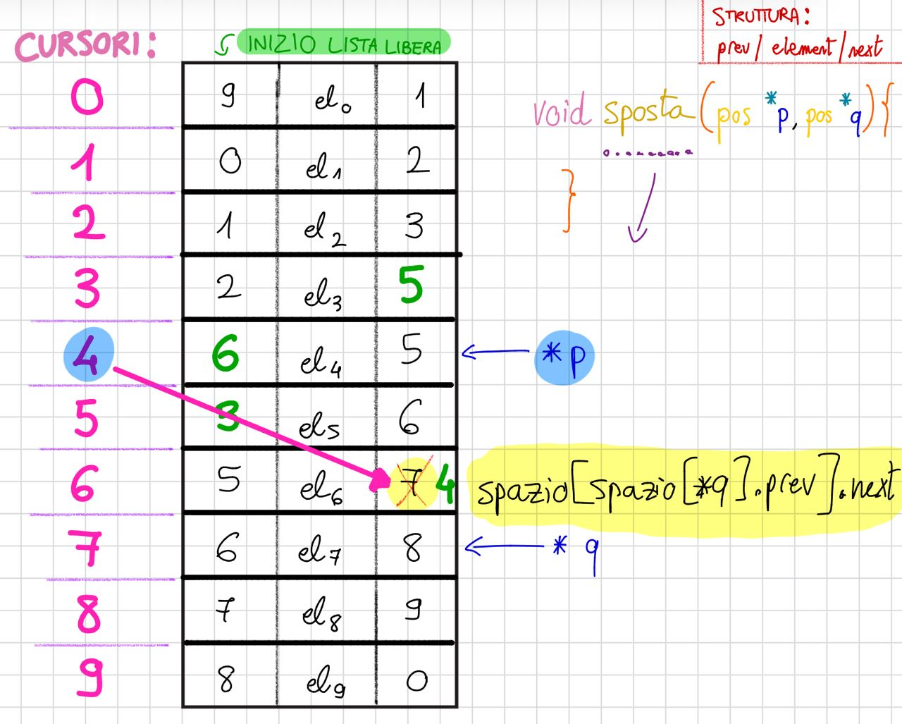

---

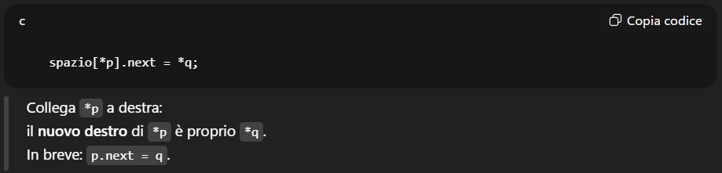

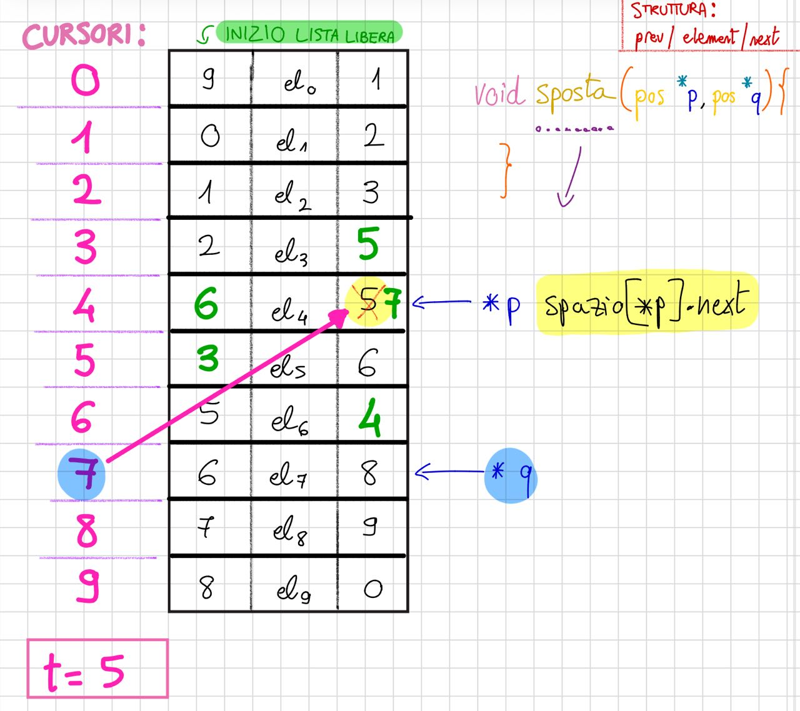

---


---


Ergo non punta più al nodo 7 bensì al 4:

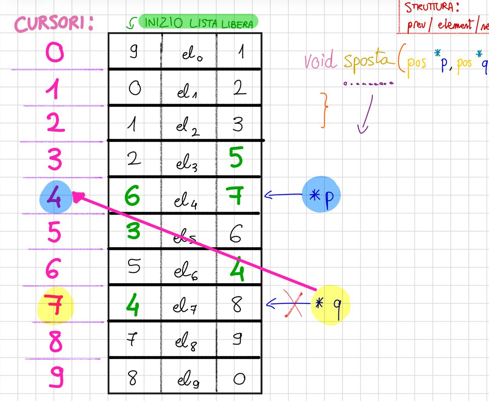

---

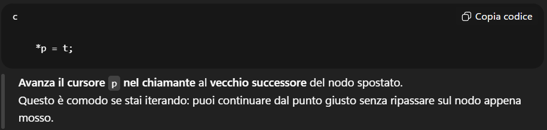

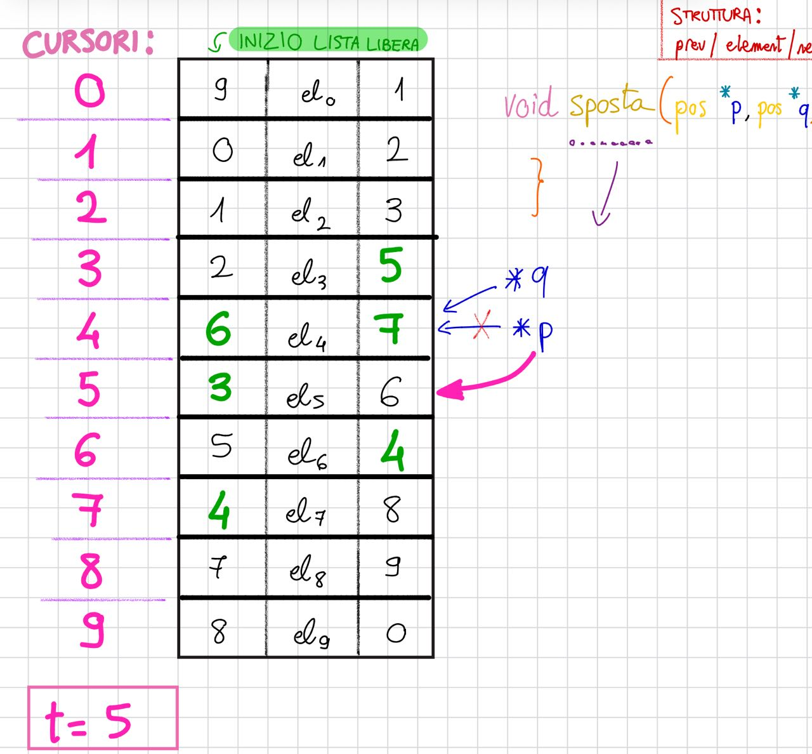

---

Quindi la situazione finale è la seguente:


---

#####  **Attenzione:**

Dopo le ultime due righe, `*q` vale il vecchio `*p` (il nodo appena spostato), e `*p` vale il vecchio `next` di `*p`. Quindi sì, a quel punto `*q` e `*p` sembrano "staccati" — uno nella destinazione, uno nella sorgente. Non stai più guardando una relazione di precedenza tra i due, stai solo avanzando due cursori su due "percorsi" diversi. La relazione `*p era prima di *q` era vera **prima** della chiamata, ed è quello che la funzione ha realizzato strutturalmente. Dopo, i cursori vengono riposizionati per il passo successivo, non per descrivere il risultato.

In sintesi: le ultime due righe non fanno parte dello spostamento, sono la **preparazione all'iterazione successiva**.

---

##### **3 modi equivalenti (scegli quello che ti serve)**

1. **“Pura” (nessun aggiornamento di cursori)**
2. La funzione fa **solo i relink** `prev/next` in `O(1)` e basta.
3. Decidi tu, **fuori**, come muovere `p` e `q`.

```c
void sposta_idx(posizione p, posizione q) {
    // sposta la cella p prima della cella q (entrambi indici, by-value)
    posizione L = spazio[p].prev, R = spazio[p].next;
    // stacca p
    spazio[L].next = R;
    spazio[R].prev = L;
    // inserisci p prima di q
    posizione Lq = spazio[q].prev;
    spazio[p].prev = Lq;
    spazio[p].next = q;
    spazio[Lq].next = p;
    spazio[q].prev = p;
}
// uso:
sposta_idx(p, q);
// poi decidi tu: p = next_salvato; q = p; oppure altro…
```

---

2. **“Con esito” (ritorna cosa _potresti_ voler fare)**

- La funzione fa i relink e **ti restituisce** valori utili per cursori; tu **puoi** usarli o ignorarli.

```c
typedef struct { posizione next_p; posizione new_q; } EsitoSposta;

EsitoSposta sposta_esito(posizione p, posizione q) {
    posizione t = spazio[p].next;
    sposta_idx(p, q);
    return (EsitoSposta){ .next_p = t, .new_q = p };
}
// uso:
EsitoSposta e = sposta_esito(p, q);
// se vuoi iterare in avanti:
p = e.next_p;  // opzionale
q = e.new_q;   // opzionale
```

---

3. **“Parametrizzata” (decidi con flag)**

- Stesso prototipo originale, ma **decidi tu** se aggiornare `p` e/o `q`.

```c
#include <stdbool.h>

void sposta_ctrl(posizione *p, posizione *q, bool upd_p, bool upd_q) {
    posizione t = spazio[*p].next;
    sposta_idx(*p, *q);
    if (upd_q) *q = *p;   // fai seguire q al nodo spostato
    if (upd_p) *p = t;    // fai avanzare p al vecchio successore
}
```

---

##### **Quando ha senso aggiornare (pattern tipici)**

- **Rimozione → lista libera:** `upd_p = true` (per continuare a scorrere la lista sorgente), `upd_q = true` (q “segue” l’ultimo inserito in free-list).
- **Inserzione da free-list → lista dati:** spesso `upd_p = true` (p scorre la free-list), `upd_q = true` (q resta vicino al punto di inserzione).
- **Spostamento singolo/isolato:** **nessun aggiornamento**; gestisci tu dopo la chiamata.

##### **Morale**

- Gli aggiornamenti di `*p` e `*q` **non sono necessari** alla correttezza dei link; servono solo a **comodità di chi itera**.
- Se “non vuoi mantenere quel controllo logico”, **non aggiornarli** in `sposta()` e muovi i cursori **esplicitamente** nel chiamante come preferisci.

---

### **6. Osservazioni finali**

#### **Equivalenza cursori ↔ puntatori**

| Operazione con puntatori | Equivalente con cursori       |
| ------------------------ | ----------------------------- |
| `p->next`                | `spazio[p].next`              |
| `p->next->prev`          | `spazio[spazio[p].next].prev` |

#### **Vantaggi e svantaggi**

- I **cursori** permettono di simulare puntatori in linguaggi che non li supportano (Fortran).

##### ⚙️ **Perché gli operatori restano efficienti ($O(1)$)**

Gli **operatori di base** — come:

- inserire un nodo tra due altri nodi,
- cancellare un nodo,
- spostare un nodo da una lista a un’altra —

agiscono **solo modificando pochi numeri interi (`prev` e `next`)**.

Esempio:

```c
spazio[a].next = b;
spazio[b].prev = a;
```

Queste operazioni:

- non richiedono cicli,
- non fanno scansioni,
- non dipendono dalla lunghezza della lista.

➡️ Quindi hanno **costo costante $O(1)$**,  
esattamente come se avessi usato puntatori veri (`p->next = q; q->prev = p;`).

---

##### 🧠 **Ma attenzione: l’accesso e la ricerca sono lineari ($O(n)$)**

Questo è il punto chiave.

Anche se le operazioni locali (`insert`, `delete`, `sposta`) sono costanti,  
**trovare un elemento** o **raggiungere la sua posizione** richiede di **scorrere la lista**.

Esempio:  
Vuoi cercare l’elemento che vale `42`.

```c
posizione p = inizio;
while (p != fine && spazio[p].elemento != 42) {
    p = spazio[p].next;
}
```

Questo ciclo passa da una cella all’altra:

- nel caso migliore → lo trova subito ($O(1)$),
- nel caso medio/peggiore → deve attraversare tutta la lista ($O(n)$).

💬 In altre parole:

> anche se puoi “tagliare e incollare” nodi in $O(1)$,  
> per _trovare_ dove tagliare o incollare devi comunque camminare uno per uno.

---

##### 📉 **Perché non puoi accedere direttamente a un elemento**

Nel C con **puntatori veri**, puoi avere un riferimento diretto:

```c
p = malloc(sizeof(cella));   // hai l’indirizzo reale
```

Nel modello con **cursori**, invece, l’unica cosa che hai è **l’indice numerico** di una cella nel vettore `spazio[]`.  
E se non sai già quale sia, non puoi “saltarci” con un indirizzo: devi **scorrere tutta la lista** per trovarlo.

---

## ⚖️ **5. Riassunto concettuale**

| Aspetto                             | Con cursori                                                            | Con puntatori                                               |
| :---------------------------------- | :--------------------------------------------------------------------- | :---------------------------------------------------------- |
| Struttura dati                      | Vettore di celle con indici `prev/next`                                | Celle allocate dinamicamente con `next/prev` come indirizzi |
| Inserimento / cancellazione         | $O(1)$                                                                 | $O(1)$                                                      |
| Spostamento di nodi                 | $O(1)$                                                                 | $O(1)$                                                      |
| Accesso a un elemento per posizione | $O(n)$                                                                 | $O(n)$                                                      |
| Allocazione dinamica                | Simulata (tramite lista libera)                                        | Vera (malloc / free)                                        |
| Vantaggio                           | Funziona anche in linguaggi senza puntatori, evita problemi di memoria | Accesso diretto alla memoria                                |
| Svantaggio                          | Devi gestire a mano la lista libera; ricerca lenta                     | Maggior complessità nella gestione di allocazioni           |

> I **cursori** sono un trucco per fare finta di avere puntatori.  
> Tutto quello che riguarda la **topologia** della lista (chi è vicino a chi) funziona in tempo costante.  
> Ma tutto quello che riguarda **il contenuto o la posizione** (chi contiene cosa o dove si trova un valore) richiede comunque di scorrere uno a uno: ed è lì che paghi $O(n)$.

---

### **7. Sintesi concettuale**

- Le **liste** sono la prima vera struttura dati del corso.
- Sono la base per pile, code e molte altre organizzazioni più complesse.
- Abbiamo visto come possono essere implementate **con puntatori** o **con cursori**.
- Gli operatori principali operano in **tempo costante** $O(1)$.
- L’accesso sequenziale resta la loro principale limitazione.

---

> Le liste incarnano l’idea stessa di “ordine dinamico”: dati che vivono, si muovono e si collegano.  
> Da qui in poi, ogni nuova struttura sarà solo un’evoluzione di questa semplice ma geniale intuizione.
