# **M2 UD2 Lezione 1 – Pile (Stacks)**

---

### **1. Definizione**

Una **pila** o **stack** è una sequenza di elementi dello stesso tipo in cui è possibile **inserire** o **rimuovere** elementi solo dalla **testa** della sequenza.

ATTENZIONE: il termine "testa" ovviamente non si riferisce a sx o dx: nelle liste, eravamo abituati a concepire, poiché era intuitivo, che:

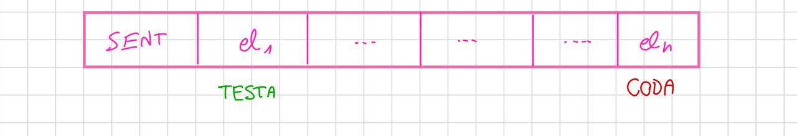

E poi veniva da sé che si potevano aggiungere elementi ovunque. Adesso, avendo una limitazione in fase di inserimento/rimozione, dobbiamo prestare più attenzione a cosa vuol dire testa:

Pensiamo sequenzialmente e visivamente: è possibile trasformare una lista bidirezionale con sentinella in una pila con pochi aggiustamenti?

$\rightarrow$ sì, a patto di ridefinire i punti critici che rispettano la sua specifica; MA NON E' L'UNICO MODO!
Infatti, se le liste erano realizzabili con vettori, logicamente anche le pile saranno emulabili in un qualche modo simile.
 
La regola prima citata realizza la cosiddetta logica **LIFO – Last In, First Out**, dove l’ultimo elemento entrato è il primo a uscire.

Esempio intuitivo:

$$  
[\text{base}] \ \longrightarrow a_1 \ \longrightarrow \ a_2 \ \longrightarrow \ a_3 (\text{top})  
$$


---

### **2. Specifica sintattica**

```text
creapila:      () → pila
pilavuota:     (pila) → booleano
leggipila:     (pila) → tipoelem
fuoripila:     (pila) → pila
inpila:        (tipoelem, pila) → pila
```

- `Λ` rappresenta la pila vuota
    
- `P` è una pila di elementi $a_i$ di tipo `tipoelem`
    
- `b` è un valore booleano

---

### **3. Specifica semantica**

```text
creapila() = P'
post: P' = Λ
```

```text
pilavuota(P) = b
post: b è vero sse P = Λ
```

```text
leggipila(P) = a
pre: P = a₁,…,aₙ con n ≥ 1
post: a = a₁
```

```text
fuoripila(P) = P'
pre: P = a₁,…,aₙ con n ≥ 1
post:
    P' = a₂,…,aₙ   se n > 1
    P' = Λ          se n = 1
```

```text
inpila(a, P) = P'
pre: P = a₁,…,aₙ con n ≥ 0
post: P' = a, a₁,…,aₙ
```

---

### **4. Realizzazione con liste**

Il tipo di dato **pila** può essere costruito riutilizzando gli **operatori delle liste**, con tutti i vantaggi della loro dinamicità.

|Operatore pila|Equivalente lista|
|---|---|
|`creapila`|`crealista`|
|`pilavuota(P)`|`listavuota(P)`|
|`leggipila(P)`|`leggilista(primolista(P), P)`|
|`fuoripila(P)`|`canclista(primolista(P), P)`|
|`inpila(a, P)`|`inslista(a, primolista(P), P)`|

> Tutte le operazioni hanno **complessità O(1)**.

#### **Criticità da risolvere**

Quando lavoravamo con le liste - bidirezionali con sentinella, come al solito ci riferiamo solo a queste - eravamo abituati, come già mostrato in precedenza, a una situazione simile:


Rivediamo tale logica usando degli alias, "cima" e "base", che siano semanticamente più comprensibili.

Inizialmente, una pila vuota apparirà come:

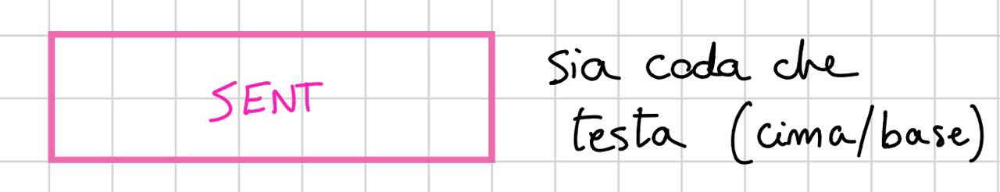

Dopo l'aggiunta del primo elemento, invece sarà:

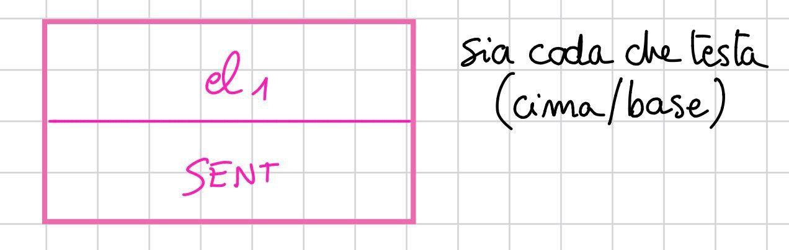

Dopo l'aggiunta di un secondo elemento, avremo poi:

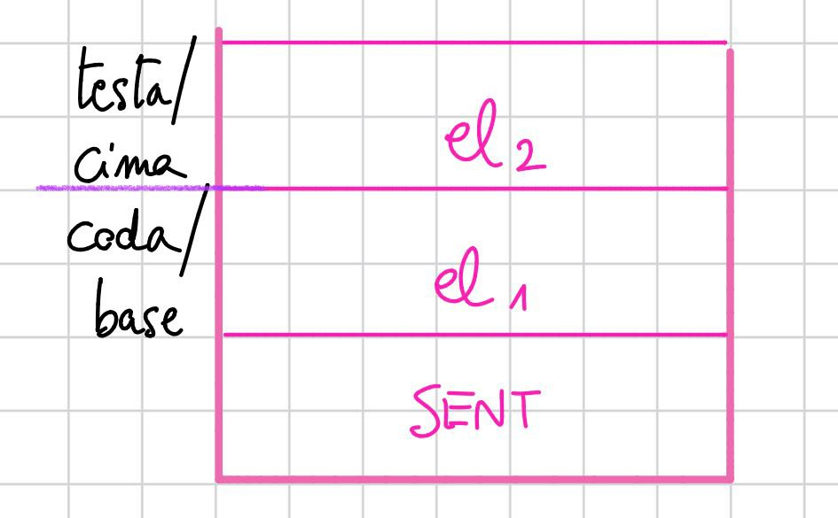

Finché poi potremo raggiungere una situazione del tipo:

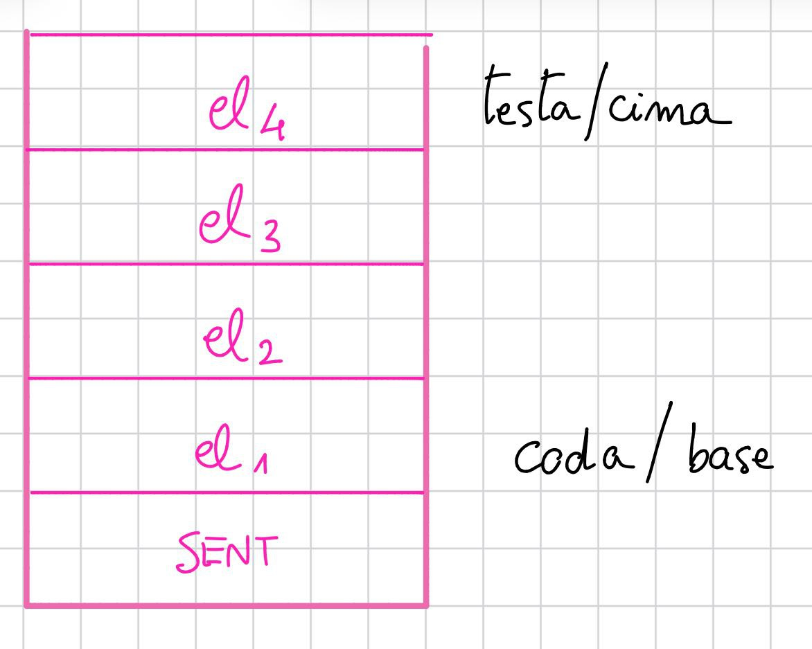

Ovviamente questa variazione di orientamento, da orizzontale a verticale, a noi poco importa: è pur sempre una struttura lineare, ovvero l'unica cosa che a noi interessa sia rispettata.
#### **Implementazione in C**

```c
#include <stdio.h>
#include <stdlib.h>
#include <stdbool.h>

// Obiettivo: partire dalla medesima struttura della lezione precedente,
// creare un alter ego di "lista" che rappresenti la pila, e implementare
// la politica LIFO che la caratterizza.

// Non ci resta che fare CTRL+V della lezione precedente...
typedef struct _cella {
    int elem;
    struct _cella *next, *prev;
} cella;

typedef cella* posizione;
typedef cella* lista;

void creaListaVuota(lista *L) {
    *L = malloc(sizeof(cella));
    if (!*L) { perror("malloc"); exit(1); }
    (*L)->next = *L;
    (*L)->prev = *L;
}

bool isListaVuota(lista L) {
    return L->next == L;
}

posizione primoNodo(lista L)   { return L->next; }
posizione ultimoNodo(lista L)  { return L->prev; }

posizione successivoDi(posizione p) { return p->next; }
posizione precedenteDi(posizione p) { return p->prev; }

bool fineLista(posizione p, lista L) { return p == L; }

int leggiElemLista(posizione p, lista L) {
    if (fineLista(p, L)) {
        fprintf(stderr, "Attenzione: sentinella raggiunta!\n");
        exit(1);
    }
    return p->elem;
}

void sovrascriviElemLista(int x, posizione p, lista L) {
    if (fineLista(p, L)) {
        fprintf(stderr, "Attenzione: scrittura sulla sentinella non consentita!\n");
        exit(1);
    }
    p->elem = x;
}

void insElemInListaPrimaDi(int x, posizione p) {
    posizione n = malloc(sizeof(cella));
    if (!n) { perror("malloc"); exit(1); }
    n->elem = x;
    
    n->next = p;
    n->prev = p->prev;

    p->prev->next = n;
    p->prev = n;
}

void cancElemLista(posizione p, lista L) {
    if (fineLista(p, L)) {
        fprintf(stderr, "Errore: tentativo di cancellare la sentinella!\n");
        exit(1);
    }

    p->prev->next = p->next;
    p->next->prev = p->prev;
    free(p);
}
```

Fin qui tutto identico all'implementazione passata.

Ora però, prima di procedere, è bene SOTTOLINEARE il punto cruciale, affinché non ci si confonda:

Il nostro metodo di inserimento, ovvero la funzione insElemInListaPrimaDi
è un metodo di inserimento IN CODA. Cioè visivamente:

### 📊 Schema visivo

#### Lista vuota

`[SENT]   ← sia testa che coda`

#### Dopo `push(1)`

`[SENT] ⇄ [1]`

#### Dopo `push(2)`

`[SENT] ⇄ [2] ⇄ [1]`

#### Dopo `push(3)`

`[SENT] ⇄ [3] ⇄ [2] ⇄ [1]`

Come si può ben osservare, si riempie da destra a sinistra: questo vuol dire che la nostra lista ha:

1) primoNodo, il next della sentinella, colui "a destra" = testa = cima della futura pila
2) ultimoNodo, il prev della sentinella, colui "a sinistra" = coda = base della futura pila

Questo è essenziale!

Ci aiuta infatti a capire che abbiamo commesso un piccolissimo errore in fase di design: i disegni di prima sono concettualmente sbagliati: la sentinella dovrebbe "innalzarsi", se trasliamo il precedente schema da orizzontale a verticale, e non rimanere sotto a tutti gli elementi: quello sarebbe il disegno che scaturirebbe se inserissimo gli elementi DOPO la posizione passata!

Situazione iniziale (fixed):


Dopo il primo push:

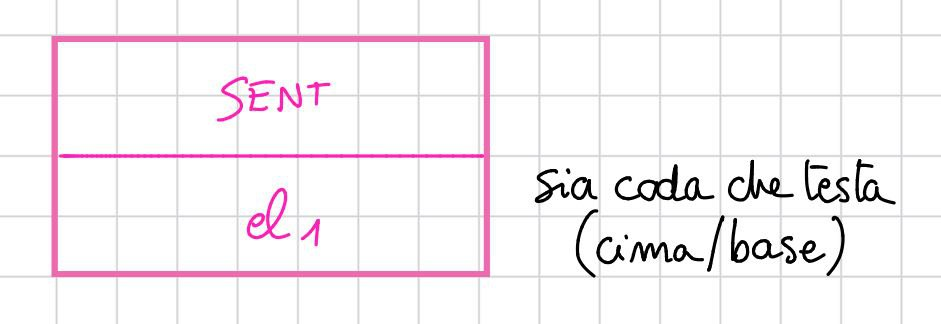

Dopo il secondo push:

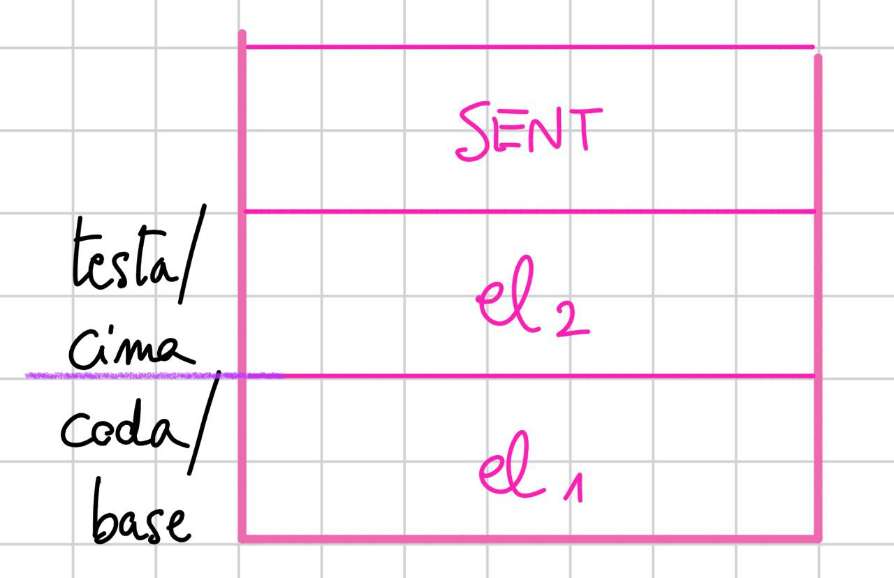

Etc...

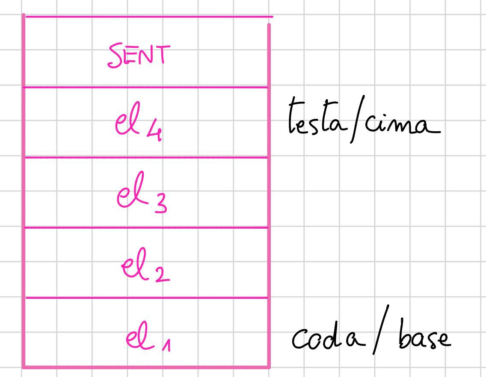

Come si può vedere, la politica LIFO è facilmente implementabile: si inserisce sempre PRIMA del PRIMONODO, e si cancella sempre il PRIMONODO per svuotare la pila.

Ora che abbiamo queste due regole d'oro, e che abbiamo due funzioni dedicati per realizzarle, è un batter d'occhio far partire la baracca!

```c
// =========================
//        P I L A  (LIFO)
// =========================

typedef lista pila;  // pila = lista con "cima" = primo nodo dopo la sentinella

// Crea una pila vuota (solo sentinella)
void creaPilaVuota(pila *P) {
    creaListaVuota(P);
}

// true se non ci sono nodi "veri"
bool isPilaVuota(pila P) {
    return isListaVuota(P);
}

// Legge il qualsiasi elemento (senza rimuoverlo)
int leggiElemInPosizione(posizione p, pila P) {
    return leggiElemLista(p, P);
}

// Legge (senza rimuovere) l'elemento in cima
int leggiElemInCima(pila P) {
    if (isPilaVuota(P)) {
        fprintf(stderr, "Errore: leggiElemInCima su pila vuota!\n");
        exit(1);
    }
    return leggiElemLista(primoNodo(P), P);
}

// Legge (senza rimuovere) l'elemento in fondo
int leggiElemAllaBase(pila P) {
    if (isPilaVuota(P)) {
        fprintf(stderr, "Errore: leggiElemAllaBase su pila vuota!\n");
        exit(1);
    }
    return leggiElemLista(ultimoNodo(P), P);
}

// Pop: rimuove l'elemento in cima
void poppaDallaCima(pila P) {
    if (isPilaVuota(P)) {
        fprintf(stderr, "Warning: pop su pila vuota ignorato.\n");
        return;
    }
    cancElemLista(primoNodo(P), P);  // passa anche P per bloccare la sentinella
}

// Push: inserisce in cima (subito dopo la sentinella)
void pushaInCima(int x, pila P) {
    // Inseriamo un nuovo nodo PRIMA della posizione passata.
    // Se P è vuota, primoNodo(P) == sentinella: va benissimo.
    insElemInListaPrimaDi(x, primoNodo(P));
}

// (opzionale) Svuota la pila e libera anche la sentinella
void distruggiPila(pila *P) {
    if (!*P) return;
    posizione cur = successivoDi(*P);
    
    while (!fineLista(cur, *P)) {
        posizione nxt = successivoDi(cur);
        cancElemLista(cur, *P);
        cur = nxt;
    }
    free(*P);   // libera la sentinella
    *P = NULL;
}
```

Per la fase di testing servirà anche una funzione di stampa ben formattata.
  
```c
// Funzioni di stampa:

// Vogliamo realizzare una funzione di stampa che:

// 1) Se la pila è vuota, stampa: "Pila = [ Sentinella P ]"
// 2) Altrimenti, stampa:

//    a) Se la pila ha un solo elemento:
//       "Pila = [ Sentinella P ] [ <elemento1> (sia cima che base) ]

//    b) Se la pila ha più elementi:
//       "Pila = [ Sentinella P ] [ <elemento1> (cima), <elemento2>, ..., <elementoN> (base) ]"

void stampaPila(pila P) {

    printf("Pila = [ Sentinella P ]");
    if (isPilaVuota(P)) {
        printf("\n\n");
        return;
    }

    printf("  [ ");
    posizione cur = primoNodo(P);
    while (!fineLista(cur, P)) {
        int elem = leggiElemInPosizione(cur, P);   // ✅ usa la funzione pubblica della pila
        bool isTop  = (cur == primoNodo(P));
        bool isBase = (cur == ultimoNodo(P));

        if (isTop && isBase) {
            printf("%d (sia cima che base) ]", elem);
        } else if (isTop) {
            printf("%d (cima) ]", elem);
        } else if (isBase) {
            printf("%d (base) ]", elem);
        } else {
            printf("%d ]", elem);
        }

        cur = successivoDi(cur);
        if (!fineLista(cur, P)) printf("  [ ");
    }
    printf("\n\n");
}
```

E finalmente:

```c
// Facciamo una demo per le nostre geniali elucubrazioni:

int main() {

    pila P;
    creaPilaVuota(&P);

    // Stampiamo lo stato iniziale:
    stampaPila(P);
    // Riempiamo con un ciclo una pila di 10elementi da 10 a 100, e a ogni iterazione la stampiamo evidenziando la cima e la base:
    for (int i = 1; i <= 10; i++) {
        pushaInCima(i * 10, P);
        stampaPila(P);
    }
    return 0;
}
```

In console vedremo che tutto fila!

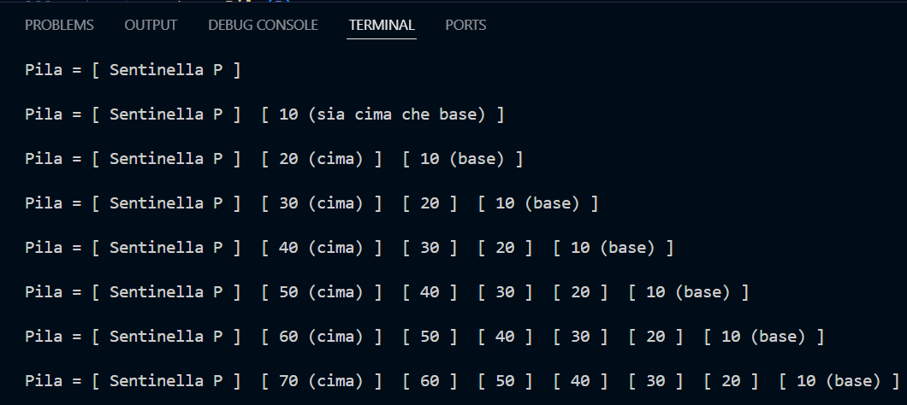


---

### **5. Realizzazione con vettore**

Se si preferisce evitare i puntatori, la pila può essere realizzata anche con un **vettore**.  
Gli elementi vengono memorizzati **in ordine inverso** nelle prime posizioni di un array di dimensione massima `maxlung`.  
Un cursore `testa` indica la **prima posizione libera**.

- **Pila vuota:** `testa = 0`
    
- **Pila piena:** `testa = maxlung`
    

#### **Implementazione in C**

```c
#include <stdio.h>
#include <stdlib.h>
#include <stdbool.h>

#define maxlung 10

// La struttura della pila vettoriale si presenta così:
typedef struct _pila {
    int testa;
    int elementi[maxlung];
} pila;

void creaPilaVuota(pila *P) {
    P->testa = 0;
}

bool isPilaVuota(pila *P) {
    return (P->testa == 0);
}

int leggiElementoInCima(pila *P) {
    if (!isPilaVuota(P))
        return P->elementi[P->testa - 1];
    else {
        printf("Pila vuota: impossibile leggere elemento\n");
        exit(1);
    }
}

void poppaDallaCima(pila *P) {
    if (!isPilaVuota(P))
        P->testa--;
}

void impilaInCima(int elem, pila *P) {
    if (P->testa == maxlung)
        printf("Pila piena: impossibile impilare l'elemento %d\n", elem);
    else {
        P->elementi[P->testa] = elem;
        P->testa++;
    }
}

// Vogliamo realizzare una funzione di stampa che:
// 1) Se la pila è vuota, stampa: "Pila vuota (testa = 0)"
// 2) Altrimenti, stampa: 
// "Pila con N/maxlung elementi: [ elem1 i=0 ] [ elem2 i=1 ] ..., [ elemN i=N-1 ] (testa = <testa>)"

void stampaPila(pila *P) {
    if (isPilaVuota(P)) {
        printf("Pila vuota (testa = 0)\n");
    } else {
        printf("Pila con %d/%d elementi: ", P->testa, maxlung);
        for (int i = 0; i < P->testa; i++) {
            printf(" [ %d i=%d ]", P->elementi[i], i);
        }
      }
	  printf(" ] (testa = %d)\n", P->testa);
}

// Facciamo una demo per le nostre geniali elucubrazioni:
int main() {
    pila P;
    creaPilaVuota(&P);
    // Stampiamo lo stato iniziale:
    stampaPila(&P);
    // Riempiamo con un ciclo una pila di 10 elementi da 10 a 100, e a ogni iterazione la stampiamo:
    for (int i = 1; i <= 10; i++) {
        impilaInCima(i * 10, &P);
        stampaPila(&P);
    }

// Proviamo a impilare un undicesimo elemento per vedere il messaggio di pila piena:
    impilaInCima(110, &P);
    
// Infine poppiamo tutti gli elementi uno alla volta, stampando lo stato della pila ad ogni iterazione:
	for (int i = 10; i >= 1; i--) {
        poppaDallaCima(&P);
        stampaPila(&P);
    }
    return 0;
}
```

Vedremo in console proprio il risultato desiderato:

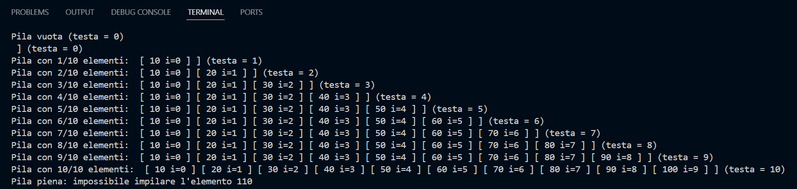

E a seguire:

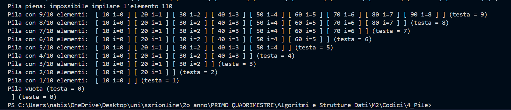

---

### **6. Osservazioni**

- Tutti gli operatori rispettano le pre/postcondizioni definite nella semantica
    
- Ogni operazione ha **costo O(1)**
    
- Il limite principale è la **dimensione fissa** della pila nel caso vettoriale
    
- Un valore `maxlung` troppo grande può causare **spreco di memoria**

---

### **7. In sintesi**

- Introdotto il **tipo di dato pila**
    
- Viste due realizzazioni equivalenti: **con liste** e **con vettore**
    
- Applicazioni principali:
    
    - Stack per **programmazione ricorsiva**
        
    - **Garbage collector** nei linguaggi gestiti
        
    - Struttura ausiliaria in **molti algoritmi** (es. DFS, conversioni infissa–postfissa)

---

> La pila è una struttura “disciplinata”: accetta solo l’ultimo arrivato e rilascia solo da un lato.  
> Comprenderla è il primo passo per dominare il comportamento dello **stack di esecuzione** dei programmi e il flusso della memoria dinamica.