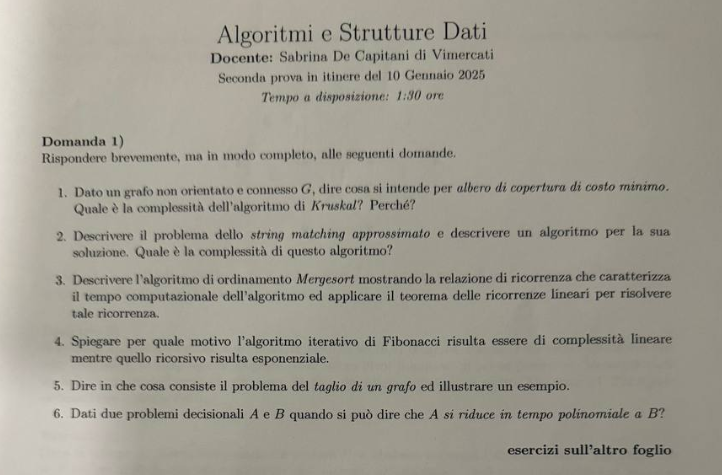
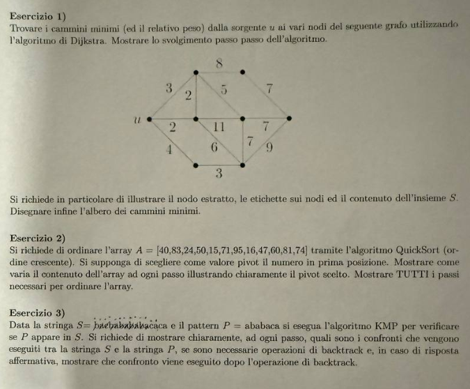

# Soluzione della seconda prova in itinere — 10 gennaio 2025

Prova di **Algoritmi e Strutture Dati**, durata dichiarata: 1 ora e 30 minuti. La traccia è composta da sei domande di teoria e tre esercizi.

### **1. Domande di teoria**

#### **1.1. Minimum Spanning Tree e algoritmo di Kruskal**

**Traccia.** Definire il problema del Minimum Spanning Tree. Descrivere l'algoritmo di Kruskal, indicarne la complessità e motivarla.

> **Riferimenti di teoria:** [M08 — Kruskal](../../M08_Greedy/UD2/L1_Algoritmo_di_Kruskal.md), [M05 — MFSET](../../M05_DS_Orizzontali/UD1/L3_MFSET.md).

Dato un grafo non orientato, connesso e pesato $G=(V,E,w)$, un albero ricoprente è un sottografo aciclico e connesso che contiene tutti i vertici. Ogni albero ricoprente ha $|V|-1$ archi. Il problema MST richiede di minimizzare

$$
\sum_{e\in T}w(e)
$$

tra tutti gli alberi ricoprenti $T$ di $G$.

Kruskal parte da una foresta di $|V|$ componenti singole, ordina gli archi per peso non decrescente e li esamina in tale ordine. Un arco $(u,v)$ viene aggiunto se $u$ e $v$ appartengono a componenti diverse; le componenti vengono quindi fuse. `TROVA` e `FONDI` di MFSET consentono di eseguire il test senza cercare esplicitamente un cammino.

L'ordinamento costa $O(|E|\log|E|)$. Le operazioni MFSET con compressione dei cammini e unione per rango costano complessivamente $O(|E|\alpha(|V|))$, quasi lineare. Domina quindi l'ordinamento:

$$
O(|E|\log|E|)=O(|E|\log|V|),
$$

poiché in un grafo semplice $|E|<|V|^2$. La scelta è corretta per la proprietà del taglio: il più leggero arco che collega due componenti correnti è sicuro per almeno un MST.

#### **1.2. String matching approssimato**

**Traccia.** Definire il problema dello string matching approssimato. Descrivere un algoritmo e indicarne la complessità.

> **Riferimento di teoria:** [M10 — String matching approssimato](../../M10_Programmazione_Dinamica/UD2/L1_Algoritmo_per_StringMatching_approssimato.md).

Dati un testo $T=t_1\ldots t_n$ e un pattern $P=p_1\ldots p_m$, si cerca una sottostringa del testo che sia quanto più possibile simile al pattern secondo una distanza, tipicamente la distanza di edit: inserimento, cancellazione e sostituzione hanno costo unitario.

Si costruisce una matrice $D$ in cui $D[i,j]$ è il costo minimo per trasformare $p_1\ldots p_i$ nel prefisso di testo considerato fino a $t_j$. La ricorrenza è

$$
D[i,j]=\min\begin{cases}
D[i-1,j]+1 & \text{cancellazione},\\
D[i,j-1]+1 & \text{inserimento},\\
D[i-1,j-1]+[p_i\ne t_j] & \text{corrispondenza o sostituzione}.
\end{cases}
$$

Per cercare il pattern dentro il testo, e non soltanto confrontare due stringhe intere, si inizializza la prima riga a zero, consentendo alla corrispondenza di iniziare in qualunque posizione. Il minimo dell'ultima riga determina il miglior allineamento; risalendo le scelte si ricostruiscono le operazioni. La tabella ha $(m+1)(n+1)$ celle: tempo $\Theta(mn)$, spazio $\Theta(mn)$, riducibile a $\Theta(m)$ se serve solo il costo.

#### **1.3. MergeSort e ricorrenza**

**Traccia.** Descrivere MergeSort, fornire la relazione di ricorrenza e risolverla con il teorema delle ricorrenze lineari.

> **Riferimento di teoria:** [M07/UD2 — Mergesort](../../M07_Divide_et_Impera/UD2/L1_Merge_sort.md).

MergeSort divide il vettore in due metà, le ordina ricorsivamente e le fonde in tempo lineare. Per $n>1$:

$$
T(n)=2T(n/2)+\Theta(n),\qquad T(1)=\Theta(1).
$$

Nel teorema $a=2$, $b=2$ e $f(n)=\Theta(n)$. Poiché $n^{\log_ba}=n$, $f(n)=\Theta(n^{\log_ba})$ e si ottiene

$$
T(n)=\Theta(n\log n).
$$

Il risultato vale nei casi migliore, medio e peggiore: anche un vettore ordinato viene suddiviso e fuso integralmente.

#### **1.4. Fibonacci iterativo e ricorsivo**

**Traccia.** Spiegare perché il calcolo iterativo di Fibonacci è lineare mentre quello ricorsivo è esponenziale.

> **Riferimento di teoria:** [Approfondimento — Fibonacci](../Approfondimenti_per_Esame/L3%20-%20Fibonacci%20iterativo%20ricorsivo%20e%20dinamico.md).

L'algoritmo iterativo calcola una volta sola ciascuno dei valori $F_2,\ldots,F_n$ e mantiene gli ultimi due: $\Theta(n)$ tempo e $\Theta(1)$ spazio. La ricorsione ingenua esegue invece entrambe le chiamate `FIB(n-1)` e `FIB(n-2)` senza ricordare i risultati. La sua ricorrenza

$$
T(n)=T(n-1)+T(n-2)+\Theta(1)
$$

genera un albero di chiamate con numerosi sottoproblemi duplicati e dà $T(n)=\Theta(\varphi^n)$. Memoizzazione o programmazione dinamica eliminano le ripetizioni e riportano il costo a $\Theta(n)$.

#### **1.5. Taglio di un grafo**

**Traccia.** Definire il taglio di un grafo e fornire un esempio.

> **Riferimento di teoria:** [Approfondimento — Tagli e Prim](../Approfondimenti_per_Esame/L2%20-%20Algoritmo%20di%20Prim%20e%20propriet%C3%A0%20del%20taglio.md).

Un taglio di $G=(V,E)$ è una partizione $(S,V\setminus S)$ con $\varnothing\ne S\ne V$. Un arco attraversa il taglio se ha un estremo in ciascuna parte. Per $V=\{a,b,c,d\}$, scegliendo $S=\{a,b\}$ e $V\setminus S=\{c,d\}$, gli archi $ac$, $ad$, $bc$ e $bd$ eventualmente presenti attraversano il taglio; $ab$ e $cd$ no.

Negli MST è fondamentale la proprietà del taglio: un arco di peso minimo tra quelli che attraversano un taglio compatibile con le scelte correnti è sicuro.

#### **1.6. Riduzione polinomiale**

**Traccia.** Quando un problema $A$ è polinomialmente riducibile a un problema $B$?

> **Riferimento di teoria:** [M11 — Classi P e NP](../../M11_Teoria_Complessita/UD2/L1_Classi_P_e_NP.md).

Si scrive $A\le_p B$ se esiste una trasformazione $f$, calcolabile in tempo polinomiale, tale che per ogni istanza $x$:

$$
x\in A \iff f(x)\in B.
$$

La trasformazione conserva quindi esattamente le risposte sì/no. Se $A\le_pB$ e $B$ si risolve in tempo polinomiale, anche $A$ è in P: si calcola $f(x)$ e si risolve l'istanza risultante di $B$. Per dimostrare che $B$ è almeno difficile quanto $A$, la direzione corretta è da $A$ verso $B$, non viceversa.

### **2. Esercizio 1 — Dijkstra**

**Traccia.** Applicare Dijkstra al grafo non orientato e pesato della figura, usando $u$ come sorgente, e mostrare tutti i passi.

Poiché nella fotografia i sette vertici diversi da $u$ non hanno etichetta, li denominiamo in base alla posizione: $a$ alto-sinistra, $b$ alto-destra, $c$ centro-sinistra, $d$ centro, $e$ destra, $f$ basso-sinistra, $g$ basso-destra. Gli archi letti dalla figura sono:

$$
\begin{aligned}
&ua=3,\ uc=2,\ uf=4,\ ab=8,\ ac=2,\ ad=5,\\
&cd=11,\ cg=6,\ de=7,\ dg=7,\ be=7,\ eg=9,\ fg=3.
\end{aligned}
$$

La tabella usa $\infty$ per i vertici non ancora raggiunti. Tra parentesi è indicato il predecessore.

| Vertice estratto | $a$ | $b$ | $c$ | $d$ | $e$ | $f$ | $g$ |
|---|---:|---:|---:|---:|---:|---:|---:|
| iniziale | $\infty$ | $\infty$ | $\infty$ | $\infty$ | $\infty$ | $\infty$ | $\infty$ |
| $u$ | $3(u)$ | $\infty$ | $2(u)$ | $\infty$ | $\infty$ | $4(u)$ | $\infty$ |
| $c$ | $3(u)$ | $\infty$ | definitivo $2$ | $13(c)$ | $\infty$ | $4(u)$ | $8(c)$ |
| $a$ | definitivo $3$ | $11(a)$ | — | $8(a)$ | $\infty$ | $4(u)$ | $8(c)$ |
| $f$ | — | $11(a)$ | — | $8(a)$ | $\infty$ | definitivo $4$ | $7(f)$ |
| $g$ | — | $11(a)$ | — | $8(a)$ | $16(g)$ | — | definitivo $7$ |
| $d$ | — | $11(a)$ | — | definitivo $8$ | $15(d)$ | — | — |
| $b$ | — | definitivo $11$ | — | — | $15(d)$ | — | — |
| $e$ | — | — | — | — | definitivo $15$ | — | — |

Ordine di estrazione: $u,c,a,f,g,d,b,e$. Le distanze finali sono

$$
d(u)=0,\ d(c)=2,\ d(a)=3,\ d(f)=4,\ d(g)=7,\ d(d)=8,\ d(b)=11,\ d(e)=15.
$$

L'albero dei cammini minimi contiene $uc$, $ua$, $uf$, $fg$, $ad$, $ab$, $de$. Per esempio, il cammino minimo verso $e$ è $u-a-d-e$ e pesa $3+5+7=15$.

### **3. Esercizio 2 — QuickSort con primo pivot**

**Traccia.** Ordinare in senso crescente

$$
[40,83,24,50,15,71,95,16,47,60,81,74]
$$

con QuickSort, scegliendo come pivot il primo elemento di ogni sottovettore, e mostrare tutti i passi.

> **Riferimento di teoria:** [M07/UD2 — Quicksort](../../M07_Divide_et_Impera/UD2/L2_Quick_sort.md).

Adottiamo la convenzione dichiarata nella lezione: elementi $\le p$, pivot, elementi $>p$, conservando l'ordine relativo. Gli elementi sono distinti.

1. pivot $40$:
   $[24,15,16,\mathbf{40},83,50,71,95,47,60,81,74]$;
2. nel blocco $[24,15,16]$, pivot $24$:
   $[15,16,\mathbf{24},40,83,50,71,95,47,60,81,74]$;
3. nel blocco $[15,16]$, pivot $15$: la configurazione non cambia;
4. nel blocco destro, pivot $83$:
   $[15,16,24,40,50,71,47,60,81,74,\mathbf{83},95]$;
5. nel blocco $[50,71,47,60,81,74]$, pivot $50$:
   $[15,16,24,40,47,\mathbf{50},71,60,81,74,83,95]$;
6. nel blocco $[71,60,81,74]$, pivot $71$:
   $[15,16,24,40,47,50,60,\mathbf{71},81,74,83,95]$;
7. nel blocco $[81,74]$, pivot $81$:
   $[15,16,24,40,47,50,60,71,74,\mathbf{81},83,95]$.

Il vettore ordinato è quindi

$$
[15,16,24,40,47,50,60,71,74,81,83,95].
$$

### **4. Esercizio 3 — KMP**

**Traccia.** Applicare KMP a $S=\texttt{baebabababacaca}$ e $P=\texttt{ababaca}$, mostrando tutti i passi e, in particolare, il confronto eseguito dopo il backtracking.

La funzione prefisso del pattern è

| $j$ | 0 | 1 | 2 | 3 | 4 | 5 | 6 |
|---:|---:|---:|---:|---:|---:|---:|---:|
| $P[j]$ | a | b | a | b | a | c | a |
| $\pi[j]$ | 0 | 0 | 1 | 2 | 3 | 0 | 1 |

Indichiamo con $q$ la lunghezza del prefisso già riconosciuto.

| $i$ | $S[i]$ | Operazione | Nuovo $q$ |
|---:|:---:|---|---:|
| 0 | b | `b` $\ne P[0]=$ `a` | 0 |
| 1 | a | corrisponde a $P[0]$ | 1 |
| 2 | e | `e` $\ne P[1]$; fallback a $q=0$; `e` $\ne P[0]$ | 0 |
| 3 | b | `b` $\ne P[0]$ | 0 |
| 4 | a | match | 1 |
| 5 | b | match | 2 |
| 6 | a | match | 3 |
| 7 | b | match | 4 |
| 8 | a | match | 5 |
| 9 | b | mismatch con $P[5]=$ `c`; fallback $q=\pi[4]=3$; **si confronta ancora lo stesso `b` con $P[3]=$ `b`**, match | 4 |
| 10 | a | match | 5 |
| 11 | c | match | 6 |
| 12 | a | match completo | 7 |

Il pattern termina all'indice $12$, quindi inizia a

$$
12-7+1=6
$$

con indici da zero, ossia in **settima posizione** con indici da uno. La sottostringa $S[6..12]$ è `ababaca`. Il punto cruciale è che al mismatch $i=9$ l'indice del testo non arretra: KMP riusa il bordo di lunghezza 3 e confronta nuovamente lo stesso carattere con la nuova posizione del pattern. Complessità $\Theta(|S|+|P|)$.

### **5. Verifica finale**

- Kruskal: complessità motivata dall'ordinamento e da MFSET.
- Dijkstra: tutte le distanze soddisfano le disuguaglianze triangolari sugli archi.
- QuickSort: risultato crescente e multinsieme invariato.
- KMP: occorrenza verificata direttamente in $S[6..12]$.

### **6. Fonti fotografiche originali**

