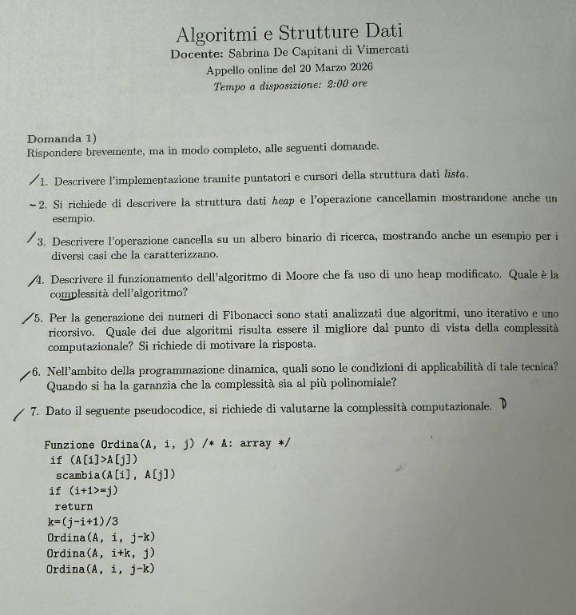
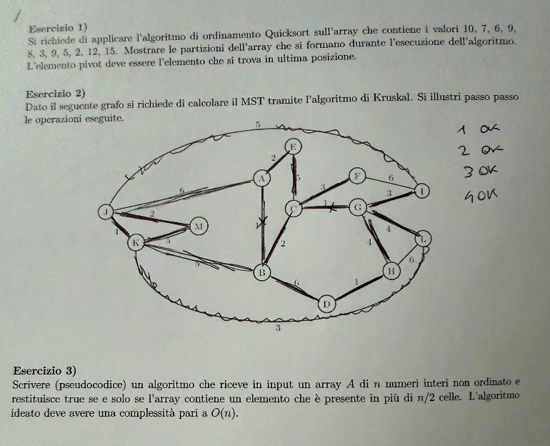

# Soluzione dell'appello online — 20 marzo 2026

Appello di **Algoritmi e Strutture Dati**, durata dichiarata: 2 ore. La traccia contiene sette domande di teoria e tre esercizi.

### **1. Domande di teoria**

#### **1.1. Liste con puntatori e con cursori**

**Traccia.** Descrivere le implementazioni delle liste tramite puntatori e tramite cursori, evidenziando analogie e differenze.

> **Riferimento di teoria:** [M02 — Liste](../../M02_DS_Lineari/UD1/L1/L1_Liste.md).

Nella rappresentazione a puntatori ogni nodo occupa memoria dinamica e contiene valore e indirizzo del successivo, eventualmente anche del precedente. Inserimento o cancellazione in una posizione già nota richiedono $O(1)$ aggiornamenti; la ricerca di una posizione costa $O(n)$. I nodi non devono essere contigui.

La rappresentazione a cursori simula i collegamenti dentro un array: al posto di un indirizzo si memorizza l'indice della cella successiva. Le celle libere sono mantenute in una free-list. Anche qui il collegamento logico è indipendente dall'ordine fisico, ma la capacità è fissata o richiede ridimensionamento; in compenso non si usano puntatori reali e la memoria è controllata esplicitamente.

Entrambe realizzano la stessa astrazione e consentono concatenamenti; cambiano il dominio dei riferimenti, la gestione dello spazio e i vincoli di capacità.

#### **1.2. Heap e `CANCELLAMIN`**

**Traccia.** Definire il min-heap e descrivere `CANCELLAMIN` con un esempio.

> **Riferimento di teoria:** [M03 — Heap](../../M03_DS_Alberi/UD2/L1_Heap.md).

Un min-heap è un albero binario completo in cui ogni nodo ha chiave non maggiore di quelle dei figli. In un vettore con indici da 1, i figli di $i$ sono $2i$ e $2i+1$; il minimo è alla radice.

`CANCELLAMIN` salva la radice, sposta l'ultimo elemento nella radice, riduce la dimensione e lo fa scendere scambiandolo con il figlio di chiave minore finché la proprietà è ripristinata.

Esempio: da $[2,5,4,9,7,8]$, rimosso 2 e portato 8 in radice si ha $[8,5,4,9,7]$; si scambia con 4 e si ottiene $[4,5,8,9,7]$. L'altezza è $\Theta(\log n)$, dunque `CANCELLAMIN` costa $O(\log n)$.

#### **1.3. Cancellazione in un BST**

**Traccia.** Descrivere i casi della cancellazione in un albero binario di ricerca.

> **Riferimento di teoria:** [M05 — Alberi di ricerca](../../M05_DS_Orizzontali/UD3/L1_Alberi_bilanciati_di_ricerca.md).

Trovato il nodo $z$:

1. se è foglia, lo si scollega;
2. se ha un solo figlio, il figlio prende il posto di $z$;
3. se ha due figli, si sostituisce la chiave con il successore inordine, cioè il minimo del sottoalbero destro, oppure simmetricamente con il predecessore; si elimina poi quel nodo, che ha al massimo un figlio.

Il costo è $O(h)$, dove $h$ è l'altezza: $O(\log n)$ in un albero bilanciato, $O(n)$ nel caso degenerato.

#### **1.4. Moore con heap**

**Traccia.** Descrivere la modifica di Moore mediante heap e analizzarne la complessità.

> **Riferimento di teoria:** [M08 — Algoritmo di Moore](../../M08_Greedy/UD3/L1_Algoritmo_di_Moore.md).

Moore ordina i lavori per scadenza non decrescente. Mantiene il tempo cumulato e un max-heap delle durate dei lavori provvisoriamente puntuali. Inserisce ciascun lavoro; se il tempo supera la scadenza corrente, estrae dal heap il lavoro di durata massima e ne sottrae la durata dal totale. I lavori estratti saranno collocati in coda come tardivi.

L'ordinamento costa $O(n\log n)$. Ogni lavoro causa un inserimento $O(\log n)$ e al più un'estrazione $O(\log n)$; il totale resta $O(n\log n)$. Rispetto alla ricerca lineare del massimo, il heap evita un possibile costo quadratico.

#### **1.5. Fibonacci iterativo e ricorsivo**

**Traccia.** Confrontare le versioni iterativa e ricorsiva di Fibonacci e indicare quale sia computazionalmente migliore.

> **Riferimento di teoria:** [Approfondimento — Fibonacci](../Approfondimenti_per_Esame/L3%20-%20Fibonacci%20iterativo%20ricorsivo%20e%20dinamico.md).

La versione iterativa produce una volta sola ogni termine e conserva due valori: $\Theta(n)$ tempo, $\Theta(1)$ spazio. La ricorsione ingenua soddisfa

$$
T(n)=T(n-1)+T(n-2)+\Theta(1)=\Theta(\varphi^n)
$$

e usa stack $\Theta(n)$, perché ricalcola gli stessi termini. La versione iterativa è quindi migliore tra le due. Memoizzazione e tabulazione possono rendere lineare anche il calcolo derivato dalla ricorrenza.

#### **1.6. Applicabilità della programmazione dinamica**

**Traccia.** Quando è applicabile la programmazione dinamica? Garantisce sempre complessità polinomiale?

> **Riferimento di teoria:** [M10 — Programmazione dinamica](../../M10_Programmazione_Dinamica/UD1/L1_Progetto_di_algo_per_programmazione_dinamica.md).

È applicabile quando la soluzione si compone da sottoproblemi con sottostruttura ottima e quando tali sottoproblemi si sovrappongono, così da trarre vantaggio dal memorizzarli. Si devono poter definire stati sufficienti, transizioni corrette, casi base e un ordine aciclico di valutazione.

Non garantisce automaticamente tempo polinomiale rispetto alla lunghezza dell'input. Il costo è, in prima approssimazione,

$$
\text{numero di stati}\times\text{costo per stato}.
$$

Se gli stati sono esponenziali, anche la DP è esponenziale. Inoltre algoritmi come knapsack in $O(nW)$ sono pseudo-polinomiali: $W$ è un valore numerico codificato con $\Theta(\log W)$ bit. La tecnica elimina duplicazioni, ma la polinomialità va dimostrata nella misura corretta dell'input.

#### **1.7. Analisi di `Ordina`**

**Traccia.** Analizzare la complessità della procedura:

```text
Ordina(A,i,j)
    se A[i] > A[j] scambia A[i] e A[j]
    se i + 1 >= j restituisci
    k <- floor((j-i+1)/3)
    Ordina(A,i,j-k)
    Ordina(A,i+k,j)
    Ordina(A,i,j-k)
```

La procedura è la struttura nota come Stooge Sort: ordina i primi due terzi, gli ultimi due terzi e di nuovo i primi due terzi. Se $n=j-i+1$, ogni chiamata ha dimensione circa $2n/3$ e il lavoro locale è costante:

$$
T(n)=3T(2n/3)+\Theta(1).
$$

Nel teorema fondamentale $a=3$, $b=3/2$, dunque

$$
T(n)=\Theta\left(n^{\log_{3/2}3}\right)\approx\Theta(n^{2.7095}).
$$

Il costo è quindi polinomiale ma molto peggiore di $\Theta(n\log n)$. Le sovrapposizioni tra i due intervalli sono intenzionali e spiegano le tre chiamate.

### **2. Esercizio 1 — QuickSort con ultimo pivot**

**Traccia.** Ordinare in senso crescente $[10,7,6,9,8,3,9,5,2,12,15]$ con QuickSort, scegliendo come pivot l'ultimo elemento di ogni sottovettore e mostrando i passi.

> **Riferimento di teoria:** [M07/UD2 — Quicksort](../../M07_Divide_et_Impera/UD2/L2_Quick_sort.md).

Usiamo una partizione dichiarata $[\le p]\,[p]\,[>p]$, preservando l'ordine relativo; in presenza di un altro 9 uguale al pivot, lo collochiamo nel gruppo sinistro.

1. pivot $15$: nessuna modifica;
2. pivot $12$ nel prefisso: nessuna modifica;
3. pivot $2$: $[\mathbf2,10,7,6,9,8,3,9,5,12,15]$;
4. pivot $5$ nel blocco $[10,7,6,9,8,3,9,5]$: $[2,3,\mathbf5,10,7,6,9,8,9,12,15]$;
5. pivot $9$ nel blocco $[10,7,6,9,8,9]$: $[2,3,5,7,6,9,8,\mathbf9,10,12,15]$;
6. pivot $8$ nel blocco $[7,6,9,8]$: $[2,3,5,7,6,\mathbf8,9,9,10,12,15]$;
7. pivot $6$ nel blocco $[7,6]$: $[2,3,5,6,7,8,9,9,10,12,15]$.

Risultato finale:

$$
[2,3,5,6,7,8,9,9,10,12,15].
$$

Gli stati intermedi di una partizione in-place possono differire, ma devono rispettare lo stesso pivot, produrre sottoproblemi validi e giungere al medesimo ordinamento.

### **3. Esercizio 2 — Kruskal**

**Traccia.** Applicare Kruskal al grafo non orientato della figura, mostrando tutti i passi e l'MST risultante.

Gli archi letti sono:

| Peso | Archi |
|---:|---|
| 1 | $J-K$, $C-G$, $G-H$, $H-D$ |
| 2 | $J-M$, $A-E$, $B-C$ |
| 3 | $K-M$, $K-D$, $C-F$, $G-I$ |
| 4 | $A-B$, $G-L$ |
| 5 | $J-I$, $K-B$, $E-C$ |
| 6 | $J-A$, $B-D$, $F-I$, $H-L$ |

Eseguiamo l'ordinamento per peso; entro uno stesso peso l'ordine non influenza l'ottimalità.

| Passo | Arco | Decisione | Motivo |
|---:|---|---|---|
| 1 | $J-K(1)$ | accetta | componenti diverse |
| 2 | $C-G(1)$ | accetta | componenti diverse |
| 3 | $G-H(1)$ | accetta | collega $H$ |
| 4 | $H-D(1)$ | accetta | collega $D$ |
| 5 | $J-M(2)$ | accetta | collega $M$ |
| 6 | $A-E(2)$ | accetta | nuova componente a due vertici |
| 7 | $B-C(2)$ | accetta | collega $B$ alla componente di $C$ |
| 8 | $K-M(3)$ | scarta | $K$ e $M$ già connessi tramite $J$ |
| 9 | $K-D(3)$ | accetta | unisce le componenti $JKM$ e $BCGHD$ |
| 10 | $C-F(3)$ | accetta | collega $F$ |
| 11 | $G-I(3)$ | accetta | collega $I$ |
| 12 | $A-B(4)$ | accetta | collega la componente $AE$ alla componente principale |
| 13 | $G-L(4)$ | accetta | collega l'ultimo vertice $L$ |

Si sono accettati 12 archi per 13 vertici; il sottografo è connesso e aciclico, quindi è un albero ricoprente. Il peso è

$$
4\cdot1+3\cdot2+3\cdot3+2\cdot4=4+6+9+8=27.
$$

Gli archi di peso almeno 5 non vengono esaminati ulteriormente perché l'MST è già completo. Un possibile MST è

$$
\{JK,CG,GH,HD,JM,AE,BC,KD,CF,GI,AB,GL\}.
$$

### **4. Esercizio 3 — Elemento maggioritario**

**Traccia.** Progettare un algoritmo $O(n)$ che determini se un vettore contiene un elemento presente più di $n/2$ volte.

Si usa il voto di Boyer–Moore seguito da una verifica:

```text
MAGGIORITARIO(A,n)
    se n = 0 restituisci NESSUNO
    conteggio <- 0
    per ogni x in A
        se conteggio = 0
            candidato <- x
            conteggio <- 1
        altrimenti se x = candidato
            conteggio <- conteggio + 1
        altrimenti
            conteggio <- conteggio - 1

    occorrenze <- 0
    per ogni x in A
        se x = candidato
            occorrenze <- occorrenze + 1
    se occorrenze > floor(n/2)
        restituisci candidato
    restituisci NESSUNO
```

La prima scansione cancella concettualmente coppie di valori diversi. Se una maggioranza esiste, dopo tutte le cancellazioni deve essere il candidato superstite. La seconda scansione è necessaria perché la prima produce un candidato anche quando non esiste una maggioranza. Tempo $\Theta(n)$, spazio $\Theta(1)$.

Per $[2,1,2,3,2,2,4,2]$ il candidato finale è 2; la verifica trova 5 occorrenze e $5>8/2$. Per $[1,2,3]$ la verifica impedisce un falso positivo.

### **5. Verifica finale**

- QuickSort: il duplicato 9 è conservato e il risultato è crescente.
- Kruskal: 13 vertici, 12 archi, peso totale 27; ogni arco scartato chiude un ciclo.
- Maggioranza: la soglia è stretta, `>` e non `\ge`.

### **6. Fonti fotografiche originali**




