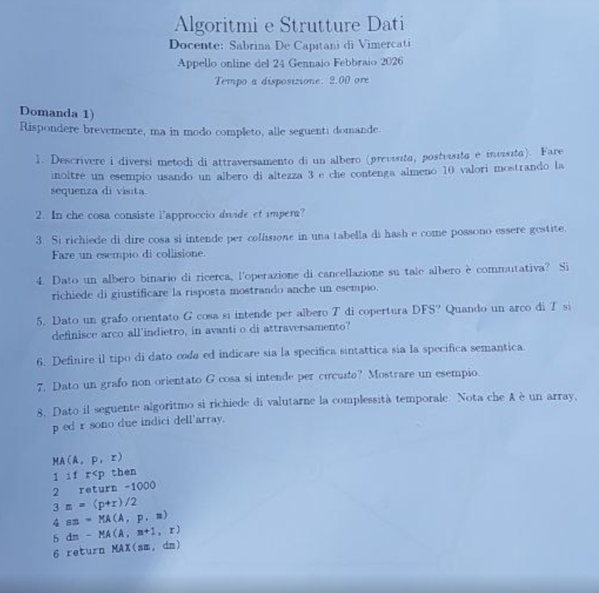
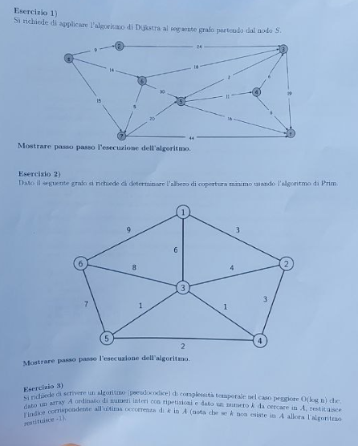

# Soluzione dell'appello archiviato come 21 gennaio 2026

Appello di **Algoritmi e Strutture Dati**, durata dichiarata: 2 ore. La data usata nel nome deriva dalla cartella fornita; l'intestazione fotografata riporta invece la stringa incongruente “Appello online del 24 Gennaio Febbraio 2026”.

### **1. Domande di teoria**

#### **1.1. Visite preordine, inordine e postordine**

**Traccia.** Definire le tre visite e applicarle a un albero di altezza 3 con almeno 10 valori.

> **Riferimento di teoria:** [M03 — Algoritmi di visita degli alberi](../../M03_DS_Alberi/UD1/L2_Alberi_Algoritmi_visita.md).

Per un albero binario:

- preordine: radice, sottoalbero sinistro, sottoalbero destro;
- inordine: sottoalbero sinistro, radice, sottoalbero destro;
- postordine: sottoalbero sinistro, sottoalbero destro, radice.

Consideriamo l'albero con radice 8; figli 4 e 12; figli di 4 pari a 2 e 6; figli di 12 pari a 10 e 14; figli di 2 pari a 1 e 3; figlio sinistro di 6 pari a 5. Ha 10 nodi e altezza 3, contando gli archi dalla radice al livello più profondo.

$$
\begin{aligned}
\text{preordine}&: 8,4,2,1,3,6,5,12,10,14;\\
\text{inordine}&: 1,2,3,4,5,6,8,10,12,14;\\
\text{postordine}&: 1,3,2,5,6,4,10,14,12,8.
\end{aligned}
$$

Il fatto che l'inordine sia crescente conferma che l'esempio è anche un BST.

#### **1.2. Divide et impera**

**Traccia.** Descrivere la tecnica divide et impera.

> **Riferimento di teoria:** [M07 — Progetto divide et impera](../../M07_Divide_et_Impera/UD1/L2_Progetto_di_algo_Divide_et_Impera.md).

La tecnica divide un'istanza in sottoproblemi più piccoli dello stesso tipo, li risolve ricorsivamente e combina le soluzioni. I casi base sono risolti direttamente. La complessità tipica ha forma

$$
T(n)=aT(n/b)+f(n),
$$

dove $a$ è il numero di sottoproblemi, $n/b$ la loro dimensione e $f(n)$ il costo di divisione e combinazione. Correttezza e terminazione richiedono che la composizione produca una soluzione del problema originale e che la dimensione diminuisca.

#### **1.3. Collisioni nelle tabelle hash**

**Traccia.** Definire una collisione, descrivere le tecniche di gestione e fornire un esempio.

> **Riferimento di teoria:** [M05 — Tabelle hash](../../M05_DS_Orizzontali/UD2/L2_Tabelle_Hash.md).

Si ha collisione quando chiavi distinte $k_1\ne k_2$ soddisfano $h(k_1)=h(k_2)$. Con concatenamento, ogni cella punta a una collezione delle chiavi con lo stesso hash. Con indirizzamento aperto, tutte le chiavi restano nella tabella e si genera una sequenza di ispezione: scansione lineare, quadratica o doppio hashing.

Con $m=7$, $h(k)=k\bmod7$, le chiavi 10 e 24 collidono nella cella 3. Il concatenamento le conserva entrambe nella lista 3; la scansione lineare pone 10 in 3 e prova 4 per 24. Il fattore di carico influenza fortemente il costo atteso.

#### **1.4. Commutatività della cancellazione in un BST**

**Traccia.** La cancellazione di due chiavi in un BST è commutativa? Motivare con un esempio.

> **Riferimento di teoria:** [M05 — Alberi di ricerca](../../M05_DS_Orizzontali/UD3/L1_Alberi_bilanciati_di_ricerca.md).

Il **contenuto finale** è lo stesso se entrambe le chiavi esistono, ma la struttura non è necessariamente uguale. Assumiamo la consueta cancellazione di un nodo con due figli mediante il successore.

Inserendo $[1,2,4,3,6,5]$ si ottiene: $1$ ha figlio destro $2$; $2$ ha figlio destro $4$; $4$ ha figli $3$ e $6$; $6$ ha figlio sinistro $5$.

- cancellare 3 e poi 4: 3 è foglia; 4 resta con il solo figlio 6 e viene sostituito da 6, che conserva 5 come figlio sinistro;
- cancellare 4 e poi 3: 4 ha due figli ed è sostituito dal successore 5; cancellando poi 3, 5 resta figlio destro di 2 e ha 6 come figlio destro.

In entrambi i casi le chiavi residue sono $\{1,2,5,6\}$, ma le forme differiscono. La cancellazione non è quindi commutativa rispetto alla struttura del BST.

#### **1.5. Archi nella DFS**

**Traccia.** Definire l'albero di copertura DFS di un grafo orientato e classificare i suoi archi.

> **Riferimento di teoria:** [M04 — Proprietà delle visite](../../M04_DS_Reticolari/UD2/L3_Proprieta_grafo.md).

Partendo da una radice, gli archi con cui DFS scopre per la prima volta i vertici formano un **albero DFS**; se non tutti i vertici sono raggiungibili dalla prima radice, ripetendo la visita dai vertici ancora bianchi si ottiene una **foresta DFS** di copertura. Ogni vertice compare una volta e il padre di un vertice non radice è il vertice dal quale è stato scoperto.

Rispetto a tale albero o foresta, in un grafo orientato gli archi sono:

- d'albero, se scoprono un vertice bianco;
- all'indietro, verso un antenato grigio;
- in avanti, verso un discendente già nero ma non tramite l'arco d'albero considerato;
- trasversali, tra rami o alberi distinti senza relazione antenato-discendente.

Gli archi all'indietro caratterizzano la presenza di un ciclo diretto. Nei grafi non orientati, considerando ogni arco una sola volta, si osservano essenzialmente archi d'albero e all'indietro.

#### **1.6. ADT coda**

**Traccia.** Fornire specifica sintattica e semantica della coda.

> **Riferimento di teoria:** [M02 — Code](../../M02_DS_Lineari/UD3/L1/L1_Code.md).

Una specifica sintattica possibile è:

$$
\begin{aligned}
&\operatorname{crea}:\to Coda,\\
&\operatorname{accoda}:Coda\times E\to Coda,\\
&\operatorname{primo}:Coda\to E,\\
&\operatorname{decoda}:Coda\to Coda,\\
&\operatorname{vuota}:Coda\to Boolean.
\end{aligned}
$$

La semantica FIFO impone, tra l'altro, che il primo elemento accodato sia il primo rimosso. Per una coda vuota $Q_0$, $\operatorname{primo}(\operatorname{accoda}(Q_0,x))=x$; accodando $y$ a una coda non vuota, il primo resta quello precedente. `primo` e `decoda` hanno precondizione coda non vuota.

#### **1.7. Circuito in un grafo non orientato**

**Traccia.** Definire un circuito in un grafo non orientato e fornire un esempio.

> **Riferimento di teoria:** [M04 — Definizioni e modelli](../../M04_DS_Reticolari/UD1/L1_Grafi_definizioni_e_modelli.md).

Un circuito è un cammino chiuso che parte e termina nello stesso vertice e non ripete archi; un ciclo semplice non ripete neppure vertici interni. Se il grafo contiene $ab$, $bc$, $ca$, la sequenza $a,b,c,a$ è un circuito e un ciclo semplice. La sequenza $a,b,a$ non costituisce un ciclo semplice nel consueto grafo semplice non orientato, perché riutilizza lo stesso arco.

#### **1.8. Analisi della procedura `MA`**

**Traccia.** Stabilire che cosa calcola e analizzare la complessità della procedura seguente:

```text
MA(A,p,r)
    se r < p restituisci -10000
    m <- floor((p+r)/2)
    sn <- MA(A,p,m)
    dn <- MA(A,m+1,r)
    restituisci MAX(sn,dn)
```

Così trascritta, per $p=r$ si avrebbe $m=p$ e la prima chiamata sarebbe identica a quella corrente: manca un caso base per l'intervallo unitario. L'intenzione algoritmica, evidente dal valore sentinella e dalla combinazione con `MAX`, è:

```text
se r < p restituisci -10000
se p = r restituisci A[p]
```

Con tale caso base `MA(A,p,r)` restituisce il massimo dell'intervallo $A[p..r]$. La correttezza segue per induzione: il massimo dell'intero intervallo è il massimo tra i massimi delle due metà. La ricorrenza è

$$
T(n)=2T(n/2)+\Theta(1)=\Theta(n).
$$

> ⚠️ Il valore $-10000$ è una sentinella corretta soltanto se ogni elemento ammesso è almeno $-10000$; una specifica robusta userebbe $-\infty$ o eviterebbe intervalli vuoti.

### **2. Esercizio 1 — Dijkstra sul grafo orientato**

**Traccia.** Applicare Dijkstra a partire da $S$ al grafo orientato della figura e mostrare tutti i passi.

Gli archi letti dalla figura sono:

$$
\begin{aligned}
&S\to2:9,\ S\to6:14,\ S\to7:15,\ 2\to3:24,\\
&6\to3:18,\ 6\to5:30,\ 6\to7:5,\\
&7\to5:20,\ 7\to1:44,\\
&5\to3:2,\ 5\to4:11,\ 5\to1:14,\\
&4\to3:6,\ 4\to1:6,\ 3\to1:19.
\end{aligned}
$$

| Estratto | Aggiornamenti prodotti |
|---|---|
| $S$, $d=0$ | $d(2)=9$, $d(6)=14$, $d(7)=15$ |
| $2$, $d=9$ | $d(3)=33$ |
| $6$, $d=14$ | $d(3)=32$, $d(5)=44$; $d(7)$ resta 15 |
| $7$, $d=15$ | $d(5)=35$, $d(1)=59$ |
| $3$, $d=32$ | $d(1)=51$ |
| $5$, $d=35$ | $d(4)=46$, $d(1)=49$; $d(3)$ resta 32 |
| $4$, $d=46$ | nessun miglioramento: $52>32$, $52>49$ |
| $1$, $d=49$ | fine |

Ordine di estrazione: $S,2,6,7,3,5,4,1$. Risultati:

| Vertice | $S$ | 2 | 6 | 7 | 3 | 5 | 4 | 1 |
|---|---:|---:|---:|---:|---:|---:|---:|---:|
| Distanza | 0 | 9 | 14 | 15 | 32 | 35 | 46 | 49 |
| Predecessore | — | $S$ | $S$ | $S$ | 6 | 7 | 5 | 5 |

L'albero dei cammini minimi è formato da $S\to2$, $S\to6$, $S\to7$, $6\to3$, $7\to5$, $5\to4$, $5\to1$.

### **3. Esercizio 2 — Prim**

**Traccia.** Applicare Prim al grafo non orientato della figura e mostrare tutti i passi.

Gli archi sono: $1-6:9$, $1-3:6$, $1-2:3$, $6-3:8$, $6-5:7$, $3-2:4$, $3-4:1$, $3-5:1$, $2-4:3$, $5-4:2$.

Partendo dal vertice 1:

| Passo | Vertici nell'albero | Arco leggero scelto | Peso cumulato |
|---:|---|---|---:|
| 1 | $\{1,2\}$ | $1-2$ di peso 3 | 3 |
| 2 | $\{1,2,4\}$ | $2-4$ di peso 3 | 6 |
| 3 | $\{1,2,3,4\}$ | $4-3$ di peso 1 | 7 |
| 4 | $\{1,2,3,4,5\}$ | $3-5$ di peso 1 | 8 |
| 5 | tutti | $5-6$ di peso 7 | 15 |

L'MST è

$$
\{1-2,2-4,4-3,3-5,5-6\}
$$

e pesa 15. A ogni passo l'arco scelto è minimo sul taglio tra vertici già inseriti e vertici esterni. Gli eventuali pareggi consentono scelte diverse ma non un peso totale inferiore.

### **4. Esercizio 3 — Ultima occorrenza**

**Traccia.** Dato un vettore ordinato di interi, con possibili ripetizioni, e un intero $k$, restituire l'indice dell'ultima occorrenza di $k$ in $O(\log n)$, oppure $-1$ se assente.

```text
ULTIMA-OCCORRENZA(A,n,k)
    lo <- 0
    hi <- n - 1
    ans <- -1
    mentre lo <= hi
        m <- lo + floor((hi-lo)/2)
        se A[m] <= k
            se A[m] = k
                ans <- m
            lo <- m + 1
        altrimenti
            hi <- m - 1
    restituisci ans
```

Su $[1,2,2,2,5]$ con $k=2$, una corrispondenza non conclude la ricerca: si salva l'indice e si continua a destra, ottenendo infine 3. Per $k=4$, `ans` resta $-1$. L'intervallo si dimezza, quindi tempo $O(\log n)$ e spazio $O(1)$.

### **5. Verifica finale**

- Dijkstra: tutti i pesi sono non negativi e ogni rilassamento è stato controllato.
- Prim: cinque archi su sei vertici, nessun ciclo, peso totale 15.
- Ricerca binaria: gestisce duplicati, chiave assente e vettore vuoto.

### **6. Fonti fotografiche originali**




