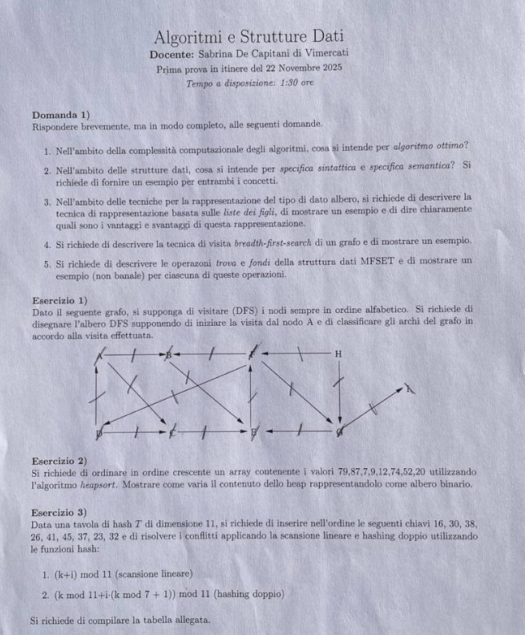

# Soluzione della prima prova in itinere — 22 novembre 2025

Prova di **Algoritmi e Strutture Dati**, durata dichiarata: 1 ora e 30 minuti. La fotografia contiene cinque domande di teoria e tre esercizi.

### **1. Domande di teoria**

#### **1.1. Algoritmo ottimo**

**Traccia.** Definire che cosa si intende per algoritmo ottimo.

> **Riferimento di teoria:** [M01 — Efficienza e complessità](../../M01_Elementi_Fondamentali_DS_e_Algo/UD1/L2_2_Efficienza_e_complessita.md).

Fissato un problema, un modello di calcolo e una misura della dimensione $n$, un algoritmo è asintoticamente ottimo se la sua complessità coincide, a fattore costante, con un limite inferiore valido per ogni algoritmo che risolve il problema. Se ogni algoritmo richiede $\Omega(f(n))$ e l'algoritmo considerato usa $O(f(n))$, allora usa $\Theta(f(n))$ ed è ottimo rispetto a quel modello e a quella risorsa.

> ⚠️ “Ottimo” non significa necessariamente più veloce per ogni input concreto: è un giudizio relativo a modello, risorsa analizzata e comportamento asintotico.

#### **1.2. Specifica sintattica e semantica di un ADT**

**Traccia.** Descrivere la specifica sintattica e la specifica semantica di un tipo di dato astratto, con esempi.

> **Riferimento di teoria:** [M01 — Costruzione degli ADT](../../M01_Elementi_Fondamentali_DS_e_Algo/UD2/L2_Costruzione_ADT.md).

La specifica **sintattica** elenca i sort e le firme delle operazioni, indicando dominio e codominio. Per una pila di elementi $E$:

$$
\begin{aligned}
&\operatorname{crea}:\to Pila,\\
&\operatorname{push}:Pila\times E\to Pila,\\
&\operatorname{top}:Pila\to E,\\
&\operatorname{pop}:Pila\to Pila,\\
&\operatorname{vuota}:Pila\to Boolean.
\end{aligned}
$$

La specifica **semantica** definisce il significato delle operazioni mediante assiomi, precondizioni e proprietà osservabili. Esempi:

$$
\operatorname{top}(\operatorname{push}(S,x))=x,
$$

$$
\operatorname{pop}(\operatorname{push}(S,x))=S,
$$

$$
\operatorname{vuota}(\operatorname{crea}())=vero.
$$

`top` e `pop` richiedono come precondizione una pila non vuota. La sintassi dice quali espressioni sono lecite; la semantica stabilisce cosa devono significare, indipendentemente dalla rappresentazione concreta.

#### **1.3. Rappresentazione di alberi con liste di figli**

**Traccia.** Descrivere la rappresentazione degli alberi tramite liste di figli, fornire un esempio e discuterne vantaggi e svantaggi.

> **Riferimento di teoria:** [M03 — Realizzazioni degli alberi](../../M03_DS_Alberi/UD1/L3_Alberi_realizzazioni.md).

Ogni nodo conserva il proprio valore e un riferimento a una lista dei figli diretti. Per un albero con radice $a$, figli $b,c,d$ e due figli $e,f$ di $b$, le liste sono:

- $figli(a)=[b,c,d]$;
- $figli(b)=[e,f]$;
- $figli(c)=figli(d)=figli(e)=figli(f)=[]$.

Il numero complessivo di riferimenti figlio è $n-1$, quindi lo spazio è $\Theta(n)$ anche se i gradi sono molto diversi. Enumerare i figli di un nodo costa tempo proporzionale al suo grado. La rappresentazione è flessibile e naturale per alberi generali, ma accedere al padre non è immediato senza un puntatore aggiuntivo; anche cercare il $k$-esimo figlio in una lista concatenata può costare $O(k)$.

#### **1.4. Visita BFS**

**Traccia.** Descrivere la visita BFS di un grafo e fornire un esempio.

> **Riferimento di teoria:** [M04 — Esplorazione di grafi](../../M04_DS_Reticolari/UD2/L1_Esplorazione_grafo.md).

BFS visita un grafo per livelli dalla sorgente $s$. Marca $s$, lo inserisce in una coda e ripete: estrae il primo vertice $u$, esamina i suoi adiacenti e accoda quelli non ancora scoperti, memorizzandone distanza e predecessore. Con liste di adiacenza costa $\Theta(|V|+|E|)$.

Per archi $a-b$, $a-c$, $b-d$, $c-e$ e sorgente $a$, i livelli sono $L_0=\{a\}$, $L_1=\{b,c\}$, $L_2=\{d,e\}$. In un grafo non pesato, tali livelli forniscono le distanze minime in numero di archi.

#### **1.5. MFSET: `TROVA` e `FONDI`**

**Traccia.** Descrivere le operazioni `TROVA` e `FONDI` di MFSET, con esempi non banali.

> **Riferimento di teoria:** [M05 — MFSET](../../M05_DS_Orizzontali/UD1/L3_MFSET.md).

MFSET mantiene una partizione di elementi in insiemi disgiunti, rappresentati come foreste di alberi.

- `TROVA(x)` risale i padri fino alla radice, rappresentante dell'insieme. Con compressione dei cammini rende figli diretti della radice i nodi attraversati.
- `FONDI(x,y)` calcola le due radici e, se diverse, collega l'albero di rango minore sotto quello di rango maggiore; a parità sceglie una radice e ne incrementa il rango.

Esempio: partendo da $\{1,2,3,4,5,6\}$, dopo `FONDI(1,2)`, `FONDI(3,4)`, `FONDI(1,3)` si ha la componente $\{1,2,3,4\}$. Se il cammino di $4$ è $4\to3\to1$, `TROVA(4)` restituisce $1$ e comprime il cammino ponendo direttamente $padre[4]=1$. `FONDI(4,5)` unisce poi la componente di $5$ a quella rappresentata da $1$, non soltanto i due nodi nominali.

Con entrambe le euristiche, una sequenza di $m$ operazioni su $n$ elementi costa $O(m\alpha(n))$.

### **2. Esercizio 1 — DFS e classificazione degli archi**

**Traccia.** Eseguire DFS sul grafo orientato in figura, scegliendo in ordine alfabetico sia le nuove radici sia i vertici adiacenti; disegnare la foresta e classificare tutti gli archi.

Dalla figura si leggono gli archi:

$$
\begin{aligned}
&A\to B,\ A\to E,\ B\to F,\\
&C\to B,\ C\to D,\ C\to G,\\
&D\to A,\ D\to E,\ E\to F,\ F\to C,\\
&G\to F,\ G\to I,\ H\to C,\ H\to G.
\end{aligned}
$$

La DFS parte da $A$ e segue sempre il primo adiacente alfabetico:

$$
A\to B\to F\to C\to D\to E,
$$

quindi, tornando a $C$, visita $G\to I$. Terminato l'albero di $A$, i vertici $B$–$G$ e $I$ sono già visitati; $H$ diventa una seconda radice. L'ordine di scoperta è

$$
A,B,F,C,D,E,G,I,H.
$$

La foresta DFS è descritta dai padri:

| Vertice | $A$ | $B$ | $F$ | $C$ | $D$ | $E$ | $G$ | $I$ | $H$ |
|---|---|---|---|---|---|---|---|---|---|
| Padre | NIL | $A$ | $B$ | $F$ | $C$ | $D$ | $C$ | $G$ | NIL |

Classificazione:

- **archi d'albero:** $A\to B$, $B\to F$, $F\to C$, $C\to D$, $D\to E$, $C\to G$, $G\to I$;
- **archi all'indietro:** $C\to B$, $D\to A$, $E\to F$, $G\to F$, perché puntano a un antenato grigio;
- **arco in avanti:** $A\to E$, verso un discendente già completato;
- **archi trasversali:** $H\to C$, $H\to G$, verso vertici completati in un altro albero della foresta.

Ogni arco della figura compare esattamente in una classe.

### **3. Esercizio 2 — HeapSort**

**Traccia.** Applicare HeapSort a $[79,87,7,9,12,74,52,20]$, mostrando tutti i passi e la struttura a livelli.

Per ordinare in senso crescente si costruisce un max-heap. La rappresentazione per livelli coincide con l'ordine del vettore: livello 0 un elemento, livello 1 i due successivi, livello 2 i quattro seguenti.

| Fase | Heap attivo per livelli | Coda già ordinata |
|---|---|---|
| max-heap | $[87]\mid[79,74]\mid[20,12,7,52]\mid[9]$ | — |
| estrai 87 | $[79]\mid[20,74]\mid[9,12,7,52]$ | $87$ |
| estrai 79 | $[74]\mid[20,52]\mid[9,12,7]$ | $79,87$ |
| estrai 74 | $[52]\mid[20,7]\mid[9,12]$ | $74,79,87$ |
| estrai 52 | $[20]\mid[12,7]\mid[9]$ | $52,74,79,87$ |
| estrai 20 | $[12]\mid[9,7]$ | $20,52,74,79,87$ |
| estrai 12 | $[9]\mid[7]$ | $12,20,52,74,79,87$ |
| estrai 9 | $[7]$ | $9,12,20,52,74,79,87$ |

In forma lineare, il max-heap iniziale è

$$
[87,79,74,20,12,7,52,9].
$$

Dopo l'ultima estrazione il risultato è

$$
[7,9,12,20,52,74,79,87].
$$

La costruzione bottom-up del heap costa $\Theta(n)$; le $n-1$ estrazioni con ripristino costano $O(\log n)$ ciascuna, per un totale $\Theta(n\log n)$.

### **4. Esercizio 3 — Tabelle hash**

**Traccia.** Inserire nell'ordine le chiavi $16,30,38,26,41,45,37,23,32$ in una tabella di dimensione 11, prima con scansione lineare

$$
h(k,i)=(k+i)\bmod 11,
$$

poi con doppio hashing

$$
h(k,i)=\bigl(k+i((k\bmod7)+1)\bigr)\bmod11.
$$

#### **4.1. Scansione lineare**

| Chiave | Posizioni provate | Posizione finale |
|---:|---|---:|
| 16 | 5 | 5 |
| 30 | 8 | 8 |
| 38 | 5, 6 | 6 |
| 26 | 4 | 4 |
| 41 | 8, 9 | 9 |
| 45 | 1 | 1 |
| 37 | 4, 5, 6, 7 | 7 |
| 23 | 1, 2 | 2 |
| 32 | 10 | 10 |

| Indice | 0 | 1 | 2 | 3 | 4 | 5 | 6 | 7 | 8 | 9 | 10 |
|---:|---:|---:|---:|---:|---:|---:|---:|---:|---:|---:|---:|
| Valore | — | 45 | 23 | — | 26 | 16 | 38 | 37 | 30 | 41 | 32 |

#### **4.2. Doppio hashing**

| Chiave | Passo $(k\bmod7)+1$ | Posizioni provate | Posizione finale |
|---:|---:|---|---:|
| 16 | 3 | 5 | 5 |
| 30 | 3 | 8 | 8 |
| 38 | 4 | 5, 9 | 9 |
| 26 | 6 | 4 | 4 |
| 41 | 7 | 8, 4, 0 | 0 |
| 45 | 4 | 1 | 1 |
| 37 | 3 | 4, 7 | 7 |
| 23 | 3 | 1, 4, 7, 10 | 10 |
| 32 | 5 | 10, 4, 9, 3 | 3 |

| Indice | 0 | 1 | 2 | 3 | 4 | 5 | 6 | 7 | 8 | 9 | 10 |
|---:|---:|---:|---:|---:|---:|---:|---:|---:|---:|---:|---:|
| Valore | 41 | 45 | — | 32 | 26 | 16 | — | 37 | 30 | 38 | 23 |

Il passo del secondo hash è sempre tra 1 e 7 e quindi coprimo con 11: la sequenza può visitare tutta la tabella. Rispetto alla scansione lineare, si riduce l'addensamento primario.

### **5. Verifica finale**

- DFS: 14 archi iniziali = 7 d'albero + 4 all'indietro + 1 in avanti + 2 trasversali.
- HeapSort: il risultato contiene gli stessi otto valori in ordine crescente.
- Hash: nove chiavi occupano nove celle distinte in entrambe le tabelle.

### **6. Fonte fotografica originale**

