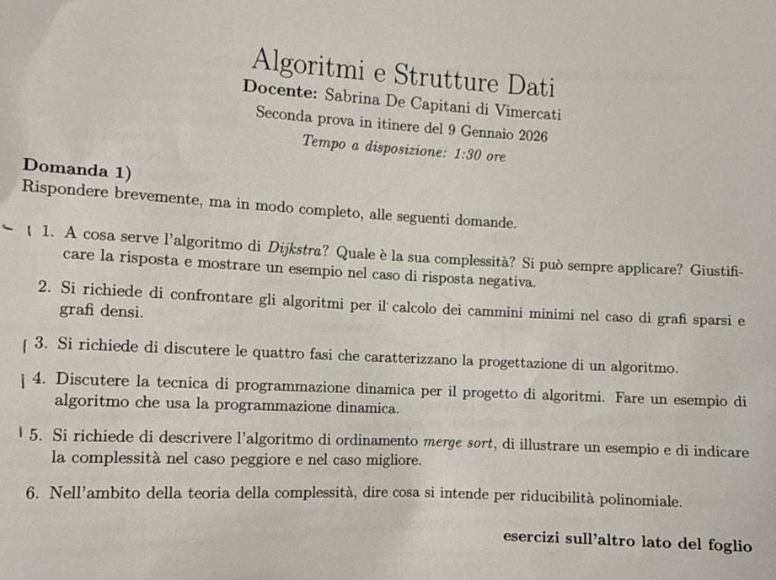
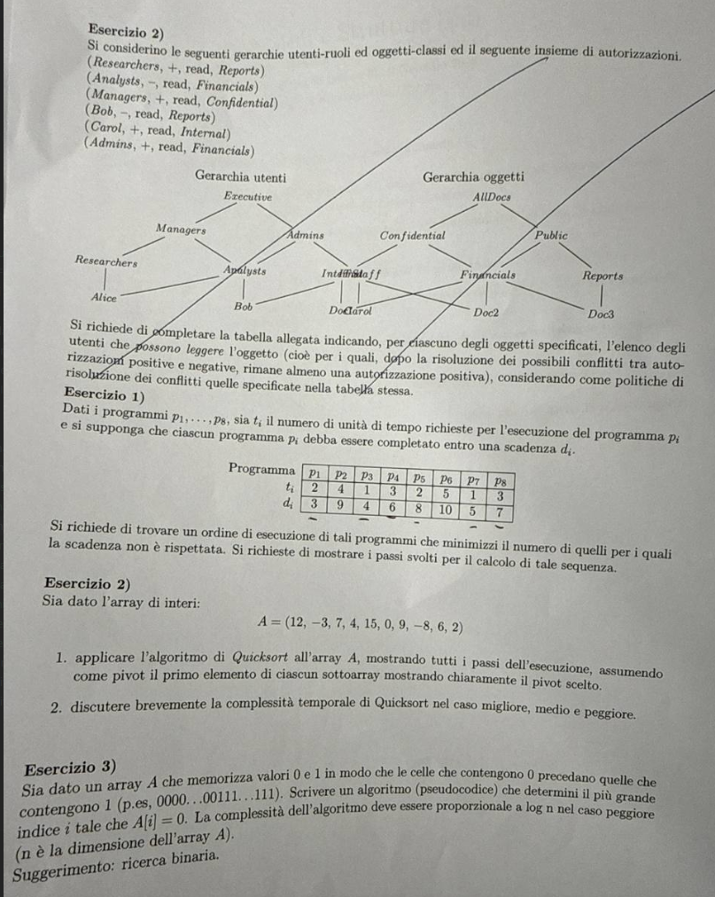

# Soluzione della seconda prova in itinere — 9 gennaio 2026

Prova di **Algoritmi e Strutture Dati**, durata dichiarata: 1 ora e 30 minuti. La traccia algoritmica comprende sei domande di teoria e tre esercizi.

> ⚠️ La parte superiore della seconda fotografia contiene la coda di un esercizio estraneo ad Algoritmi, relativo a gerarchie di utenti, ruoli, classi di oggetti e conflitti RBAC. Il testo rimanda a una tabella allegata che non è presente. Tale frammento non appartiene alla numerazione algoritmica, che ricomincia subito sotto da “Esercizio 1”, e non viene completato per congettura.

### **1. Domande di teoria**

#### **1.1. Dijkstra: obiettivo, complessità e pesi negativi**

**Traccia.** Descrivere l'obiettivo e la complessità di Dijkstra e spiegare se è applicabile in presenza di pesi negativi, con controesempio.

> **Riferimenti di teoria:** [M06 — Dijkstra](../../M06_Impatto_delle_DS_su_complessita_algo/UD1/L2_Algo_Dijkstra_Johnson.md), [M06 — Cammini minimi](../../M06_Impatto_delle_DS_su_complessita_algo/UD1/L1_2_Problema_dei_cammini_minimi.md).

Dijkstra calcola le distanze minime da una sorgente $s$ a tutti i vertici di un grafo pesato con pesi **non negativi**. Mantiene distanze provvisorie $d[v]$, estrae il vertice non definitivo con distanza minima e rilassa i suoi archi uscenti.

- matrice di adiacenza e selezione lineare: $\Theta(|V|^2)$;
- liste e heap binario: $O((|V|+|E|)\log|V|)$;
- heap di Fibonacci: $O(|E|+|V|\log|V|)$.

Un peso negativo invalida la definitività dell'estrazione. Controesempio: $s\to a$ pesa 2, $s\to b$ pesa 5, $b\to a$ pesa $-4$. Dijkstra rende definitivo $a$ con distanza 2 prima di $b$, ma il cammino $s\to b\to a$ pesa $1$. Per archi negativi, in assenza di cicli negativi raggiungibili, si usa Bellman–Ford.

#### **1.2. Grafi sparsi e densi nei cammini minimi**

**Traccia.** Confrontare gli algoritmi per cammini minimi rispetto a grafi sparsi e densi.

> **Riferimento di teoria:** [M06 — Confronto delle complessità](../../M06_Impatto_delle_DS_su_complessita_algo/UD1/L4_Confronto_tra_complessita.md).

Un grafo sparso ha $|E|$ vicino a $|V|$; uno denso può avere $\Theta(|V|^2)$ archi. Nei grafi sparsi liste di adiacenza e heap evitano di scandire coppie non connesse: Dijkstra con heap binario costa $O(|E|\log|V|)$. Nei grafi densi, il costo $\Theta(|V|^2)$ della versione a matrice e selezione lineare è spesso preferibile a $O(|E|\log|V|)=O(|V|^2\log|V|)$.

La scelta dipende anche dai pesi: Dijkstra richiede pesi non negativi, Bellman–Ford gestisce pesi negativi in $O(|V||E|)$ e segnala cicli negativi; per tutte le coppie, Floyd–Warshall costa $\Theta(|V|^3)$ ed è naturale su grafi densi, mentre ripetere un algoritmo da sorgente singola può essere migliore sui grafi sparsi.

#### **1.3. Quattro fasi del progetto di un algoritmo**

**Traccia.** Elencare e spiegare le quattro fasi del progetto di un algoritmo.

> **Riferimento di teoria:** [M06 — Progetto di algoritmi](../../M06_Impatto_delle_DS_su_complessita_algo/UD2/L1_Progetto_di_algoritmi.md).

1. **Classificare il problema:** precisare input, output, vincoli, dimensione e famiglia del problema.
2. **Caratterizzare la soluzione:** individuare proprietà necessarie e sufficienti che una risposta corretta deve soddisfare.
3. **Scegliere la tecnica algoritmica:** forza bruta, divide et impera, greedy, programmazione dinamica, backtracking o altra strategia coerente con la struttura.
4. **Scegliere le strutture dati:** selezionare rappresentazioni e operazioni che realizzino efficientemente i passi dominanti.

Le fasi si influenzano a vicenda: una struttura dati può cambiare la complessità senza cambiare l'idea matematica, come avviene per Dijkstra con matrice o heap.

#### **1.4. Programmazione dinamica**

**Traccia.** Descrivere la tecnica della programmazione dinamica e fornire un esempio.

> **Riferimento di teoria:** [M10 — Progetto con programmazione dinamica](../../M10_Programmazione_Dinamica/UD1/L1_Progetto_di_algo_per_programmazione_dinamica.md).

La programmazione dinamica è adatta quando il problema possiede sottostruttura ottima e sottoproblemi sovrapposti. Si definiscono gli stati, una ricorrenza, i casi base e un ordine di calcolo; ogni sottoproblema distinto viene risolto una sola volta, mediante memoizzazione top-down o tabulazione bottom-up.

Per Fibonacci, $F_i=F_{i-1}+F_{i-2}$: tabulando $F_0,\ldots,F_n$ si passa dall'esponenziale della ricorsione ingenua a $\Theta(n)$. Un esempio più strutturale è la distanza di edit, in cui lo stato $D[i,j]$ rappresenta il costo ottimo sui prefissi di lunghezza $i$ e $j$.

#### **1.5. MergeSort**

**Traccia.** Descrivere MergeSort con un esempio e indicarne complessità nel caso migliore e peggiore.

> **Riferimento di teoria:** [M07/UD2 — Mergesort](../../M07_Divide_et_Impera/UD2/L1_Merge_sort.md).

MergeSort dimezza ricorsivamente il vettore fino a ottenere sottovettori unitari e fonde coppie di sequenze ordinate in tempo lineare. Per $[4,1,3,2]$: $[4,1]\to[1,4]$, $[3,2]\to[2,3]$, poi $[1,4]$ e $[2,3]\to[1,2,3,4]$.

$$
T(n)=2T(n/2)+\Theta(n)=\Theta(n\log n).
$$

Migliore e peggiore coincidono asintoticamente, perché divisione e fusione vengono eseguite indipendentemente dall'ordine iniziale.

#### **1.6. Riducibilità polinomiale**

**Traccia.** Definire la riducibilità polinomiale e spiegarne il significato.

> **Riferimento di teoria:** [M11 — Classi P e NP](../../M11_Teoria_Complessita/UD2/L1_Classi_P_e_NP.md).

$A\le_pB$ se esiste una funzione $f$ calcolabile in tempo polinomiale tale che $x$ è un'istanza sì di $A$ se e solo se $f(x)$ è un'istanza sì di $B$. La riduzione mostra che $B$ è almeno difficile quanto $A$: una soluzione polinomiale di $B$ implicherebbe una soluzione polinomiale di $A$.

### **2. Esercizio 1 — Algoritmo di Moore**

**Traccia.** Applicare Moore ai processi seguenti, mostrando tutti i passi e indicando i processi in ritardo.

| Processo | $p_1$ | $p_2$ | $p_3$ | $p_4$ | $p_5$ | $p_6$ | $p_7$ | $p_8$ |
|---|---:|---:|---:|---:|---:|---:|---:|---:|
| tempo $t_i$ | 2 | 4 | 1 | 3 | 2 | 5 | 1 | 3 |
| scadenza $d_i$ | 3 | 9 | 4 | 6 | 8 | 10 | 5 | 7 |

L'ordine EDD per scadenza non decrescente è

$$
p_1,p_3,p_7,p_4,p_8,p_5,p_2,p_6.
$$

Si inseriscono i processi in tale ordine; quando il tempo cumulato supera la scadenza corrente, si rimuove dalla sequenza il processo di durata massima.

| Processo inserito | Tempo prima della correzione | Esito | Sequenza puntuale corrente |
|---|---:|---|---|
| $p_1$ | 2 $\le3$ | nessuna rimozione | $p_1$ |
| $p_3$ | 3 $\le4$ | nessuna rimozione | $p_1,p_3$ |
| $p_7$ | 4 $\le5$ | nessuna rimozione | $p_1,p_3,p_7$ |
| $p_4$ | 7 $>6$ | rimuovi $p_4$ di durata 3 | $p_1,p_3,p_7$; tempo 4 |
| $p_8$ | 7 $\le7$ | nessuna rimozione | $p_1,p_3,p_7,p_8$ |
| $p_5$ | 9 $>8$ | rimuovi $p_8$ di durata 3 | $p_1,p_3,p_7,p_5$; tempo 6 |
| $p_2$ | 10 $>9$ | rimuovi $p_2$ di durata 4 | $p_1,p_3,p_7,p_5$; tempo 6 |
| $p_6$ | 11 $>10$ | rimuovi $p_6$ di durata 5 | $p_1,p_3,p_7,p_5$; tempo 6 |

I processi puntuali sono $p_1,p_3,p_7,p_5$; quelli tardivi sono $p_4,p_8,p_2,p_6$. Una pianificazione ottima completa è

$$
[p_1,p_3,p_7,p_5\mid p_4,p_8,p_2,p_6],
$$

dove la parte dopo la barra può essere ordinata arbitrariamente rispetto all'obiettivo di minimizzare il numero di tardivi. Il minimo è quindi **4 processi tardivi**.

### **3. Esercizio 2 — QuickSort con primo pivot**

**Traccia.** Ordinare $[12,-3,7,4,15,0,9,-8,6,2]$ con QuickSort scegliendo il primo elemento come pivot; mostrare i passi e indicare la complessità nei casi migliore e peggiore.

> **Riferimento di teoria:** [M07/UD2 — Quicksort](../../M07_Divide_et_Impera/UD2/L2_Quick_sort.md).

Usiamo la partizione stabile dichiarata nella lezione: elementi $\le p$, pivot, elementi $>p$, conservando l'ordine relativo.

1. pivot $12$: $[-3,7,4,0,9,-8,6,2,\mathbf{12},15]$;
2. pivot $-3$: $[-8,\mathbf{-3},7,4,0,9,6,2,12,15]$;
3. pivot $7$: $[-8,-3,4,0,6,2,\mathbf7,9,12,15]$;
4. pivot $4$: $[-8,-3,0,2,\mathbf4,6,7,9,12,15]$;
5. pivot $0$ nel blocco $[0,2]$: configurazione invariata.

Risultato:

$$
[-8,-3,0,2,4,6,7,9,12,15].
$$

Caso migliore $\Theta(n\log n)$ con partizioni bilanciate; caso peggiore $\Theta(n^2)$ con partizioni $0$ e $n-1$. Il caso medio è $\Theta(n\log n)$.

### **4. Esercizio 3 — Ultimo zero**

**Traccia.** Dato un vettore ordinato contenente prima zero e poi uno, progettare un algoritmo che restituisca l'indice dell'ultimo zero in $O(\log n)$; se non esistono zeri, restituire $-1$.

```text
ULTIMO-ZERO(A, n)
    lo <- 0
    hi <- n - 1
    ans <- -1
    mentre lo <= hi
        m <- lo + floor((hi - lo) / 2)
        se A[m] = 0
            ans <- m
            lo <- m + 1
        altrimenti
            hi <- m - 1
    restituisci ans
```

Se $A[m]=0$, $m$ è un candidato ma l'ultimo zero può trovarsi più a destra; se $A[m]=1$, per l'ordinamento l'ultimo zero può trovarsi solo a sinistra. L'invariante preserva in `[lo,hi]` ogni posizione ancora capace di migliorare `ans`. L'intervallo si dimezza a ogni iterazione: tempo $O(\log n)$, spazio $O(1)$.

Esempi limite: `[]` o `[1,1]` restituiscono $-1$; `[0,0]` restituisce 1; `[0,0,1,1]` restituisce 1.

### **5. Verifica finale**

- Moore: la parte puntuale rispetta tutte le scadenze cumulative $2,3,4,6$.
- QuickSort: risultato crescente e multinsieme invariato.
- Ultimo zero: sono trattati vettore vuoto, assenza di zeri e assenza di uno.

### **6. Fonti fotografiche originali**




