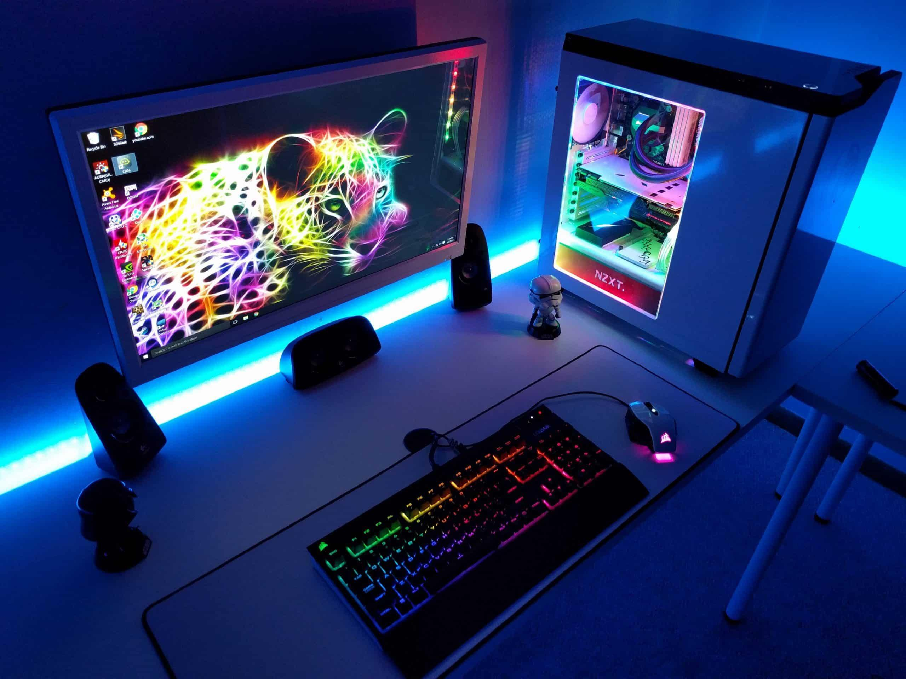

# **M1 UD1 Lezione 6 - Classificazione dei sistemi di elaborazione**

### **1. Introduzione**

#### **1.1. Perché classificare i sistemi di elaborazione**

Nel corso dell’evoluzione dell’informatica, i sistemi di elaborazione si sono differenziati per **dimensioni, potenza, destinazione d’uso e numero di utenti**.  
Capire questa classificazione è essenziale per comprendere **le scelte progettuali dei sistemi operativi**, poiché ogni tipologia di macchina richiede politiche differenti di gestione delle risorse, scheduling e sicurezza.

In questa lezione concludiamo il Modulo 1 esplorando i **principali tipi di sistemi di elaborazione**, dalle grandi macchine centralizzate ai moderni sistemi distribuiti e embedded.

---

### **2. Mainframe**

#### **2.1. Origini e funzioni**

I **mainframe** sono i discendenti diretti dei primi calcolatori elettronici di larga scala e rappresentano il **tipo più vecchio** di sistema di elaborazione.

Sono composti da un'**unità centrale** alla quale vengono connessi dispositivi di ingresso e dispositivi di uscita. Nei sistemi degli **anni '60**, i dispositivi tipici erano:

- **Dispositivi di ingresso**: le **schede perforate**, in cui la presenza o l'assenza di una perforazione indicava rispettivamente gli **uni** e gli **zeri** dei dati da introdurre nel sistema.
- **Dispositivi di uscita**: le **stampanti**.

Successivamente, per semplificare l'immissione di grandi quantità di dati — che diventavano poco maneggevoli con l'uso delle schede — e per estrarre risultati da conservare e riutilizzare in elaborazioni future, sono stati introdotti i **nastri magnetici** sia come dispositivi di ingresso sia come dispositivi di uscita.

##### **Elaborazione a lotti (batch)**

Queste architetture erano tipicamente orientate a lavori **non interattivi**, e l'uso specifico era quello dell'**elaborazione a lotti** (_batch processing_): il programma veniva **caricato, eseguito, terminato**, e si passava al successivo.

---

#### **2.2. Evoluzione: monoprogrammazione, multiprogrammazione, multiprocessing**

L'utilizzo dei mainframe è passato attraverso tre fasi progressive, che hanno portato a uno sfruttamento sempre migliore dell'unità centrale.

##### **Sistemi monoprogrammati**

Inizialmente, i mainframe erano **monoprogrammati**: in ciascun momento un **solo programma** era caricato in memoria centrale.

In questo scenario l'unità centrale era **sottoutilizzata**: ogni volta che doveva essere effettuata un'operazione di ingresso/uscita, la CPU doveva attendere i **tempi elettromeccanici** dei dispositivi di I/O senza poter procedere. Il risultato era uno **sfruttamento ridotto** della CPU e quindi **costi di uso più elevati**, poiché la quantità di tempo utile effettivamente dedicata alla compilazione ed esecuzione dei programmi era ridotta.

##### **Sistemi multiprogrammati**

Per ovviare a questo problema sono stati introdotti i **sistemi multiprogrammati**, in cui **più programmi** vengono caricati in memoria centrale **contemporaneamente**. Questo riduce il tempo di attesa tra un programma e l'altro.

Tuttavia, questa soluzione **non risolve definitivamente** il problema dell'attesa delle periferiche: l'unità centrale deve comunque attendere il completamento delle operazioni di I/O prima di poter procedere a svolgere altro lavoro utile.

##### **Multiprocessing**

La soluzione definitiva è stata l'introduzione del **multiprocessing**, ossia dell'**esecuzione di più programmi contemporaneamente** con commutazione automatica al verificarsi di operazioni di I/O.

Quando un programma lancia un'operazione di ingresso/uscita, il sistema procede ad **eseguirla in modo asincrono** e **non attende** la risposta proveniente dalle periferiche: invece **esegue altri programmi**, in modo tale da **evitare tempi morti** di esecuzione.

$$
\begin{cases}
\textbf{Monoprogrammato:}~ & \text{1 programma in RAM, CPU attende l'I/O.} \\\\
\textbf{Multiprogrammato:}~ & \text{N programmi in RAM, ma CPU ancora bloccata dall'I/O del programma corrente.} \\\\
\textbf{Multiprocessing:}~ & \text{N programmi in RAM, CPU passa a un altro programma durante l'I/O.}
\end{cases}
$$

---

#### **2.3. Mainframe interattivi: l'arrivo dei terminali**

Una successiva evoluzione dei sistemi mainframe è stata quella di permettere l'**interazione di molti utenti operanti contemporaneamente**.

Questi **sistemi interattivi** nascono nel momento in cui all'unità centrale vengono collegati dispositivi pensati per l'interazione con gli utenti: i **terminali**. Composti da una **tastiera** e da un **video**, i terminali permettono all'utente di fornire dati e comandi e di vedere **immediatamente** i risultati dell'elaborazione.

Come altri dispositivi di uscita venivano tipicamente utilizzati ancora **stampanti** e **dischi**, questi ultimi per conservare informazioni a lungo termine.

In questo contesto l'elaborazione avviene in modo leggermente diverso e prevede l'**elaborazione contemporanea di flussi di attività diversi**, chiamati **processi**.

##### **Time sharing**

Il sistema interattivo multiutente combina:

- più programmi caricati in memoria centrale,
- uso condiviso del processore tramite tecniche di multiprocessing,
- e una **condivisione omogenea del tempo** basata sul meccanismo di **time share**.

Il time-sharing crea l'**illusione**, per ciascun utente, di un sistema **dedicato** a lui, evitando un'evoluzione "a singhiozzo" dei programmi nonostante la presenza di altri utenti.

Con l'introduzione del time-sharing, i mainframe diventano dunque **sistemi multiutente interattivi**, con schedulazione multilivello, controllo accessi e sicurezza avanzata.

$$
\begin{cases}
\text{CPU:}~ & \text{un singolo processore di grandi dimensioni;} \\\\
\text{Memoria:}~ & \text{ripartita tra più job in multiprogrammazione;} \\\\
\text{Dispositivi I/O:}~ & \text{nastri, dischi magnetici, stampanti, terminali;} \\\\
\text{Gestione CPU:}~ & \text{in condivisione di tempo (time sharing).}
\end{cases}
$$

---

#### **2.4. 💾 Easter Egg storico e videoludico**

I fan di _Call of Duty: Black Ops Cold War_ ricorderanno la missione **“Echoes of a Cold War”**, ambientata in una **base sovietica sotterranea abbandonata tra le montagne**.  
In quell’episodio, **Mason e Woods** si infiltrano per recuperare un **mainframe segreto**, rimasto operativo dagli anni della Guerra Fredda: un gigantesco calcolatore a nastro, simbolo dell’**informatica centralizzata militare** dell’epoca.

Il riferimento è un chiaro omaggio ai **mainframe reali** usati negli anni ’60-’80 per calcolo scientifico, crittografia e controllo radar.

Nella missione finale **“Ashes to Ashes”**, ambientata presso la **vera antenna radar sovietica Duga**, situata vicino a **Černobyl’**, si nota che all'epoca piaceva già fare le cose in grande, in quanto a reti di telecomunicazioni.  
Quella struttura, realmente esistente, era un gigantesco **radar Over-the-Horizon** (detto _Russian Woodpecker_) capace di captare lanci missilistici intercontinentali.  
Nel contesto del corso, rappresenta l’evoluzione estrema dei mainframe: enormi infrastrutture di elaborazione e sorveglianza, antenate dei moderni **data center**.

---

### **3. Minicomputer**

L'evoluzione delle tecnologie ha permesso di **ridurre la complessità** dei sistemi di elaborazione, realizzando architetture **dedicate a gruppi più piccoli di utenti** e quindi più economiche.

I **minicomputer** sono dunque sistemi **tipicamente dipartimentali**: meno costosi dei mainframe, ma ancora capaci di consentire una **forte interazione con gli utenti** e di supportare la **presenza di più utenti contemporanei** nel sistema. Adottano architetture a **time sharing** e **multiprogrammazione**.

Esempi storici: **PDP-11** e **VAX** della DEC.

---

### **4. Workstation**

La tecnologia ha poi permesso di realizzare le **workstation**, riducendo ulteriormente la scala dei minicomputer per portare il sistema direttamente sul **tavolo del singolo utente** con esigenze particolarmente sofisticate, ma riducendo i costi di uso di un sistema interattivo.

Questi sistemi di tipo **desktop** hanno di solito:

- caratteristiche e **dispositivi di interazione particolarmente avanzati**;
- una **capacità di elaborazione molto elevata**;
- una **forte interazione** in un ambiente **multi-processo in tempo reale**.

Sono destinate a utenti tecnici (ingegneri, ricercatori, grafici), dotate di CPU multi-core e GPU dedicate, e supportano sistemi operativi multitasking con interfaccia grafica (UNIX, Linux, Solaris).

---

### **5. Personal Computer (PC)**

Dall'altra parte, l'evoluzione delle tecnologie che hanno permesso di realizzare i **terminali** ha portato pian piano alla creazione di **terminali interattivi sempre più intelligenti**, in grado di supportare un'interazione evoluta con i sistemi centrali e di svolgere **piccole attività di elaborazione locale**.

Questi **personal computer**, partiti come terminali intelligenti, sono poi diventati anche **sistemi autonomi** — come quelli che siamo abituati a vedere oggi sul mercato — dotati di **capacità grafiche** e **dispositivi di interazione avanzata**.

Con il PC l'elaborazione diventa quindi **individuale e interattiva**, ed è un sistema multi-processo progettato per applicazioni locali ma costantemente connesso in rete.

$$
\begin{cases}
\text{Interfaccia:}~ & \text{grafica, basata su finestre e dispositivi di puntamento;} \\\\
\text{Gestione CPU:}~ & \text{multitasking e time sharing;} \\\\
\text{Esempi:}~ & \text{Windows, macOS, Linux desktop.}
\end{cases}
$$

---

### **6. Computer palmari e dispositivi mobili**

La tecnologia ha poi permesso di ridurre ulteriormente la scala dei sistemi personali:

- prima a **sistemi portatili** (laptop);
- poi a **sistemi che possono stare in una mano**, i **computer palmari**.

Ne esistono diverse tipologie: gli **elaboratori palmari** veri e propri (PDA, ovvero Personal Digital Assistant, tablet), o sistemi un po' più **specializzati** come i **telefoni cellulari** (smartphone).

In questi sistemi abbiamo:

- ancora una **forte interazione** con l'utente;
- la necessità di **attivare più processi contemporaneamente**;
- la necessità di un **basso consumo di potenza** (autonomia della batteria);
- tipicamente un **numero abbastanza limitato di processi** attivi.

I sistemi operativi tipici (Android, iOS) sono ottimizzati per la gestione dinamica delle connessioni wireless e per il risparmio energetico, e le CPU adottate sono prevalentemente ARM.

.jpg>)

---

### **7. Sistemi in tempo reale e dedicati**

#### **7.1. Sistemi in tempo reale**

Alcuni sistemi sono stati sviluppati per affrontare **applicazioni specifiche** in cui è cruciale rispettare vincoli temporali. I principali ambiti applicativi dei **sistemi di elaborazione in tempo reale** sono:

- il **controllo di processi industriali** e l'**automazione industriale**;
- l'**automazione della casa** (domotica);
- i **sistemi biomedicali**;
- le **telecomunicazioni**;
- e così via.

L'obiettivo di questi sistemi è essere in grado di **rispondere in tempi brevi agli eventi** che si verificano nel mondo esterno. Si distinguono due categorie:

- **Hard real-time**: il rispetto della **scadenza temporale è obbligatorio** e una sua violazione comporta il fallimento del sistema (es. controllo di un airbag).
- **Soft real-time**: il vincolo temporale è **più lasco** e una tolleranza al ritardo è accettabile (es. streaming audio/video).

L'**architettura hardware** deve essere quindi in grado di **scambiare segnali col mondo esterno** per poter supportare queste tipologie di interazione. Il sistema operativo, a sua volta, deve adeguarsi in modo tale da garantire che gli eventi esterni siano **sentiti e gestiti dal sistema nel tempo richiesto** dall'applicazione.

---

#### **7.2. Sistemi dedicati (embedded)**

Sono stati sviluppati anche **sistemi specifici dedicati a una sola applicazione**, riducendo fortemente l'architettura generale per selezionare **soltanto quei componenti strettamente indispensabili** all'applicazione considerata.

Questi sono i **sistemi dedicati** (_embedded_), e li troviamo ovunque intorno a noi, ad esempio:

- negli **elettrodomestici** (lavatrici, forni a microonde, frigoriferi smart);
- nei **motori d'automobile** (centraline elettroniche, ABS, gestione iniezione);
- in robot, dispositivi biomedicali, sistemi di sicurezza, ecc.

Hanno di solito **caratteristiche limitate** di:

- **capacità computazionale**,
- **memoria**,
- e **periferiche** disponibili.

Tipicamente usano firmware o RTOS minimalisti.

---

### **8. Sistemi multimediali**

Gli utenti hanno spesso cercato modalità di interazione di tipo **diverso e più ricco**. Da questa esigenza nascono i **sistemi multimediali**, che dispongono di **caratteristiche specifiche di architettura** proprio per migliorare la possibilità di interazione attraverso **vari media** e **vari canali di comunicazione** con l'utente — il tutto, ovviamente, **in tempo reale**.

Integrano quindi suoni, immagini e video in tempo reale, richiedendo CPU multi-core e GPU dedicate.

Esempi: computer creativi, console di gioco, piattaforme di editing e streaming.

---

### **9. Sistemi multiprocessore, cluster e distribuiti**

#### **9.1. Sistemi multiprocessore**

Per supportare le necessità computazionali di alcuni ambiti applicativi sono stati sviluppati i **sistemi multiprocessore**, in modo tale da:

- avere **forti capacità di elaborazione**;
- effettuare **economie di scala sulle periferiche** (le periferiche vengono condivise tra più CPU).

##### **Architettura**

L'architettura tipica di un sistema multiprocessore è composta da:

- un **bus di sistema** che connette i vari elementi;
- **più unità di elaborazione (CPU)** collegate al bus;
- una **memoria condivisa** tra tutte le CPU;
- un insieme di **interfacce comuni** per la gestione dell'I/O.

##### **Simmetrici vs. asimmetrici**

I processori possono essere organizzati in due modi:

- **Sistema multiprocessore simmetrico (SMP)**: tutti i processori possono svolgere la **stessa tipologia di attività**, in modo equivalente.
- **Sistema multiprocessore asimmetrico (AMP)**: i processori sono **specializzati** — alcuni dedicati a gestire l'I/O, altri a eseguire il sistema operativo, altri ancora ai task applicativi.

Anche in questo caso il sistema supporta **più utenti in modo interattivo**.

---

#### **9.2. Architettura a cluster**

In un'architettura a **cluster** le interconnessioni con il sistema sono **più lasche** rispetto a un multiprocessore: abbiamo un **sistema di bus** che connette **più calcolatori** tra loro in modo abbastanza stretto, ma **non così stretto** come nel caso del multiprocessore (in cui i processori condividono direttamente un unico bus di sistema).

Gli obiettivi principali del cluster sono:

- migliorare ulteriormente le **economie di scala** sulle periferiche;
- aumentare l'**affidabilità del sistema in caso di guasto** (se un nodo cade, gli altri proseguono);
- e soprattutto poter essere realizzati con **componenti facilmente disponibili sul mercato** (_commodity hardware_), riducendo così i **costi di acquisizione**.

---

#### **9.3. Sistemi distribuiti**

Il **sistema distribuito** è l'architettura in cui i calcolatori sono connessi in modo **ancora più lasco**: la condivisione di risorse avviene **attraverso una rete informatica**.

Anche in questo caso si supportano **sistemi interattivi multiutente**, ma con un grado di autonomia molto maggiore di ciascun nodo. Sono l'architettura tipica di **cloud computing** e **grid computing**.

---

##### **Riepilogo comparativo**

$$
\begin{cases}
\textbf{Multiprocessore:}~ & \text{più CPU su unico bus, memoria condivisa (SMP / AMP).} \\\\
\textbf{Cluster:}~ & \text{più calcolatori connessi tramite bus, componenti commodity.} \\\\
\textbf{Distribuito:}~ & \text{nodi autonomi collegati via rete informatica.}
\end{cases}
$$

---

### **10. Sintesi finale**

$$
\begin{cases}
\textbf{Mainframe:}~ & \text{grandi sistemi centralizzati multiutente.} \\\\
\textbf{Minicomputer:}~ & \text{versione ridotta per gruppi di lavoro.} \\\\
\textbf{Workstation:}~ & \text{sistema personale ad alte prestazioni.} \\\\
\textbf{PC:}~ & \text{uso individuale e general-purpose.} \\\\
\textbf{Palmare:}~ & \text{mobile e a basso consumo.} \\\\
\textbf{Tempo reale:}~ & \text{risposta entro limiti deterministici.} \\\\
\textbf{Dedicato:}~ & \text{embedded per funzioni specifiche.} \\\\
\textbf{Multimediale:}~ & \text{gestione simultanea di flussi audio-video.} \\\\
\textbf{Multiprocessore:}~ & \text{elaborazione parallela.} \\\\
\textbf{Cluster/Distribuito:}~ & \text{cooperazione di nodi interconnessi.}
\end{cases}
$$

---

### **11. Conclusione del Modulo 1**

Abbiamo percorso l’intera evoluzione dei sistemi di elaborazione:

- dalla **macchina di von Neumann** ai **modelli multi-CPU**,
- dalla **memoria gerarchica** alle **reti interconnesse**,
- fino alle **famiglie di calcolatori** che definiscono le scelte architetturali dei sistemi operativi.

Il passo successivo sarà capire **come il sistema operativo gestisce queste architetture**: processi, risorse e comunicazioni.  
Dal mainframe della Guerra Fredda alle CPU multi-core di oggi, il principio rimane lo stesso: **controllare la complessità attraverso l’astrazione**.
