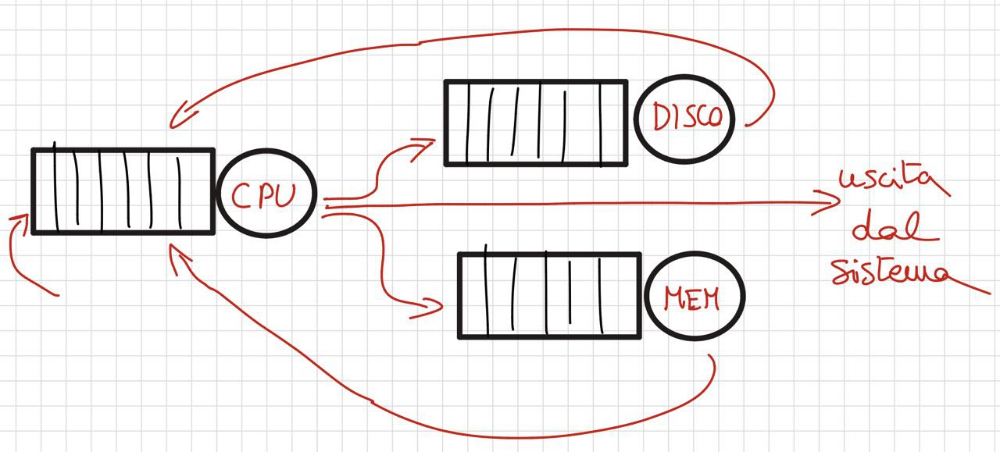

# **M3 UD3 Lezione 2 - Criteri di valutazione della schedulazione**

---

### **1. Introduzione**

La scelta di un algoritmo di schedulazione influenza in modo diretto **l’efficienza, la reattività e la stabilità** di un sistema operativo.  
Per valutare la bontà di una politica di schedulazione, bisogna definire una serie di **criteri oggettivi**, misurabili attraverso parametri temporali e prestazionali.

In questa lezione analizzeremo:

1. i **criteri fondamentali** di valutazione;
2. gli **obiettivi di ottimizzazione**;
3. i **metodi pratici e teorici** per stimare le prestazioni di una politica di scheduling.

---

### **2. Criteri di schedulazione**

I criteri descrivono le grandezze misurabili che servono a valutare la qualità del comportamento del sistema.

$$  
\begin{cases}  
\textbf{1. Utilizzo del processore:}~ & \text{percentuale di tempo in cui la CPU è effettivamente in uso.} \\\\  
\textbf{2. Throughput:}~ & \text{numero di processi completati per unità di tempo.} \\\\  
\textbf{3. Tempo di completamento (Turnaround time):}~ & \text{intervallo tra l’arrivo e la fine del processo.} \\\\  
\textbf{4. Tempo d’attesa:}~ & \text{tempo trascorso dal processo in coda, in stato di “ready”.} \\\\  
\textbf{5. Tempo di risposta:}~ & \text{intervallo tra la richiesta e la prima risposta (importante nei sistemi interattivi).}  
\end{cases}  
$$

#### **2.1. Note di dettaglio sui criteri**

- **Utilizzo del processore** = percentuale di tempo in cui il processore esegue **computazione utile per i processi applicativi**, anziché dedicare tempo ad attività di gestione o restare addirittura in attesa senza eseguire nulla. *Maggiore è l'utilizzo, minore è il costo del sistema per unità di tempo effettivamente elaborato.*
- **Throughput**: misura quanto rapidamente il sistema **completa le singole attività** richieste. È particolarmente significativo quando si hanno applicazioni che richiedono l'esecuzione di **molti processi uno dietro l'altro**.
- **Turnaround time**: importante quando è cruciale **completare la computazione entro un tempo massimo** per soddisfare l'utente; tiene conto anche dei tempi in cui la CPU è assegnata ad altri processi o alla gestione del sistema.
- **Tempo di attesa**: misura *quanto un processo rimane in attesa*, per capire quanto invece **usa effettivamente la CPU**.
- **Tempo di risposta**: misura entro quanto il processo riesce a **iniziare** l'elaborazione richiesta dall'utente (non la fine!). È cruciale per la reattività percepita.

Ogni algoritmo tende a ottimizzare uno o più di questi parametri, ma **nessuno li ottimizza tutti contemporaneamente**:  
l'efficacia dipende sempre dal **contesto di utilizzo** del sistema.

---

### **3. Obiettivi di ottimizzazione**

L’analisi dei criteri porta a individuare gli **obiettivi generali** che un buon algoritmo di schedulazione dovrebbe perseguire:

$$  
\begin{cases}  
\textbf{1.}~ & \text{Massimizzare l’utilizzo della CPU.} \\\\  
\textbf{2.}~ & \text{Massimizzare il throughput.} \\\\  
\textbf{3.}~ & \text{Minimizzare il tempo di completamento medio.} \\\\  
\textbf{4.}~ & \text{Minimizzare il tempo medio di attesa.} \\\\  
\textbf{5.}~ & \text{Minimizzare il tempo medio di risposta.} \\\\  
\textbf{6.}~ & \text{Minimizzare la varianza dei parametri per garantire predicibilità.}  
\end{cases}  
$$

Il sesto punto è cruciale nei **sistemi real-time** o **interattivi**, dove la costanza del comportamento è più importante della velocità assoluta.  
Un sistema imprevedibile, anche se veloce in media, risulta poco affidabile per applicazioni critiche.

#### **3.1. Perché conta la varianza: il limite del solo valor medio**

Massimizzare o minimizzare le cifre di merito **non basta**, perché tutto ciò che ottimizziamo è il **valor medio**.

Esempio: un utilizzo della CPU del **75%** è un dato **significativo** solo se i valori reali si discostano poco da quella media. Se invece i valori effettivi oscillano fra il **50% e il 100%**, sapere che la media è 75% è poco utile, perché la **varianza** è troppo elevata.

L'obiettivo di una buona tecnica di schedulazione è quindi anche quello di **minimizzare la varianza** dei parametri caratteristici, ottenendo così **predicibilità** del comportamento del sistema — e dando un significato realmente rilevante al valore medio dei parametri ottimizzati.

---

### **4. Metodi di valutazione**

Per confrontare diversi algoritmi di schedulazione si utilizzano vari metodi di analisi, che differiscono per complessità, precisione e costo di realizzazione.

---

#### **4.1. Valutazione analitica (modellazione deterministica)**

In questo approccio si costruisce un **modello matematico** del comportamento del sistema e si calcolano le prestazioni in modo deterministico.

$$  
\begin{cases}  
\textbf{Caratteristiche:}~ &  
\begin{cases}  
\text{semplice e veloce da applicare;} \\\\  
\text{precisa se si conoscono i dati di ingresso esatti.}  
\end{cases} \\\\  
\textbf{Limiti:}~ &  
\begin{cases}  
\text{richiede dati accurati e statici;} \\\\  
\text{i risultati non si generalizzano a carichi variabili.}  
\end{cases}  
\end{cases}  
$$

Viene usata principalmente per **situazioni controllate** o per confronti teorici tra algoritmi (ad esempio FCFS, SJF, RR).

---

#### **4.2. Valutazione statistica (modelli a reti di code)**

Questo metodo rappresenta il sistema come una **rete di servizi** in cui i processi si muovono tra **code** (attese) e **stazioni di servizio** (risorse come CPU, disco, I/O).

$$  
\begin{cases}  
\textbf{1.}~ & \text{Ogni coda rappresenta una risorsa o servizio.} \\\\  
\textbf{2.}~ & \text{Le transizioni tra code rappresentano richieste di servizio.} \\\\  
\textbf{3.}~ & \text{Ogni processo segue un percorso nella rete (sequenza di richieste).}  
\end{cases}  
$$

##### **Esempio narrativo: il cammino di un processo nella rete di code**

Nella sua vita, un processo attraversa **una sequenza di richieste di servizio**:

1. attende nella **coda del processore** finché la CPU non si libera;
2. ottiene la CPU ed esegue elaborazione; se ha bisogno di dati dal disco, **rilascia** la CPU ed entra nella **coda del disco**;
3. quando il disco ha completato la lettura, il processo torna nella **coda del processore** per elaborare i dati appena ottenuti;
4. se invece deve attendere input dalla tastiera, entra nella **coda della tastiera**; quando l'input arriva, torna in coda al processore;
5. quando termina, esce dal sistema e non utilizza più alcuna risorsa.

##### **Passi tipici per analizzare una rete di code**

1. **specificare la topologia del grafo** della rete (servizi e collegamenti);
2. **caratterizzare ogni servizio** con la **frequenza di arrivo** delle richieste e il **tempo di servizio** — tipicamente in termini statistici (media e varianza, o distribuzione);
3. **applicare le tecniche matematiche** della Teoria delle Code per ricavare le grandezze d'interesse.

L'analisi si basa sulla **Teoria delle Code**, studiando grandezze come:

- tempo medio d'attesa,
- lunghezza media delle code,
- utilizzo medio delle risorse.

Si ottengono stime **statistiche** del comportamento del sistema, spesso più realistiche di quelle analitiche ma al prezzo di una maggiore complessità (servono inoltre **semplificazioni** per rendere il modello matematicamente trattabile).

---

#### **4.3. Simulazione**

La simulazione consiste nel **realizzare un modello software** del sistema, che riproduce il comportamento dello scheduler e dei processi applicativi.

$$  
\begin{cases}  
\textbf{1.}~ & \text{Si definisce un insieme di dati significativi per i processi.} \\\\  
\textbf{2.}~ & \text{Si eseguono i processi nel simulatore.} \\\\  
\textbf{3.}~ & \text{Si misurano tempi e parametri di schedulazione.}  
\end{cases}  
$$

Questa tecnica permette di **testare nuove politiche** di scheduling in modo sicuro, senza modificare il sistema reale.  
È molto utile nella ricerca e nello sviluppo di nuovi kernel o hypervisor.

---

#### **4.4. Implementazione reale**

L’ultimo metodo consiste nel **testare direttamente l’algoritmo su un sistema operativo funzionante**.

$$  
\begin{cases}  
\textbf{Vantaggi:}~ &  
\begin{cases}  
\text{misurazione diretta e realistica;} \\\\  
\text{possibilità di adattamento dinamico.}  
\end{cases} \\\\  
\textbf{Svantaggi:}~ &  
\begin{cases}  
\text{procedura onerosa;} \\\\  
\text{richiede cooperazione degli utenti e carichi reali.}  
\end{cases}  
\end{cases}  
$$

È la strategia definitiva per verificare il comportamento pratico, ma comporta **rischi e costi elevati**.

##### **Raffinamento dinamico dello scheduler**

L'implementazione reale apre però una possibilità preziosa: durante la **vita operativa del sistema**, i componenti del sistema operativo possono **raccogliere automaticamente** informazioni sulle caratteristiche dei carichi di lavoro effettivi.

Tali dati possono poi essere usati per **rifinire i parametri** dell'algoritmo di schedulazione e ottenere un **adattamento dinamico** dello scheduler al variare dei carichi di lavoro nel tempo — senza dover ricostruire da zero il sistema o riprogettare l'algoritmo. È un meccanismo di **autosintonizzazione** che combina misurazione reale e tuning continuo.

---

### **5. Sintesi finale**

$$  
\begin{cases}  
\textbf{Criteri principali:}~ & \text{utilizzo, throughput, turnaround, attesa, risposta.} \\\\  
\textbf{Obiettivi:}~ & \text{massimizzare efficienza e prevedibilità.} \\\\  
\textbf{Metodi:}~ & \text{analitico, statistico, simulativo, implementativo.}  
\end{cases}  
$$

Ogni metodo offre un compromesso tra **precisione, costo e generalità**, e viene scelto in base al tipo di sistema e all’obiettivo dell’analisi.

---

### **6. Conclusione**

La valutazione della schedulazione è un passaggio cruciale nella progettazione dei sistemi operativi.  
Capire **come misurare e confrontare le prestazioni** consente di scegliere la politica più adatta a seconda del contesto — dai **sistemi real-time**, dove conta la prevedibilità, ai **sistemi interattivi**, dove la priorità è la rapidità di risposta.