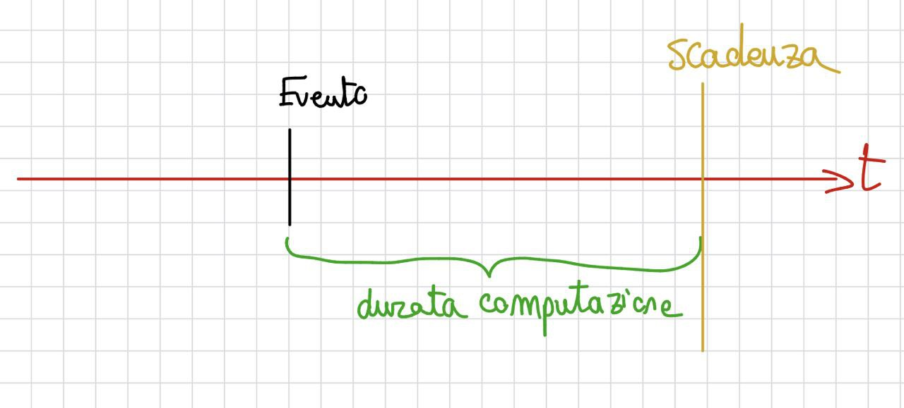

# **M3 UD3 Lezione 4 - Schedulazione per sistemi in tempo reale**

---

### **1. Introduzione**

Nei **sistemi in tempo reale** (real-time systems) la correttezza dell’esecuzione non dipende solo dal _cosa_ viene calcolato, ma anche **da _quando_ il risultato viene prodotto**.  
In altre parole, un processo può essere logicamente corretto ma **fallire** se termina troppo tardi rispetto alla sua _scadenza temporale (deadline)_.

Questi sistemi sono tipici di **ambiti critici** come:

- controllo di veicoli e robot industriali,
- gestione di impianti e sensori,
- aeronautica, medicina e telecomunicazioni,

dove il rispetto dei tempi di risposta è essenziale per la sicurezza o la stabilità del sistema.

---

### **2. Tipologie di sistemi in tempo reale**

I sistemi real-time si distinguono in due categorie fondamentali:

$$  
\begin{cases}  
\textbf{Hard real-time:}~ & \text{le scadenze devono essere rispettate rigorosamente.} \\\\  
\textbf{Soft real-time:}~ & \text{il mancato rispetto delle scadenze è tollerato entro certi limiti.}  
\end{cases}  
$$

---

#### **2.1. Sistemi in tempo reale stretto (Hard Real-Time)**

In un sistema _hard real-time_ è **obbligatorio** che ogni processo termini **entro un tempo massimo garantito** dall'attivazione.  

##### **Scenario tipico**

Nel mondo esterno si verifica un **evento** a un certo istante. Il sistema deve attivare una computazione di reazione, che durerà un tempo $\Delta_e$. Questa computazione **deve completarsi entro una scadenza massima** $T$ a partire dall'evento:

- **se la computazione termina entro $T$**: il sistema opera correttamente;
- **se la computazione si prolunga oltre $T$**: il sistema può avere problemi seri — la reazione agli eventi esterni non è più corretta.

Esempio nell'automazione industriale: se il sistema di controllo non risponde in tempo a un segnale di anomalia, possono verificarsi **fenomeni critici** nel sistema controllato (incidenti, guasti, danni).

Il mancato rispetto della scadenza rappresenta **un errore di sistema**.

Esempi:

- airbag elettronico;
- sistemi di controllo di un reattore nucleare;
- pilota automatico di un velivolo.

---

#### **2.2. Sistemi in tempo reale lasco (Soft Real-Time)**

In un sistema _soft real-time_, il mancato rispetto delle scadenze **non compromette la correttezza del sistema**, ma può ridurne le prestazioni.  
Solo i **processi critici** vengono trattati con priorità elevata.

Esempi:

- streaming video o audio (un piccolo ritardo è tollerato);
- gestione di interfacce utente interattive.

---

### **3. Schedulazione nei sistemi in tempo reale**

#### **3.1. Obiettivo generale**

Garantire che i processi vengano **completati entro i loro limiti temporali**.

#### **3.2. Caratteristiche tipiche**

$$  
\begin{cases}  
\textbf{1.}~ & \text{Schedulazione con tempo massimo di completamento garantito.} \\\\  
\textbf{2.}~ & \text{Schedulazione di processi periodici.} \\  \\
\textbf{3.}~ & \text{Algoritmi di priorità basati su frequenza o scadenza.}  
\end{cases}  
$$

---

### **4. Schedulazione con tempo di completamento garantito**

In un sistema hard real-time, ogni processo $P_i$ deve completarsi entro la sua **deadline $d_i$**.  
Lo scheduler può:

$$  
\begin{cases}  
\text{accettare il processo, garantendone la conclusione entro } d_i \\\\  
\text{oppure rifiutare il processo se non è possibile rispettare la deadline.}  
\end{cases}  
$$

L'accettazione si basa su:

- **stima del tempo di elaborazione $t_i$**
- **prenotazione delle risorse** (CPU, I/O, memoria)

#### **4.1. Nessuna politica specifica: solo analisi a priori**

Va sottolineato che **non esiste una politica di schedulazione specifica** per il tempo massimo garantito: si possono usare le politiche tradizionali (FCFS, priorità, Round Robin, ecc.). L'**unico aspetto essenziale** è che, in base al **carico di lavoro correntemente accettato** e a quello previsto per il nuovo processo, si effettui un'**analisi a priori (admission control)** che porti all'accettazione o al rifiuto del nuovo processo.

#### **4.2. Problema: predicibilità del tempo di completamento**

Il punto critico è la **predicibilità** del tempo di completamento. Se questa è effettuabile in modo sicuro, l'analisi di accettazione garantisce il rispetto della scadenza. Se invece la predicibilità è **incerta**, non si ha la certezza che la valutazione sia corretta, e l'intera garanzia temporale viene meno.

Questo tipo di schedulazione è detta anche **schedulazione predittiva o garantita**, poiché valuta a priori la fattibilità dell'ammissione del processo.

---

### **5. Processi periodici**

Molti sistemi real-time gestiscono **processi periodici**, cioè processi che si attivano a intervalli di tempo regolari.

#### **5.1. Esempio: automazione industriale**

Un sistema di controllo di un processo industriale deve eseguire **ciclicamente** una serie di attività:

1. **acquisizione dello stato** del sistema controllato (lettura dei sensori);
2. **decisione dell'azione di controllo** da applicare in base ai dati acquisiti;
3. **applicazione dell'azione** sul sistema (comando agli attuatori).

Queste attività vengono ripetute periodicamente a intervalli regolari $p_i$: a ogni periodo, il sistema riattiva il processo.

Ogni processo $P_i$ è caratterizzato da tre parametri:

$$  
\begin{cases}  
t_i & = \text{tempo di elaborazione (execution time)} \\\\  
d_i & = \text{scadenza temporale (deadline)} \\\\  
p_i & = \text{periodo di attivazione}  
\end{cases}  
$$

con la condizione:

$$  
0 \leq t_i \leq d_i \leq p_i  
$$

#### **5.2. Perché $d_i \leq p_i$**

La scadenza viene posta **minore o uguale al periodo** per garantire una **facile gestibilità** del processo e per evitare il rischio — in casi critici — che nello stesso periodo si trovino a dover essere eseguite **due istanze** dello stesso processo periodico (situazione che renderebbe ingestibile la pianificazione).

Significa quindi che l'esecuzione del processo deve terminare **entro la sua scadenza** e **prima del successivo periodo di attivazione**.

---

### **6. Politiche di schedulazione per processi periodici**

#### **6.0. Admission control anche per i processi periodici**

Anche nel caso dei processi periodici si effettua un **controllo di ammissione**: il processo viene ammesso **solo se** è dimostrabile che, usando la politica di schedulazione adottata nel sistema, riesce a completare la propria computazione **entro la scadenza** dichiarata nell'ambito di ogni periodo. Altrimenti viene **rifiutato a priori**.

#### **6.1. Round Robin**

Adatto per sistemi _soft real-time_:  
i processi periodici ricevono un quanto di tempo e vengono ciclati in modo equo.  
Non offre garanzie temporali rigorose, ma garantisce buona **reattività** e **equità**.

---

#### **6.2. Schedulazione a frequenza monotona (Rate Monotonic Scheduling – RMS)**

È uno degli algoritmi fondamentali per sistemi _hard real-time_ con processi periodici.  
Fu formalizzato da **Liu e Layland (1973)**.

##### **Caratteristiche principali**

$$  
\begin{cases}  
\textbf{1.}~ & \text{Le priorità sono statiche e assegnate in modo inversamente proporzionale al periodo.} \\\\  
\textbf{2.}~ & \text{Un processo con periodo più breve ha priorità più alta.} \\\\  
\textbf{3.}~ & \text{Lo scheduler è pre-emptive: processi più urgenti possono interrompere quelli in esecuzione.} \\\\
\textbf{4.}~ & \text{Il tempo di elaborazione } t_i \text{ deve essere omogeneo per ogni iterazione del processo } P_i.
\end{cases}  
$$

Il quarto vincolo (omogeneità del tempo di elaborazione tra le iterazioni) è ciò che rende RMS adatto ai **processi periodici regolari** ma poco flessibile per processi con tempi di elaborazione variabili da un'iterazione all'altra.

##### **Esempio**

Due processi periodici:  
$$  
\begin{cases}  
P_1: & t_1 = 1,~ p_1 = 4 \\\\  
P_2: & t_2 = 2,~ p_2 = 6  
\end{cases}  
$$

Il processo $P_1$, avendo periodo più breve, ottiene **priorità più alta**.

##### **Condizione di schedulabilità RMS**

Affinché $n$ processi periodici siano schedulabili in Rate Monotonic, deve valere:

$$  
\sum_{i=1}^{n} \frac{t_i}{p_i} \leq n \cdot (2^{1/n} - 1)  
$$

Per $n \to \infty$, il limite tende a $0.693 \approx 69\%$  
→ significa che il processore può essere utilizzato fino al 69% mantenendo le garanzie temporali.

---

#### **6.3. Schedulazione a scadenza più urgente (Earliest Deadline First – EDF)**

In EDF, la **priorità è dinamica** e dipende dalla **scadenza imminente**:  
il processo con deadline più vicina ha priorità maggiore.

A differenza di RMS, EDF **non richiede** che il tempo di elaborazione sia omogeneo tra le iterazioni — quindi si applica a un insieme più ampio di processi.

##### **Caratteristiche**

$$  
\begin{cases}  
\textbf{1.}~ & \text{Supporta processi periodici e non periodici.} \\\\  
\textbf{2.}~ & \text{Le priorità cambiano dinamicamente a ogni attivazione.} \\\\  
\textbf{3.}~ & \text{Tempo di elaborazione non necessariamente omogeneo.} \\\\
\textbf{4.}~ & \text{Offre maggiore flessibilità rispetto a RMS.}  
\end{cases}  
$$

##### **Rivalutazione dinamica delle priorità**

Le priorità vengono **rivalutate dinamicamente** ogni volta che arriva un nuovo processo pronto: i processi con **scadenza sempre più vicina galleggiano verso priorità più elevate**. In questo modo l'algoritmo concentra la CPU sui processi per cui sta diventando più urgente rispettare la scadenza, massimizzando la probabilità di soddisfarla.

##### **Condizione di schedulabilità EDF**

Per processi indipendenti e pre-emptive, EDF garantisce la schedulabilità se:

$$  
\sum_{i=1}^{n} \frac{t_i}{p_i} \leq 1  
$$

👉 Ciò significa che la CPU può essere sfruttata fino al **100%**, a differenza di RMS (limitato al 69%).

---

### **7. Sistemi in tempo reale lasco (Soft Real-Time)**

In un sistema soft real-time **non tutti i processi sono critici**: alcuni sono prioritari (rapida risposta indispensabile per la correttezza dell'applicazione), altri sono non critici.

- solo i **processi critici** ricevono priorità alta (priorità **statica**);
- i processi **non critici** vengono gestiti con priorità inferiore o **dinamica**;
- per i non critici si applicano spesso meccanismi di **aging** che permettono loro di ottenere prima o poi l'uso del processore, evitando la **starvation**.

#### **7.1. Meccanismi di supporto**

$$  
\begin{cases}  
\textbf{Priorità:}~ & \text{statica per processi critici, dinamica con aging per gli altri.} \\\\  
\textbf{Bassa latenza di dispatch:}~ & \text{il kernel deve essere rapidamente interrompibile.} \\\\  
\textbf{Pre-emption point:}~ & \text{punti di interruzione nelle chiamate di sistema lunghe.} \\\\
\textbf{Kernel interrompibile:}~ & \text{idealmente l'intero kernel deve poter essere prelazionato.}
\end{cases}  
$$

##### **Bassa latenza di dispatch**

La cosa più importante in questi sistemi è una **bassa latenza dell'operazione di dispatching**. Spesso, nel caso di **chiamate di sistema lunghe**, è necessario introdurre punti di **pre-emption** specifici (dove eseguire eventuali cambi di processo) o addirittura rendere l'**intero kernel interrompibile**. In questo modo si garantisce che il caricamento di un nuovo processo possa avvenire rapidamente, riducendo la **latenza di risposta** e permettendo al sistema di reagire in modo fluido anche sotto carico elevato.

---

### **8. Sintesi finale**

$$  
\begin{cases}  
\textbf{Hard real-time:}~ & \text{scadenze rigide e garantite.} \\\\  
\textbf{Soft real-time:}~ & \text{scadenze flessibili, priorità solo per processi critici.} \\\\  
\textbf{Algoritmi principali:}~ &  
\begin{cases}  
\text{Schedulazione garantita;} \\\\  
\text{Schedulazione periodica;} \\\\  
\text{Rate Monotonic (RMS);} \\\\  
\text{Earliest Deadline First (EDF).}  
\end{cases}  
\end{cases}  
$$

---

### **9. Conclusione**

I sistemi in tempo reale rappresentano l’espressione più rigorosa della schedulazione.  
Qui **la correttezza è temporale oltre che logica**: non basta terminare un compito, bisogna farlo _entro_ il tempo stabilito.

Gli algoritmi RMS ed EDF sono i pilastri della schedulazione deterministica:

- il primo, semplice e statico, garantisce stabilità;
- il secondo, dinamico e ottimale, massimizza l'utilizzo della CPU.

Entrambi costituiscono la base di progettazione per i **sistemi embedded, avionici, medici e di automazione industriale**, dove la puntualità vale quanto la precisione.
