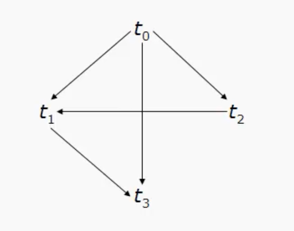
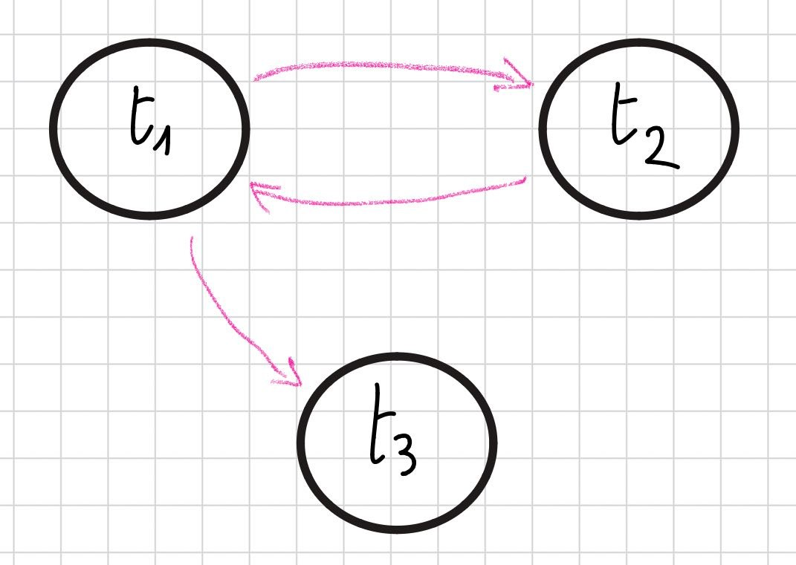

# **M6 UD3 Lezione 4 - Conflict-serializzabilità**

### **1. Introduzione**

La **conflict-serializzabilità** rappresenta una forma più **restrittiva ma praticabile** di serializzabilità rispetto alla **view-serializzabilità**.  
Essa si basa sull’analisi dei **conflitti** tra operazioni appartenenti a transazioni diverse e consente di determinare in modo **efficiente** se uno schedule concorrente produce un risultato equivalente a uno **schedule seriale**.

---

### **2. Definizione di conflitto**

Due operazioni $a_i$ e $a_j$ (con $i \ne j$) si dicono **in conflitto** se soddisfano contemporaneamente le seguenti condizioni:

1. Appartengono a **due diverse transazioni**;
2. Accedono allo **stesso oggetto** (es. stessa variabile o pagina di memoria);
3. **Almeno una delle due** è un’operazione di **scrittura**.

Esistono quindi tre tipi di conflitto:

- **read–write (rw)**
- **write–read (wr)**
- **write–write (ww)**

---

### **3. Esempio di conflitti**

Consideriamo:

```
t1: r1(x) r1(y) w1(x) w1(y)
t2: r2(y) r2(x) w2(y)
```

**Conflitti presenti:**

- $(w1(x), r2(x))$ → conflitto **write–read**
- $(w1(y), r2(y))$ → conflitto **write–read**
- $(w1(y), w2(y))$ → conflitto **write–write**
- $(r1(y), w2(y))$ → conflitto **read–write**

---

### **4. Conflict-equivalenza**

Due schedule $S_i$ e $S_j$ (con $i \ne j$) sono **conflict-equivalenti** se valgono entrambe le condizioni:

1. Contengono **le stesse operazioni**;
2. Ogni coppia di operazioni in conflitto appare **nello stesso ordine** in entrambi gli schedule.

Si indica formalmente come:

$$
S_i \equiv_C S_j
$$

---

### **5. Conflict-serializzabilità**

Uno **schedule è conflict-serializzabile** se è **conflict-equivalente a uno schedule seriale**.

L’insieme di tutti gli schedule conflict-serializzabili si indica con:

$$
CSR = { S \ |\ S \equiv_C S_{seriale} }
$$

In altre parole, anche se le operazioni delle transazioni sono intrecciate, il loro ordine relativo nei conflitti è tale da preservare l’effetto di una serializzazione corretta.

---

### **6. Esempio di conflict-serializzabilità**

```
S: w0(x) r1(x) w0(z) r1(z) r2(x) r3(z) w3(z) w1(x)
```

**Conflitti rilevati:**

Mentre li scriviamo, li affianchiamo sin da subito con $t_{prima} \rightarrow t_{dopo}$ per indicare chi ha la precedenza, perché dobbiamo rispettare l'ordine delle operazioni in conflitto per vincolo dimostrativo della conflit-equivalenza.

- $(w0(x), r1(x))$ ⚠️ $t0 \rightarrow t1$
- $(w0(x), r2(x))$ ⚠️ $t0 \rightarrow t2$
- $(w0(x), w1(x))$ ⚠️ $t0 \rightarrow t1$
- $(w0(z), r1(z))$ ⚠️ $t0 \rightarrow t1$
- $(w0(z), r3(z))$ ⚠️ $t0 \rightarrow t3$
- $(w0(z), w3(z))$ ⚠️ $t0 \rightarrow t3$
- $(r1(z), w3(z))$ ⚠️ $t1 \rightarrow t3$
- $(r2(x), w1(x))$ ⚠️ $t2 \rightarrow t1$

Guardando appunto gli ordini di precedenza, notiamo che t0 deve precedere le altre, t2 deve precedere t1 e t1 deve precedere t3.

Ci mettiamo un attimo a concatenarle:

$t0 \rightarrow t2 \rightarrow t1 \rightarrow t3$

Abbiamo trovato **l'unico** tra i $4! = 24$ possibili schedule seriali che rispetta l'ordine dei conflitti e che quindi **POTREBBE** essere equivalente a S.

Perché dico "potrebbe"? Perché dobbiamo ancora verificare che le operazioni in conflitto siano nello stesso ordine in entrambi gli schedule.

Per giungere a una conclusione, iniziamo a scrivere lo schedule seriale trovato:

```
w0(x) w0(z) r2(x) r1(x) r1(z) w1(x) r3(z) w3(z)
```

Ora a partire da questo nuovo schedule seriale, verifichiamo che le operazioni in conflitto siano nello stesso ordine di S:

- $(w0(x), r1(x))$ ⚠️ $t0 \rightarrow t1$ ✅
- $(w0(x), r2(x))$ ⚠️ $t0 \rightarrow t2$ ✅
- $(w0(x), w1(x))$ ⚠️ $t0 \rightarrow t1$ ✅
- $(w0(z), r1(z))$ ⚠️ $t0 \rightarrow t1$ ✅
- $(w0(z), r3(z))$ ⚠️ $t0 \rightarrow t3$ ✅
- $(w0(z), w3(z))$ ⚠️ $t0 \rightarrow t3$ ✅
- $(r1(z), w3(z))$ ⚠️ $t1 \rightarrow t3$ ✅
- $(r2(x), w1(x))$ ⚠️ $t2 \rightarrow t1$ ✅

Confrontando le operazioni in conflitto, vediamo che **tutte** rispettano lo stesso ordine in entrambi gli schedule.

✅ **Conclusione:** lo schedule è **conflict-serializzabile**.

Notiamo però che è oneroso ogni volta dover confrontare tutte le operazioni in conflitto per verificare la conflict-serializzabilità, specie se il numero di transazioni e di operazioni cresce. Quindi sovviene una domanda: **esiste un metodo più sistematico per verificare la conflict-serializzabilità, che non funzioni per elencazione manuale?**

---

### **7. Grafo dei conflitti**

Per verificare in modo sistematico la conflict-serializzabilità, si costruisce il **grafo dei conflitti (precedence graph)**.

**Costruzione:**

1. Ogni **transazione** è rappresentata da un **nodo**.
2. Per ogni coppia di operazioni $(a_i, a_j)$ in conflitto tali che $a_i$ **precede** $a_j$ nello schedule, si traccia un **arco orientato** da $t_i$ a $t_j$.

**Criterio di serializzabilità:**

> Uno schedule è **conflict-serializzabile se e solo se** il grafo dei conflitti è **aciclico**.

In tal caso, gli **ordinamenti topologici** del grafo rappresentano **tutti gli schedule seriali equivalenti**. Gli ordinamenti topologici sono tutti gli ordinamenti possibili dei nodi del grafo che rispettano la direzione degli archi.

---

### **8. Esempio di grafo dei conflitti**

Per lo schedule:

```
S: w0(x) r1(x) w0(z) r1(z) r2(x) r3(z) w3(z) w1(x)
```

**Conflitti già individuati:**

- $(w0(x), r1(x))$
- $(w0(x), r2(x))$
- $(w0(x), w1(x))$
- $(w0(z), r1(z))$
- $(w0(z), r3(z))$
- $(w0(z), w3(z))$
- $(r1(z), w3(z))$
- $(r2(x), w1(x))$



Il grafo risultante è **aciclico**, quindi lo schedule è **conflict-serializzabile**.

---

### **9. Relazione tra CSR e VSR**

Le due classi di serializzabilità sono **legate da un rapporto di inclusione**:

$$
CSR \subseteq VSR
$$

In altre parole:

- Se $S \in CSR$ ⇒ allora $S \in VSR$
- Se $S \notin VSR$ ⇒ allora $S \notin CSR$
- Se $S \notin CSR$ ⇒ **non possiamo dire nulla** sulla sua appartenenza a VSR
- Se $S \in VSR$ ⇒ **non possiamo dire nulla** sulla sua appartenenza a CSR

Visualmente:

```

VSR
└── CSR

```

---

### **10. Esempio: CSR vs VSR**

```
t1: r1(x) w1(x)
t2: w2(x) -- blind write
t3: w3(x) -- blind write

S: r1(x) w2(x) w1(x) w3(x)
```

Partiamo verificando la **view-serializzabilità**: dobbiamo guardare le **relazioni di lettura e scrittura finale**.

- r1(x) legge il valore iniziale di x
- la scrittura finale è ad opera di t3 con w3(x)

Ci sono $3! = 6$ possibili schedule seriali, procediamo a discriminare quelli non validi:

- dalla prima relazione di lettura t1 deve venire per forza per primo;
- dalla seconda relazione di scrittura finale t3 deve venire per forza per ultimo.

Rimane dunque confinato un unico schedule seriale possibile:

$S_{seriale} = t1 \rightarrow t2 \rightarrow t3$

$\implies$ Lo schedule è **view-serializzabile**, poiché mantiene le stesse relazioni di lettura e scrittura finale.

Valutiamo ora se lo schedule è **conflict-serializzabile**: dobbiamo costruire il grafo dei conflitti a partire dai conflitti nello schedule originale:

- $(r1(x), w2(x))$ → conflitto **read–write** → arco da t1 a t2
- $(r1(x), w3(x))$ → conflitto **read–write** → arco da t1 a t3
- $(w2(x), r1(x))$ → conflitto **write–read** → arco da t2 a t1

ALT! Non scriviamoli tutti, ci accorgiamo subito che il grafo dei conflitti contiene un **ciclo** tra t1 e t2:



- Ergo **non è conflict-serializzabile**, perché le operazioni in conflitto non possono essere ordinate in modo aciclico nel grafo.

✅ **Conclusione:** tutti gli schedule conflict-serializzabili sono view-serializzabili, ma non vale il contrario.

---

### **11. Complessità della verifica**

Determinare se uno schedule è **conflict-serializzabile** ha un **costo lineare** nella dimensione del grafo dei conflitti, quindi molto inferiore rispetto alla verifica della view-serializzabilità (NP-difficile).

Tuttavia, nei **sistemi distribuiti** o ad altissimo carico, anche questa verifica può risultare onerosa.
Per questo motivo, i DBMS reali utilizzano **condizioni ancora più restrittive**, ma **più efficienti da verificare**, come il **locking a due fasi (2PL)** o i **timestamp ordering**.

---

### **12. In sintesi**

In questa lezione abbiamo introdotto e analizzato il concetto di **conflict-serializzabilità**, criterio pratico di correttezza per gli schedule concorrenti.

**Abbiamo visto:**

- La definizione di **conflitto** tra operazioni
- Il concetto di **conflict-equivalenza**
- Il criterio di **conflict-serializzabilità**
- La **costruzione del grafo dei conflitti** e la condizione di **aciclicità**
- La relazione **CSR ⊆ VSR**
- La **complessità lineare** del controllo di conflict-serializzabilità

**Idea chiave:**
La conflict-serializzabilità fornisce un metodo **più restrittivo ma più efficiente** per garantire la correttezza dell’esecuzione concorrente rispetto alla view-serializzabilità, rappresentando il punto di equilibrio tra **teoria e applicabilità pratica**.

---


```

```

```

```
