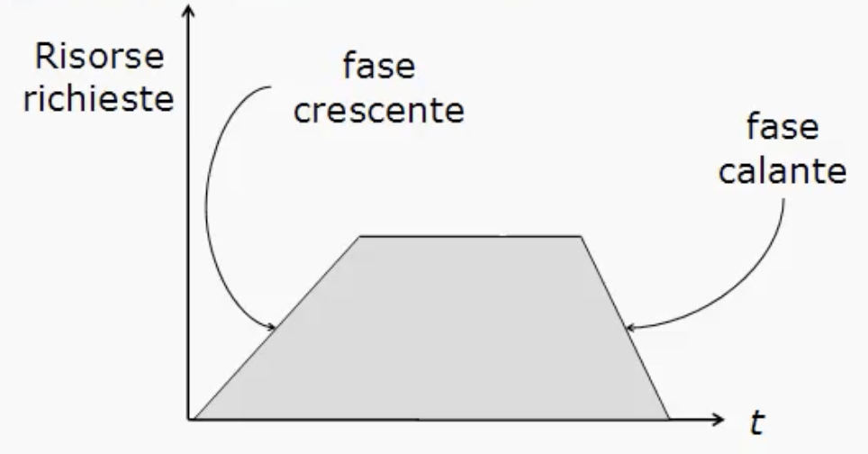
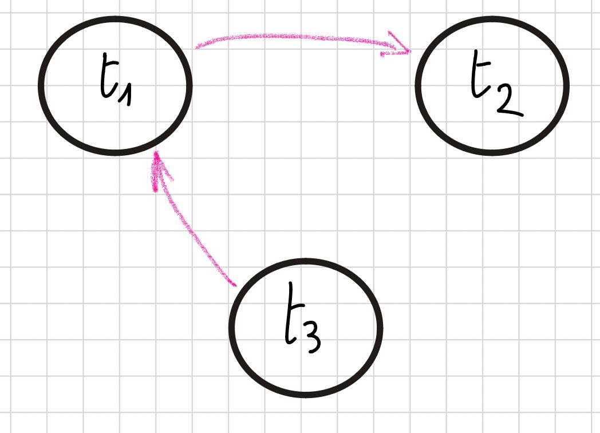

# **M6 UD3 Lezione 5 - Locking a due fasi (2PL)**

### **1. Introduzione al controllo della concorrenza**

Nei sistemi reali, la **serializzabilità** delle transazioni **non viene verificata a posteriori**, ma viene **garantita direttamente durante l’esecuzione**.  
I DBMS adottano quindi **tecniche di controllo preventivo**, che impediscono la generazione di schedule non serializzabili.

Le principali tecniche utilizzate sono:

- **Locking a due fasi (2PL)**
- **Timestamp ordering**, che può essere:
  - **monoversione**
  - **multiversione**

---

### **2. Il concetto di lock**

Un **lock** è una variabile associata a un dato del database che descrive **lo stato di accesso** di tale dato rispetto alle operazioni delle transazioni.

Serve per **sincronizzare gli accessi**:  
una transazione può leggere o scrivere un oggetto **solo se possiede il lock appropriato**.

Esistono due tipologie principali di lock:

1. **Lock binario (a due stati):**
   - `unlocked (0)`
   - `locked (1)`

2. **Lock a tre stati:**
   - `unlocked`
   - `r_locked` (blocco in lettura, condiviso)
   - `w_locked` (blocco in scrittura, esclusivo)

---

### **3. Regole del locking a due stati**

Per accedere a un dato, una transazione deve:

1. **Richiedere un lock** sull’oggetto prima dell’accesso.
2. **Rilasciare il lock (unlock)** quando non ne ha più bisogno.
3. **Accedere** al dato solo **se ha ottenuto il lock relativo**.

Una transazione che segue queste regole è detta **ben formata rispetto al locking**.

---

### **4. Regole del locking a tre stati**

Nel caso di lock a tre stati, le regole diventano:

- Per accedere **in lettura**:  
   la transazione deve ottenere un **`r_lock` (condiviso)**.
- Per accedere **in scrittura**:  
   la transazione deve ottenere un **`w_lock` (esclusivo)**.
- I lock vengono **rilasciati** (unlock) quando il dato non serve più.
- Una transazione può eseguire un’operazione **solo se possiede il lock relativo**.

Anche in questo caso, una transazione che rispetta tali regole è **ben formata rispetto al locking**.

---

### **5. Gestione dei lock**

La gestione dei lock è affidata a un modulo del DBMS chiamato **lock manager**.  
Questo modulo:

- Riceve le **richieste di lock** dalle transazioni;
- Decide se **concedere o negare** la richiesta in base alla **tabella dei conflitti**;
- Se il lock non può essere concesso, **sospende** la transazione finché diventa disponibile;
- Aggiorna le **tabelle dei lock**, mantenendo lo stato attuale e il numero di lettori condivisi.

---

### **6. Tabella dei conflitti – Lock a due stati**

| **Stato corrente** | **Richiesta** | **Nuovo stato / Esito** |
| ------------------ | ------------- | ----------------------- |
| `unlocked`         | `lock`        | `locked` ✅             |
| `locked`           | `lock`        | ❌ Non consentito       |
| `locked`           | `unlock`      | `unlocked` ✅           |
| `unlocked`         | `unlock`      | ⚠️ Errore               |

---

### **7. Tabella dei conflitti – Lock a tre stati**

| **Stato corrente** | **Richiesta** | **Nuovo stato / Esito**                                                  |
| ------------------ | ------------- | ------------------------------------------------------------------------ |
| `unlocked`         | `r_lock`      | `r_locked` ✅                                                            |
| `unlocked`         | `w_lock`      | `w_locked` ✅                                                            |
| `r_locked`         | `r_lock`      | `r_locked` ✅ (`c = c + 1`)                                              |
| `r_locked`         | `w_lock`      | `r_locked` ❌, salvo **upgrade** di un `r_lock` tenuto in modo esclusivo |
| `w_locked`         | `r_lock`      | `w_locked` ❌                                                            |
| `w_locked`         | `w_lock`      | `w_locked` ❌                                                            |
| `unlocked`         | `unlock`      | ⚠️ Errore                                                                |
| `r_locked`         | `unlock`      | ✅ `c = c - 1` → `unlocked` se `c = 0`, altrimenti `r_locked`            |
| `w_locked`         | `unlock`      | `unlocked` ✅                                                            |

Il contatore `c` indica quante transazioni possiedono un **lock condiviso** in lettura sullo stesso dato.

---

### **8. Locking a due fasi (2PL)**

Il **protocollo Two-Phase Locking (2PL)** stabilisce che:

> Una transazione, **dopo aver rilasciato un lock**, **non può acquisirne altri**.

Ciò significa che ogni transazione attraversa **due fasi distinte**:

1. **Fase crescente (growing phase):**  
   la transazione può **acquisire nuovi lock**, ma non rilasciarne.
2. **Fase decrescente (shrinking phase):**  
   la transazione può **rilasciare i lock**, ma non acquisirne di nuovi.

Questa regola assicura che **gli schedule prodotti siano serializzabili**, cioè che l’esecuzione concorrente mantenga la coerenza dei dati.

---

### **9. Esempio grafico di 2PL**



Durante la **fase crescente**, la transazione ottiene i lock necessari;  
una volta iniziata la **fase decrescente**, non può più richiederne di nuovi.

---

### **10. Schedule 2PL**

Gli schedule prodotti da uno **scheduler** che adotta la tecnica 2PL possiedono le seguenti caratteristiche:

- Le transazioni sono **ben formate** rispetto al locking;
- La gestione dei lock è **basata sui conflitti**;
- Tutte le transazioni rispettano la **regola delle due fasi**.

Tali schedule appartengono alla **classe 2PL**.

---

### **11. Relazione tra 2PL, CSR e VSR**

Le relazioni tra i vari insiemi di schedule sono le seguenti:

$$
2PL \subseteq CSR \subseteq VSR
$$

Significa che:

- Se $S \in 2PL$, allora $S \in CSR$
- Se $S \notin CSR$, allora $S \notin 2PL$
- Se $S \notin 2PL$, **non si può sapere** se $S \in CSR$
- Se $S \in CSR$, **non si può sapere** se $S \in 2PL$

Graficamente:

```
VSR
 └── CSR
      └── 2PL
```

---

### **12. Esempio: Schedule conflict-serializzabile ma non 2PL**

```
S: r1(x) w1(x) r2(x) w2(x) r3(y) w1(y)
```

Dimostriamo innanzitutto che è **conflict-serializzabile**:

iniziamo a elencare i conflitti:

- $(w1(x), r2(x))$ ⚠️ $t1 \rightarrow t2$
- $(w1(x), w2(x))$ ⚠️ $t1 \rightarrow t2$
- $(w2(x), r1(x))$ ⚠️ $t1 \rightarrow t2$
- $(w2(x), w1(x))$ ⚠️ $t1 \rightarrow t2$
- $(w1(y), r3(y))$ ⚠️ $t3 \rightarrow t1$

Grafo risultante:



è aciclico, con un unico ordinamento topologico, quindi:

- Lo schedule è **conflict-serializzabile**, equivalente a una serializzazione in ordine **t3 → t1 → t2**.

Ora dimostriamo che non è 2PL:

Lavoriamo nell'assunzione che lo scheduler abbia accettato e concesso i lock e vediamo se riusciamo ad arrivare fino in fondo...

Per semplicità useremo **lock a due stati**:

- `t1` richiede lock su `x` → concesso: `x` è locked da `t1`
- `t1` legge `x` e poi scrive `x`
- ora tocca a `t2` leggere, ma allora dovremmo unlockare `x` da `t1`

$\implies$ ma questo non ci piace, perché guardando alla fine dello schedule, notiamo che `t1` scrive anche su `y`.

Allora i casi sono due:

- quando rilascia il lock su `x` aveva già acquisito anche il lock su `y` oppure no.

In caso negativo, questo non gli verrà mai più dato, perché saremmo già nella shrinking phase.
Supponiamo dunque di essere nel primo caso:

- `t1` chiede e ottiene lock su `y` → concesso: `y` è locked da `t1`
- ora possiamo passare alla fase di shrinking di `t1`, che rilascia i lock su `x`, cosicché...
- `t2` può ora chiedere e ottenere lock su `x` → una volta ottenuto, legge e scrive `x` e poi rilascia il lock su `x`
- ora il protagonista dovrebbe diventare `t3` che vorrebbe chiedere lock su `y` per leggerla, ma questo non gli viene concesso perché `t1` è ancora in fase di shrinking e possiede il lock su `y`.

Siamo giunti a una configurazione che non ci consente di proseguire - questo è quello che vedremo nella lezione 8 e che prende il nome di deadlock, o stallo.

- Quindi, **non rispetta la regola delle due fasi**, quindi **non appartiene alla classe 2PL**.

---

### **13. Variante: Locking a due fasi stretto**

Nella pratica, lo scheduler **non conosce in anticipo** l’esito (commit o abort) delle transazioni.  
Per questo motivo, si applica una variante chiamata **2PL stretto (strict 2PL)**, utilizzata nella maggior parte dei DBMS commerciali.

Regole del **2PL stretto:**

1. Una transazione, dopo aver rilasciato un lock, non può più acquisirne altri.
2. **Tutti i lock** (sia in lettura che in scrittura) **possono essere rilasciati solo dopo il commit o l’abort**.

Questo elimina il rischio di **letture sporche** e semplifica il **recovery** in caso di guasto.

---

### **14. Variazioni del protocollo 2PL**

| **Tipo di 2PL**      | **Descrizione**                                                                | **Proprietà garantite**     |
| -------------------- | ------------------------------------------------------------------------------ | --------------------------- |
| **2PL base**         | Una transazione, dopo aver rilasciato un lock, non può acquisirne altri        | Garantisce serializzabilità |
| **2PL stretto**      | Come il 2PL base, ma i lock vengono rilasciati solo dopo commit/abort          | Elimina letture sporche     |
| **2PL conservativo** | La transazione deve acquisire **tutti i lock** prima di iniziare le operazioni | Previene deadlock           |

---

### **15. In sintesi**

In questa lezione abbiamo studiato il **meccanismo di locking a due fasi**, base di molti sistemi di gestione della concorrenza.

**Concetti chiave:**

- Il **lock** rappresenta lo stato di accesso a un dato.
- Le transazioni **ben formate** richiedono e rilasciano lock nel modo corretto.
- Il protocollo **2PL** garantisce la **serializzabilità** suddividendo ogni transazione in:
  - **fase crescente**, in cui acquisisce i lock;
  - **fase decrescente**, in cui li rilascia.
- Le varianti **stretto** e **conservativo** aggiungono vincoli ulteriori per prevenire rispettivamente **letture sporche** e **deadlock**.
- Vale la relazione fondamentale:  
   $$2PL \subseteq CSR \subseteq VSR$$

---


