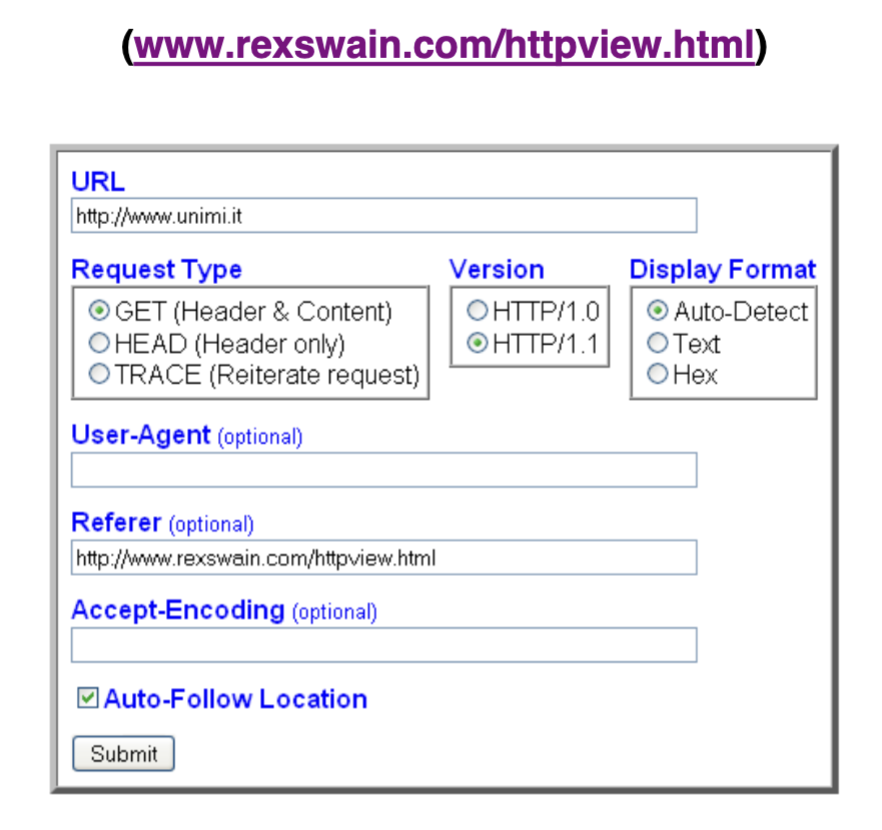

# **Esercizio L8.1 – Un Semplice Visualizzatore di Header HTTP**

**Autore:** Ernesto Damiani — Modulo 4 (DAMNO_M4_U1_L8)

---

## **Consegna / Descrizione dello strumento**

Lo strumento didattico di riferimento è l'**HTTP Viewer di Rex Swain**, che permette di osservare in dettaglio le richieste e risposte HTTP generate durante una normale comunicazione web, rendendo visibili gli header che il browser normalmente nasconde all'utente.

---

### **Come usare l'HTTP Viewer**

Fondamentalmente basta inserire un URL e poi fare clic sul pulsante **Submit**.

#### **Parametri configurabili**

**URL**
- Deve iniziare con `http://`.
- Il visualizzatore non supporta HTTPS (connessioni cifrate con TLS).

**Request Type**
- `GET` (default): mostra sia l'header sia il contenuto della risposta.
- `HEAD`: mostra solo l'header HTTP, senza scaricare il corpo del documento.
- `TRACE`: di scarso interesse — ripete semplicemente la richiesta (echo della richiesta HTTP).

**Version**
- La versione HTTP può influenzare la risposta del server.
- `HTTP/1.1` è la versione più moderna.
- Attenzione: con `HTTP/1.1` il server può rispondere con dati "spezzettati" (`Transfer-Encoding: chunked`), in cui la risposta completa è divisa in parti più piccole inviate separatamente.

**Display Format**
- `Auto-Detect` (default): legge il campo `Content-Type` nell'header e sceglie automaticamente il formato di visualizzazione appropriato.
- `Text`: forza la visualizzazione testuale — adatta per HTML, CSS, JS.
- `Hex`: forza la visualizzazione esadecimale — più appropriata per file di immagini o binari.

**User-Agent** *(opzionale)*
- Talvolta un server remoto ritorna una risposta diversa a seconda del client o del browser che ha iniziato la richiesta.
- Se non specificato, viene copiata la stringa User-Agent del browser corrente.

**Referer** *(opzionale)*
- Comunica al server l'URL da cui si è ottenuto il link alla risorsa richiesta.
- Il server può rispondere diversamente in base alla risorsa di riferimento (referrer): consente la creazione di back-link, logging, caching ottimizzata, individuazione di link obsoleti.
- Il campo `Referer` non dovrebbe essere inviato se l'URL è stata digitata direttamente dall'utente (non proveniente da un'altra pagina).

**Accept-Encoding** *(opzionale)*
- Specifica i formati compressi che il client è in grado di gestire nella risposta.
- Esempi: `compress`, `gzip`, `deflate`.
- Il server potrà inviare la risposta compressa, riducendo la quantità di dati trasmessi.

**Auto-Follow Location**
- Se il server risponde con un header `Location:` (redirect), il viewer segue automaticamente il nuovo indirizzo.
- Continua a seguire i redirect fino a un massimo di **4 volte consecutive**.

---

## **Cosa mostra l'HTTP Viewer**

### **Sezione Header**

Mostra ciò che il browser riceverebbe, ma normalmente non visualizza all'utente. Esempi di campi tipici:

| Campo header | Significato |
|---|---|
| `Last-Modified:` | Data dell'ultima modifica della risorsa sul server |
| `Set-Cookie:` | Chiede al browser di salvare un cookie localmente |
| `Location:` | Chiede al browser di spostarsi a un altro URL (redirect) |
| `Transfer-Encoding: chunked` | La risposta è inviata a blocchi separati |
| `Content-Type:` | Tipo MIME del contenuto (es. `text/html`, `image/jpeg`) |

### **Sezione Content**

Mostra il corpo della risposta HTTP — i dati che il browser normalmente visualizzerebbe (simile alla funzione "View Source" del browser).

In visualizzazione testuale, i caratteri non testuali vengono mostrati esplicitamente:

| Simbolo | Significato | Codice esadecimale |
|---|---|---|
| `(LF)` | Line Feed — nuova riga Unix | `0A` |
| `(CR)` | Carriage Return — ritorno carrello | `0D` |
| `(HT)` | Horizontal Tab — tabulazione orizzontale | `09` |
| `(00)` | Byte nullo | `00` |

---

## **Spiegazione didattica step-by-step**

### **1. Perché GET vs HEAD?**

**GET** è il metodo standard per richiedere una risorsa: il server risponde con header + body (il documento completo). È ciò che il browser fa ogni volta che carichi una pagina.

**HEAD** richiede *solo* l'header: il server elabora la richiesta identicamente a GET ma non invia il corpo. È utile per:
- Verificare se una risorsa esiste (codice di stato).
- Controllare la data di ultima modifica (`Last-Modified`) senza scaricare l'intero file.
- Scoprire la dimensione di un file (`Content-Length`) prima di scaricarlo.
- Ispezionare i campi dell'header senza il costo del trasferimento del corpo.

**TRACE** fa eco della richiesta HTTP ricevuta — il server risponde con la richiesta stessa come corpo. È utile per il debugging di proxy e intermediari, ma raramente usato in pratica.

> 💡 In termini di Socket API (il tema centrale del modulo), GET e HEAD sono semplicemente stringhe diverse che il client invia nella prima riga della richiesta HTTP. Il socket non distingue: trasporta byte. È il testo della richiesta che determina il comportamento del server.

---

### **2. Perché HTTP/1.0 vs HTTP/1.1?**

**HTTP/1.0**: ogni richiesta apre una nuova connessione TCP, la usa per una sola richiesta/risposta, poi la chiude. Overhead elevato per pagine con molte risorse.

**HTTP/1.1**: connessioni persistenti — la connessione TCP rimane aperta per più richieste/risposte. Più efficiente, ma introduce la complessità del **chunked transfer encoding**: quando il server non conosce in anticipo la lunghezza della risposta (es. contenuto generato dinamicamente), la invia a pezzi (`chunk`), ciascuno prefissato dalla propria dimensione in esadecimale. Il viewer mostra questo comportamento esplicitamente.

> ⚠️ Con HTTP/1.1 e chunked encoding, i dati non arrivano in un solo blocco. Questo è esattamente il problema che il loop `while (totalBytesRcvd < echoStringLen)` in `TCPClientEcho` (L5.1) gestisce: si deve continuare a chiamare `recv()` finché non si sono ricevuti tutti i dati attesi.

---

### **3. User-Agent: perché importa?**

Alcuni server analizzano lo User-Agent per:
- Servire versioni diverse del sito (mobile vs desktop).
- Bloccare bot o crawler.
- Abilitare funzionalità specifiche del browser.

Dall'HTTP Viewer si può impostare uno User-Agent arbitrario e osservare come cambia la risposta del server: questo dimostra concretamente che l'header non è verificato — il server si fida di quello che il client dichiara.

> ⚠️ Questa mancanza di verifica è un principio generale del protocollo HTTP: come già visto in L2 (header HTTP), gli header del client non hanno autenticazione. Un attaccante può mandare qualsiasi User-Agent.

---

### **4. Referer: la catena di navigazione**

Il campo `Referer` (storicamente scritto con un errore di ortografia — dovrebbe essere "Referrer") indica da quale pagina si è arrivati alla risorsa corrente. I server lo usano per:
- **Analytics**: tracciare da dove vengono i visitatori.
- **Revenue sharing**: verificare che i click provengano da siti partner.
- **Hot-link protection**: bloccare il caricamento diretto di immagini da siti esterni.

Non va inviato se l'URL è stata digitata direttamente (nessuna pagina di riferimento): in quel caso non c'è un Referer legittimo.

---

### **5. Accept-Encoding: la compressione**

Dichiarando `gzip` o `compress`, il client dice al server che sa decomprimere quella codifica. Il server può allora inviare il contenuto compresso, riducendo la banda. L'header di risposta conterrà `Content-Encoding: gzip` e il body sarà un flusso di byte compressi (visualizzabili in hex mode).

> 💡 Questo è un esempio di **negoziazione del contenuto** in HTTP: client e server si accordano sul formato più efficiente attraverso gli header, senza che il programmatore del socket debba fare nulla di speciale — è tutto nel testo dell'header HTTP.

---

### **6. Auto-Follow Location: i redirect**

Quando un server risponde con codice `301 Moved Permanently` o `302 Found`, include un header `Location:` con il nuovo URL. Il browser normalmente segue automaticamente il redirect. Il viewer consente di osservare ogni singolo hop della catena di redirect.

**Esempio con Amazon** (dalla consegna del docente):
1. Si invia GET a `http://www.amazon.com`.
2. Amazon risponde con `301` → `Location: http://www.amazon.com/` (aggiunge lo slash finale).
3. Il viewer segue → Amazon risponde con `302` → reindirizza alla versione localizzata.
4. Durante questi hop, Amazon imposta vari `Set-Cookie` per tracciare la sessione.
5. Se sul browser ci sono già cookie Amazon, la risposta sarà diversa (il server li legge e risponde in modo personalizzato).

> 📌 Questo esempio illustra perfettamente perché HTTP è descritto come "stateless ma con meccanismi per lo stato": la sequenza di redirect + cookie è il modo in cui Amazon mantiene il contesto dell'utente attraverso più richieste HTTP stateless.

---

## **Usi pratici**

| Scenario | Come usare il viewer |
|---|---|
| Debuggare header HTTP | GET + HEAD su qualsiasi URL |
| Vedere se un redirect è temporaneo o permanente | Controllare il codice (301 vs 302) nell'header |
| Ispezionare i cookie impostati da un sito | Auto-Follow Location + leggere `Set-Cookie` nell'header |
| Vedere il sorgente di un file `.js` o `.css` | GET + Display Format: Text |
| Verificare la data di modifica di una risorsa | HEAD + leggere `Last-Modified` |
| Capire se un server comprime il contenuto | Accept-Encoding: gzip + leggere `Content-Encoding` nella risposta |

---

## **Altri strumenti simili citati dal docente**

Nella home page dell'autore sono disponibili altre demo e strumenti:
- Esempi in APL, REXX, XEDIT, KEDIT, Perl, HTML.
- Strumenti per analizzare: cookie HTTP, variabili CGI, colori RGB, Server Side Includes (SSI).

---

## **Collegamento con il resto del modulo**

> ✅ L'HTTP Viewer mostra concretamente cosa viaggia su un socket TCP quando si fa una richiesta web. Tutto ciò che si vede — header request, header response, body — è il **testo applicativo** che il programmatore deve costruire manualmente quando usa la Socket Library per implementare un client HTTP da zero. Il socket è il canale; il protocollo HTTP è il testo che ci scorre sopra.
