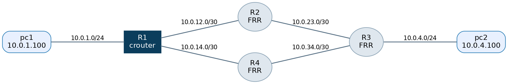
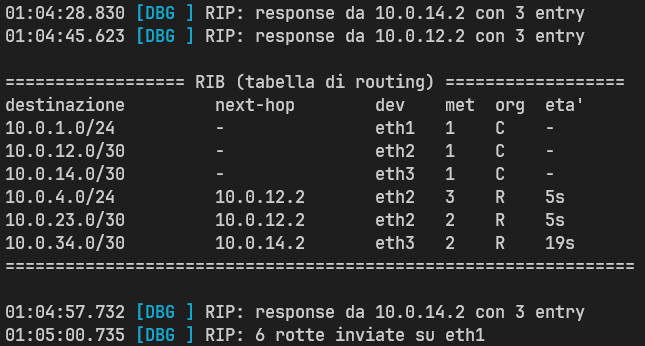
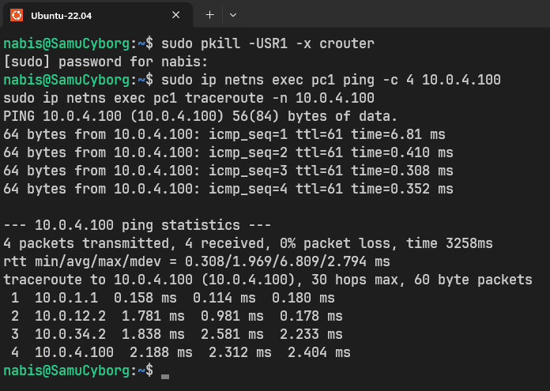
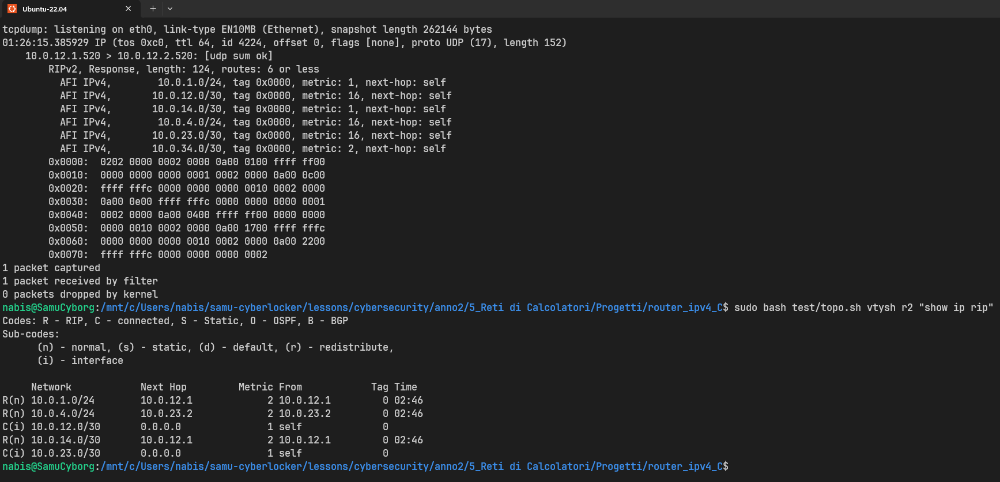
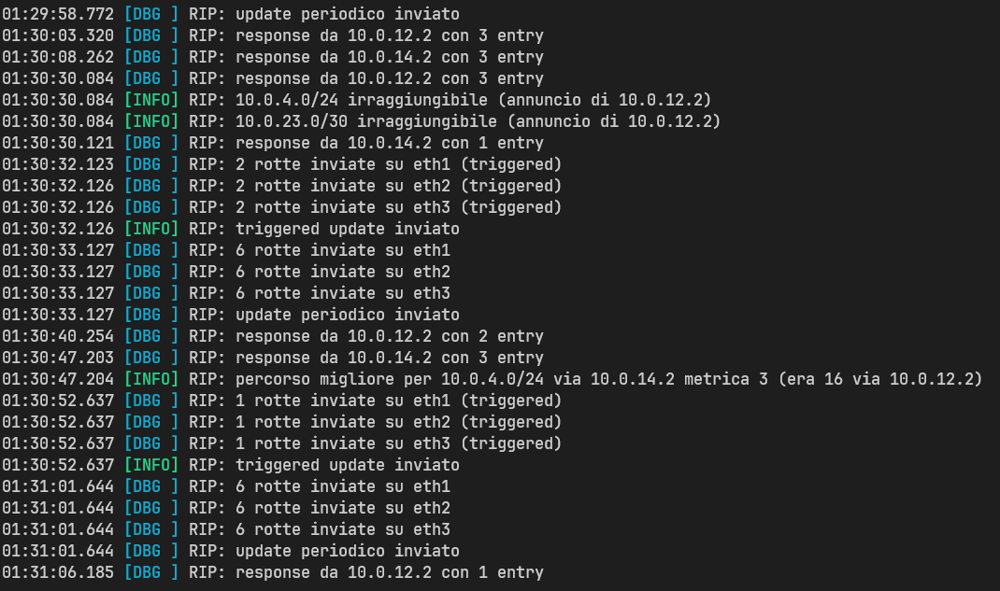
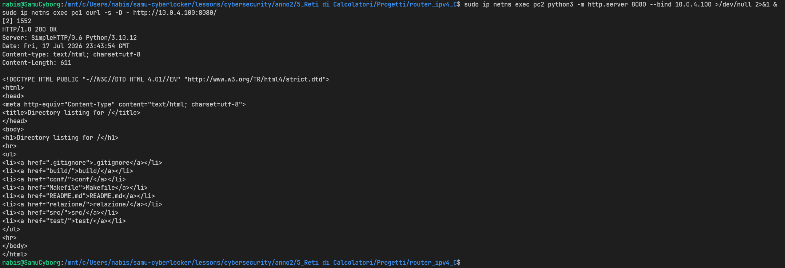

# **crouter — Router IPv4 userspace in C con RIPv2**
## **Relazione del progetto integrativo di Reti di Calcolatori**

*Corso di Laurea in Informatica per la Sicurezza dei Dati / Cybersecurity — Università degli Studi di Milano*

---

### **1. Descrizione del progetto**

#### **1.1. Obiettivi**

Il progetto realizza da zero, in linguaggio C, un **router IPv4 funzionante interamente in spazio utente**, chiamato **`crouter`**. Il programma non si limita a configurare un router esistente: riceve i frame Ethernet grezzi dalle interfacce di rete, li analizza byte per byte, decide autonomamente come instradarli e apprende dinamicamente le rotte dialogando con altri router tramite il protocollo **RIPv2 (RFC 2453)**.

Il router implementa due piani funzionali distinti, esattamente come un apparato commerciale:

- il **piano dati** (*data plane*): ricezione, validazione, instradamento e inoltro dei pacchetti IP reali, con gestione di ARP e ICMP;
- il **piano di controllo** (*control plane*): il demone RIPv2 che costruisce e mantiene aggiornata la tabella di routing scambiando annunci con i router vicini.

La correttezza dell'implementazione è dimostrata mettendo `crouter` a dialogare con **FRRouting** (FRR, il successore diretto di Quagga citato nella traccia): i router vicini eseguono il `ripd` standard di FRR, e il fatto che apprendano correttamente le nostre reti — e noi le loro — prova che `crouter` "parla RIP vero", non una versione semplificata.

> 📌 La traccia ufficiale del progetto n. 2 recita: *«Implementation of a router in C — funzionalità/protocolli di routing — modulo kernel space o Quagga»*. Abbiamo scelto una **terza via**, più istruttiva di entrambe le opzioni suggerite: un router **interamente userspace su socket raw**. Rispetto al modulo kernel evita i rischi di un kernel panic e il debugging cieco; rispetto alla pura configurazione di Quagga costringe a **scrivere davvero** il parser dei pacchetti, la tabella di forwarding e la macchina a stati del protocollo di routing. Quagga/FRR resta comunque in gioco come **controparte di interoperabilità**.

#### **1.2. Perché "userspace su socket raw"**

Un router del kernel Linux inoltra i pacchetti nel contesto del kernel stesso, invisibile all'utente. Noi invece apriamo su **ogni interfaccia** un socket `AF_PACKET / SOCK_RAW`: questo tipo di socket consegna all'applicazione il **frame Ethernet completo**, header di livello 2 incluso, e permette di ritrasmettere frame costruiti manualmente. Di conseguenza `crouter` "vede" e "scrive" esattamente gli stessi byte che passerebbero sul cavo.

La scelta ha una conseguenza progettuale importante: nel nodo che esegue `crouter`, le interfacce **non hanno un indirizzo IP a livello kernel**. Gli indirizzi IP del router vivono soltanto dentro la configurazione di `crouter`. Così è il nostro codice — e non lo stack del sistema operativo — a rispondere alle richieste ARP, agli echo ICMP e agli annunci RIP destinati a quegli indirizzi. Non esiste alcun "doppio responsore" che confonda i test, e il parametro `ip_forward` del kernel è del tutto irrilevante: l'inoltro lo fa `crouter`.

> 💡 Il progetto ricuce l'intero programma del corso in un unico artefatto: **livello 2** (Ethernet, ARP), **livello 3** (IPv4, ICMP, forwarding, routing dinamico), **livello 4** (UDP come trasporto di RIP), la **programmazione con socket e `select()`** del modulo M4, e l'**emulazione di rete** con cui si testano i progetti di design.

#### **1.3. Architettura a moduli**

Il codice è organizzato in moduli con responsabilità nette, ognuno in una coppia `.c/.h`. Il flusso di un pacchetto attraversa i moduli da sinistra a destra:

```
                    ┌──────────────────────────────────────┐
                    │               crouter                │
  eth1 ◄──────────► │ netio ──► parse ──► forward ──► netio │
  eth2 ◄──────────► │   │                   ▲              │
  eth3 ◄──────────► │   ▼                   │              │
                    │  arp ◄── icmp        rib (LPM)       │
                    │                       ▲              │
                    │  ripd (UDP 520) ──────┘              │
                    │       ▲                              │
                    │       └── timer (timeout di select)  │
                    └──────────────────────────────────────┘
```

| Modulo | File | Responsabilità |
|--------|------|----------------|
| `netio`   | `netio.c/h`   | Un socket `AF_PACKET/SOCK_RAW` per interfaccia; RX/TX dei frame Ethernet grezzi |
| `parse`   | `parse.c/h`   | Checksum Internet, checksum incrementale RFC 1624, validazione dell'header IPv4 |
| `arp`     | `arp.c/h`     | Cache ARP con scadenza, risposta alle richieste, risoluzione del next-hop con coda dei pacchetti in attesa |
| `rib`     | `rib.c/h`     | Tabella di routing (rotte connesse, statiche, RIP); **longest prefix match**; distanza amministrativa |
| `forward` | `forward.c/h` | Motore di inoltro: decremento TTL, ricalcolo checksum, lookup, riscrittura dei MAC |
| `icmp`    | `icmp.c/h`    | Generazione ICMP: Echo Reply, **Time Exceeded** (per traceroute), Destination Unreachable |
| `ripd`    | `ripd.c/h`    | RIPv2: request/response, update periodici e triggered, split horizon con poisoned reverse, timer di timeout/garbage |
| `config`  | `config.c/h`  | Parsing del file di configurazione (interfacce, rotte statiche, abilitazione RIP) |
| `main`    | `main.c`      | Event loop unico basato su `select()`, con il timeout che scandisce anche i timer |

L'intero programma dipende **solo dalla libc e dagli header Linux**: nessuna libreria esterna. Compila con `gcc -Wall -Wextra` senza un singolo warning.

#### **1.4. Il piano dati, passo per passo**

Per ogni frame ricevuto, la funzione `handle_frame()` in `main.c` esegue la pipeline canonica del forwarding:

1. **Demultiplexing Ethernet**: se l'EtherType è ARP il frame va al modulo `arp`; se è IPv4 si prosegue; altrimenti si scarta.
2. **Validazione IPv4**: versione, IHL, lunghezza totale, checksum dell'header. Un pacchetto malformato viene **scartato silenziosamente** (`parse.c:ipv4_valid`).
3. **"È destinato a noi?"** Se l'IP di destinazione è di una nostra interfaccia (o è il multicast RIP `224.0.0.9`): un Echo Request va a `icmp`, un datagramma UDP verso la porta 520 va a `ripd`, una porta UDP chiusa genera un Port Unreachable.
4. **Forwarding** (destinazione altrove): se $TTL \le 1$ si genera un ICMP **Time Exceeded** verso il mittente — è ciò che rende il router visibile a `traceroute`. Altrimenti $TTL \leftarrow TTL - 1$ con aggiornamento **incrementale** del checksum (RFC 1624).
5. **Lookup LPM** nella RIB: nessuna rotta → ICMP **Destination Unreachable (net)**; rotta trovata → si determinano next-hop e interfaccia di uscita.
6. **Risoluzione ARP** del next-hop (cache o richiesta con coda di attesa) e **trasmissione** del frame con i MAC sorgente/destinazione riscritti.

#### **1.5. Il piano di controllo: RIPv2**

- **Trasporto**: UDP porta 520, annunci in multicast su `224.0.0.9` (MAC `01:00:5e:00:00:09`).
- **Messaggi**: *Request* all'avvio (per una convergenza rapida senza attendere il primo periodico) e *Response* sia periodici (ogni **30 s** con jitter casuale) sia *triggered* alla variazione di una rotta.
- **Metrica**: hop count, con $1 \le m \le 15$ e $m = 16 = \infty$ (rete irraggiungibile).
- **Anti-loop**: **split horizon con poisoned reverse** (una rotta è riannunciata sull'interfaccia da cui è stata appresa con metrica 16); il *count-to-infinity* è comunque limitato dal tetto 15.
- **Timer per rotta**: **timeout 180 s** (la rotta viene invalidata a metrica 16) e **garbage collection 120 s** (dopo i quali la rotta è rimossa).

> ⚠️ L'interoperabilità con FRR non è gratuita: richiede il rispetto rigoroso del formato delle entry RIPv2 (Address Family Identifier = 2, campi Route Tag / Subnet Mask / Next Hop tutti valorizzati) e il jitter sugli update periodici, senza il quale gli annunci dei vari router tenderebbero a sincronizzarsi e a congestionare la rete a raffiche.

---

### **2. Brani di codice significativi**

Questa sezione commenta i quattro punti tecnicamente più delicati dell'implementazione.

#### **2.1. Longest Prefix Match e distanza amministrativa**

Il cuore dell'instradamento è la scelta, fra tutte le rotte che "contengono" l'indirizzo di destinazione, di quella con il **prefisso più lungo** (la più specifica). La RIB è un semplice array di `struct rib_entry`; a parità di lunghezza di prefisso si applicano, nell'ordine, la **distanza amministrativa** (connessa < statica < RIP, come su Cisco) e infine la metrica minore.

```c
struct rib_entry *rib_lookup(uint32_t dst)
{
    struct rib_entry *best = NULL;
    for (int i = 0; i < RIB_MAX; i++) {
        struct rib_entry *e = &tab[i];
        if (!e->in_use || e->metric >= RIP_INFINITY)
            continue;                       /* rotte in cancellazione: inutilizzabili */
        if ((dst & prefix_to_mask(e->prefix_len)) != e->prefix)
            continue;                       /* il prefisso non contiene dst           */
        if (!best ||
            e->prefix_len > best->prefix_len ||
            (e->prefix_len == best->prefix_len && dist[e->origin] < dist[best->origin]) ||
            (e->prefix_len == best->prefix_len && dist[e->origin] == dist[best->origin] &&
             e->metric < best->metric))
            best = e;
    }
    return best;
}
```

La maschera si ricava dalla lunghezza del prefisso con uno shift, prestando attenzione al caso limite del prefisso `/0` (la rotta di default), in cui uno shift di 32 posizioni sarebbe indefinito in C:

```c
static inline uint32_t prefix_to_mask(uint8_t len)
{
    return len == 0 ? 0 : htonl(~0u << (32 - len));
}
```

> 💡 La traccia menzionava il *trie binario* come struttura efficiente per l'LPM. Con le poche decine di rotte della nostra topologia l'array lineare è più che sufficiente e molto più leggibile; il trie resta la naturale evoluzione se il numero di rotte crescesse di ordini di grandezza.

#### **2.2. Checksum incrementale del TTL (RFC 1624)**

Ogni volta che il router decrementa il TTL, l'header IPv4 cambia e il suo checksum va aggiornato. Ricalcolarlo da capo su tutto l'header sarebbe corretto ma inutilmente costoso: la RFC 1624 mostra come aggiornarlo in **poche operazioni**, partendo dal vecchio valore e dalla sola parola a 16 bit che è cambiata. Il TTL e il campo protocollo condividono la stessa parola a 16 bit dell'header, e questo permette un aggiornamento puntuale:

```c
void ipv4_ttl_dec(struct ipv4_hdr *ih)
{
    /* RFC 1624: HC' = ~(~HC + ~m + m'), con m la parola a 16 bit TTL|proto */
    uint16_t m = ((uint16_t)ih->ttl << 8) | ih->proto;
    ih->ttl--;
    uint16_t m1 = ((uint16_t)ih->ttl << 8) | ih->proto;

    uint32_t sum = (uint16_t)~ntohs(ih->checksum);
    sum += (uint16_t)~m;
    sum += m1;
    sum = (sum & 0xFFFF) + (sum >> 16);
    sum = (sum & 0xFFFF) + (sum >> 16);
    ih->checksum = htons((uint16_t)~sum);
}
```

> ✅ Che il risultato sia corretto è verificabile end-to-end: i pacchetti inoltrati arrivano a destinazione (il `ping` funziona) e `tcpdump` sull'host finale non segnala mai *bad ip cksum*.

#### **2.3. La macchina a stati di una rotta RIP**

La parte concettualmente più ricca è l'elaborazione di ciascuna entry ricevuta in un messaggio Response (`ripd.c:process_entry`), che implementa alla lettera la logica della RFC 2453 §3.9.2. Vale la pena isolare la gestione del caso "aggiornamento dallo **stesso** gateway che già ci fornisce la rotta", perché contiene la nascita del *deletion process*:

```c
if (e->next_hop == nh) {
    /* stesso gateway: rinfresca il timer; se la metrica è cambiata, adeguala */
    if (metric < RIP_INFINITY) {
        e->last_update = mono_now();
        e->garbage_at  = 0;
    }
    if (metric == e->metric)
        return;
    if (metric == RIP_INFINITY) {
        if (!e->garbage_at) {                 /* avvio del deletion process */
            e->metric     = RIP_INFINITY;
            e->garbage_at = mono_now();
            e->changed    = true;             /* da annunciare subito (triggered) */
            schedule_trigger();
        }
        return;
    }
    ...
}
```

I timer sono gestiti in `ripd_tick()`, invocato ad ogni giro dell'event loop:

```c
if (!e->garbage_at && now - e->last_update >= RIP_TIMEOUT) {      /* 180 s */
    e->metric     = RIP_INFINITY;
    e->garbage_at = now;
    e->changed    = true;
    schedule_trigger();                       /* la vittima annuncia la propria morte */
} else if (e->garbage_at && now - e->garbage_at >= RIP_GARBAGE) { /* +120 s */
    rib_delete(e);
}
```

Lo **split horizon con poisoned reverse** vive invece in `send_update()`: una rotta che esce dalla stessa interfaccia da cui è stata appresa viene annunciata con metrica infinita anziché essere omessa. Bastano due righe:

```c
uint8_t metric = (e->ifidx == ifidx) ? RIP_INFINITY : e->metric;
```

> 📌 Nella cattura dello Scenario 3 (§3.3) questo comportamento è **visibile a occhio nudo**: nell'update che `crouter` invia su `eth2` verso R2, le reti apprese proprio da R2 (`10.0.12.0/30`, `10.0.4.0/24`, `10.0.23.0/30`) compaiono con `metric: 16`, mentre quelle apprese altrove mantengono la metrica reale.

#### **2.4. L'event loop unico con `select()`**

Tutto il router — RX su più interfacce, timer ARP, timer RIP — gira in un **singolo processo a thread singolo**, senza alcun rischio di *race condition*. Il collante è `select()`, che attende contemporaneamente su tutti i socket con un timeout breve; quel timeout funge anche da "battito" per far avanzare i timer:

```c
struct timeval tv = { 0, 500 * 1000 };           /* 500 ms */
int rc = select(maxfd + 1, &rfds, NULL, NULL, &tv);
...
if (rc > 0)
    for (int i = 0; i < rt.n_ifaces; i++)
        if (FD_ISSET(rt.ifaces[i].fd, &rfds)) {
            ssize_t n;
            while ((n = netio_recv(&rt.ifaces[i], frame, sizeof frame)) > 0)
                handle_frame(&rt, i, frame, (size_t)n);
        }

arp_tick(&rt, mono_now());   /* ritrasmissione richieste ARP, scadenza cache */
ripd_tick(&rt);              /* timeout/garbage, triggered e periodici        */
```

Il segnale `SIGUSR1` fa stampare a video la RIB corrente: comodissimo in fase di test (`kill -USR1 <pid>`).

---

### **3. Walkthrough con dimostrazione**

#### **3.1. Ambiente di prova**

La demo gira su **Linux network namespaces**, l'infrastruttura di virtualizzazione di rete del kernel Linux. Ogni namespace è uno stack di rete isolato: è la stessa tecnologia su cui si fondano i container Docker, e fornisce un'emulazione fedele quanto IMUNES ma completamente **scriptabile e riproducibile**. Lo script `test/topo.sh` costruisce l'intera topologia e avvia FRR nei tre router vicini; `test/demo.sh` esegue in sequenza i cinque scenari.

La topologia riproduce quella prevista nel documento di progettazione: due LAN agli estremi e un nucleo di quattro router con un **cammino ridondante**.

```
 pc1 ──(10.0.1.0/24)── R1[crouter] ══(10.0.12.0/30)══ R2[FRR] ══(10.0.23.0/30)══ R3[FRR] ──(10.0.4.0/24)── pc2
                            ║                                                      ║
                            ╚═════════(10.0.14.0/30)══ R4[FRR] ══(10.0.34.0/30)════╝
```

- **R1** esegue `crouter`; **R2**, **R3**, **R4** eseguono il `ripd` di FRR.
- I link punto-punto usano prefissi `/30` (`10.0.12.0/30`, `10.0.14.0/30`, `10.0.23.0/30`, `10.0.34.0/30`).



> 💡 **Un dettaglio pratico sui veth.** Le interfacce virtuali `veth` del kernel offrono il *checksum offload*: delegano il calcolo del checksum TCP/UDP a un hardware che, in emulazione, non esiste. Un router userspace inoltra i byte così come sono, e l'host finale scarterebbe i segmenti come corrotti. Lo script disabilita l'offload (`ethtool -K … tx off`) su tutte le interfacce — un accorgimento specifico dell'emulazione, non un limite di `crouter`, che infatti su hardware reale non si porrebbe.

#### **3.2. Scenario 1 — Convergenza a freddo**

All'avvio `crouter` invia una **Request** RIP su ogni interfaccia abilitata e, in pochi secondi, riceve le Response dei vicini e popola la tabella. Dopo ~14 secondi la RIB (stampata con `SIGUSR1`) contiene già tutte le reti remote, ciascuna con next-hop, interfaccia di uscita e metrica corretti:

```
================== RIB (tabella di routing) ==================
destinazione         next-hop        dev    met  org  eta'
10.0.1.0/24          -               eth1   1    C    -
10.0.12.0/30         -               eth2   1    C    -
10.0.14.0/30         -               eth3   1    C    -
10.0.4.0/24          10.0.12.2       eth2   3    R    14s
10.0.23.0/30         10.0.12.2       eth2   2    R    14s
10.0.34.0/30         10.0.14.2       eth3   2    R    11s
===============================================================
```

Le tre reti connesse (`C`) sono note fin dall'avvio; le tre remote (`R`) sono state apprese via RIP. La rete della LAN di pc2 (`10.0.4.0/24`) risulta a **metrica 3** perché il percorso più breve la raggiunge in tre salti (R1→R2→R3→rete).



#### **3.3. Scenario 2 — Data plane: ping e traceroute**

Con la sola tabella appresa via RIP, un host della prima LAN raggiunge un host della seconda. Il `ping` ha successo e — dettaglio importante — arriva con **TTL 61**: partito a 64, è stato decrementato di 3, uno per ciascun router attraversato. È la prova che `crouter` decrementa davvero il TTL e ne ricalcola il checksum.

```
$ ping -c 4 10.0.4.100
64 bytes from 10.0.4.100: icmp_seq=1 ttl=61 time=1.63 ms
...
4 packets transmitted, 4 received, 0% packet loss

$ traceroute -n 10.0.4.100
 1  10.0.1.1   0.057 ms      ← crouter (R1): visibile grazie all'ICMP Time Exceeded
 2  10.0.12.2  0.837 ms      ← R2 (FRR)
 3  10.0.34.2  0.833 ms      ← R3 (FRR, che risponde dall'interfaccia lato R4)
 4  10.0.4.100 0.814 ms      ← pc2, destinazione
```

Il `traceroute` mostra `crouter` come **primo hop**: significa che, ricevendo i primi probe con TTL 1, il nostro router ha correttamente generato i messaggi ICMP **Time Exceeded** che rivelano la sua presenza. Un router che non generasse questi ICMP resterebbe invisibile e "bucherebbe" il traceroute.



#### **3.4. Scenario 3 — Interoperabilità RIPv2 con FRR**

Questa è la prova che `crouter` "parla RIP vero". Con `tcpdump` catturiamo un update che `crouter` invia a R2 e lasciamo che sia il decoder di `tcpdump` — non il nostro codice — a interpretarlo. La decodifica riconosce un `RIPv2, Response` ben formato, con AFI, subnet mask, tag e metriche:

```
10.0.12.1.520 > 10.0.12.2.520:  RIPv2, Response, length: 124, routes: 6 or less
  AFI IPv4,   10.0.1.0/24,  tag 0x0000, metric: 1,  next-hop: self
  AFI IPv4,  10.0.12.0/30,  tag 0x0000, metric: 16, next-hop: self   ← poisoned reverse
  AFI IPv4,  10.0.14.0/30,  tag 0x0000, metric: 1,  next-hop: self
  AFI IPv4,   10.0.4.0/24,  tag 0x0000, metric: 16, next-hop: self   ← poisoned reverse
  AFI IPv4,  10.0.23.0/30,  tag 0x0000, metric: 16, next-hop: self   ← poisoned reverse
  AFI IPv4,  10.0.34.0/30,  tag 0x0000, metric: 2,  next-hop: self
```

Le tre reti annunciate a **metrica 16** sono esattamente quelle che `crouter` ha appreso *da* R2: il **poisoned reverse** in azione. E FRR, dall'altra parte, accetta i nostri annunci: nella sua tabella la LAN `10.0.1.0/24` compare come appresa **da 10.0.12.1 (crouter)** a metrica 2.

```
$ vtysh -N r2 -c "show ip rip"
     Network            Next Hop         Metric From            Tag Time
R(n) 10.0.1.0/24        10.0.12.1             2 10.0.12.1         0 02:42
...
```

> ✅ Un router commerciale (FRR) e il nostro router artigianale si scambiano rotte in RIP e concordano sulla topologia. L'interoperabilità è la dimostrazione più forte di correttezza del protocollo.



#### **3.5. Scenario 4 — Guasto del link e riconvergenza**

Si abbatte il link tra R2 e R3 mentre un `ping` continuo scorre da pc1 a pc2. Gli eventi, letti nel log di `crouter`, raccontano la riconvergenza:

```
23:49:19  RIP: 10.0.4.0/24  irraggiungibile (annuncio di 10.0.12.2)   ← R2 avvisa: rotta persa
23:49:19  RIP: 10.0.23.0/30 irraggiungibile (annuncio di 10.0.12.2)
23:49:21  RIP: triggered update inviato
23:49:23  RIP: percorso migliore per 10.0.4.0/24 via 10.0.14.2 metrica 3 (era 16 via 10.0.12.2)
23:49:25  RIP: triggered update inviato
```

R2, perso il cammino verso R3, annuncia a `crouter` la rotta avvelenata (metrica 16); `crouter` invalida la propria e, al successivo annuncio di R4, **reimpara** la stessa destinazione dal cammino alternativo (via `10.0.14.2`, cioè R4). La RIB finale mostra `10.0.4.0/24` di nuovo raggiungibile via `eth3`, mentre la rotta puntuale `10.0.23.0/30` — che passava solo per il link caduto — resta a metrica 16 nella fase di *garbage collection* prima di sparire:

```
10.0.4.0/24          10.0.14.2       eth3   3    R    9s
10.0.23.0/30         10.0.12.2       eth2   16   R    65s (gc)
10.0.34.0/30         10.0.14.2       eth3   2    R    9s
```

Il `ping` continuo registra solo una manciata di pacchetti persi durante la finestra di riconvergenza, per poi riprendere: il traffico è "rientrato" dal cammino ridondante **senza intervento manuale**.



#### **3.6. Scenario 5 — Traffico applicativo HTTP**

A chiudere il cerchio con il livello applicativo, si avvia un server HTTP sulla LAN di pc2 e lo si interroga da pc1. La sessione TCP completa (handshake, richiesta, risposta) attraversa `crouter` e va a buon fine:

```
$ curl -s -D - http://10.0.4.100:8080/
HTTP/1.0 200 OK
Server: SimpleHTTP/0.6 Python/3.10.12
Content-type: text/html; charset=utf-8
Content-Length: 611
```

Che una connessione **TCP** — con il suo handshake a tre vie e il controllo di flusso — funzioni attraverso il router dimostra che l'inoltro è corretto e affidabile in entrambe le direzioni, non solo per i pacchetti "facili" di ICMP.



---

### **4. Robustezza e qualità del codice**

Oltre agli scenari funzionali, il router è stato sottoposto a due prove di robustezza:

- **Fuzzing del data plane** (`test/scenari/fuzz.py`): sono stati iniettati **2200 frame malformati** — byte casuali, header IPv4 con versione/IHL/lunghezze/checksum corrotti, TTL nullo, ARP e UDP/520 troncati, EtherType arbitrari. `crouter` li ha scartati tutti senza crash e ha continuato a instradare il traffico legittimo. La validazione difensiva in `ipv4_valid()` e i controlli di lunghezza in ogni parser fanno il loro mestiere.
- **Analisi di memoria con Valgrind**: eseguendo il router sotto `valgrind --leak-check=full` durante una sessione con ping, traceroute, HTTP e fuzzing, il verdetto è netto:

```
==12754== ERROR SUMMARY: 0 errors from 0 contexts (suppressed: 0 from 0)
```

Nessun errore di memoria, nessun leak. Il codice usa buffer statici e strutture a dimensione fissa, una scelta deliberata che elimina alla radice un'intera classe di bug.

---

### **5. Come riprodurre la demo**

```sh
cd router_ipv4_C
make                                                       # compila build/crouter
sudo bash test/topo.sh up                                  # topologia + FRR su R2/R3/R4
sudo ip netns exec r1 ./build/crouter -c conf/r1.conf -v   # avvia crouter con RIP
sudo ip netns exec pc1 traceroute -n 10.0.4.100            # R1 appare come primo hop
sudo bash test/demo.sh                                      # esegue e cattura i 5 scenari
sudo bash test/topo.sh down                                # smonta tutto
```

Il comando `sudo bash test/demo.sh` ricrea l'ambiente da zero, esegue i cinque scenari in sequenza e salva ogni output in `relazione/cattura/`.

---

### **6. Conclusioni ed estensioni**

`crouter` dimostra, in circa 1.500 righe di C senza dipendenze esterne, l'intero ciclo di vita di un pacchetto in un router IPv4: dalla ricezione del frame grezzo fino all'apprendimento dinamico delle rotte e all'inoltro. L'interoperabilità con FRR e la tenuta sotto fuzzing e Valgrind ne attestano la correttezza e la robustezza.

Le direzioni di estensione naturali, discusse ma non implementate per contenere il perimetro del progetto, sono:

- **autenticazione RIPv2** (entry di tipo `0xFFFF` con password in chiaro, RFC 2453) per irrobustire il control plane contro annunci ostili;
- **trie binario** per l'LPM, se il numero di rotte crescesse;
- **rotte di default** e ridistribuzione fra protocolli;
- porting della demo su **IMUNES**, per una presentazione con interfaccia grafica accanto a quella scriptata.

> ✅ Il progetto tocca il cuore del corso — livello 3, forwarding, routing dinamico — unendo implementazione di basso livello, un protocollo di routing reale e una demo di rete emulata: le due anime (implementazione e deployment) dei progetti proposti, in un unico lavoro.
