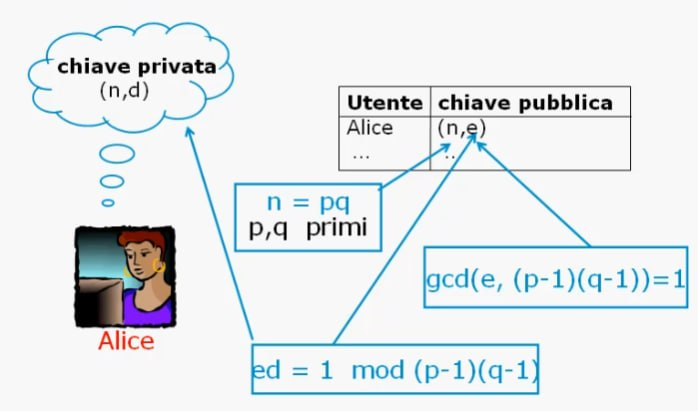
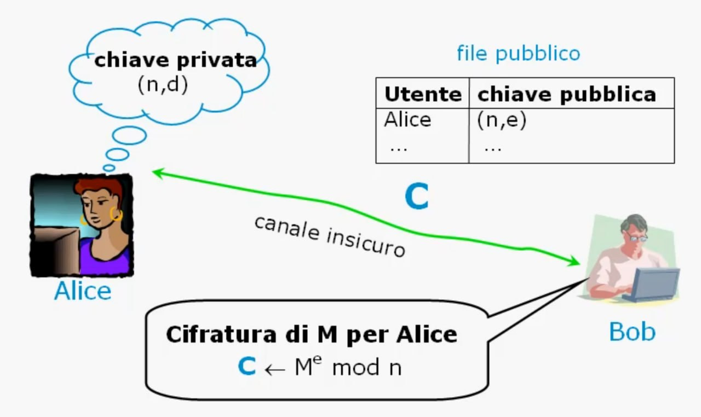
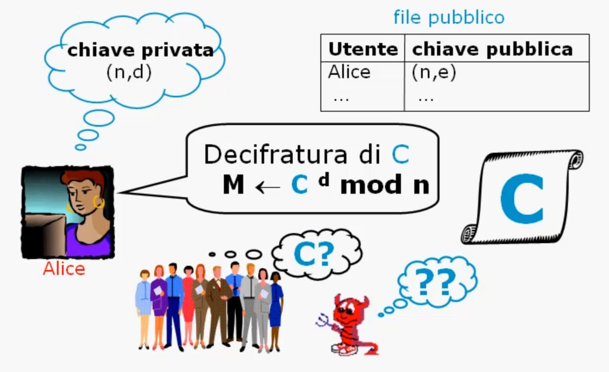
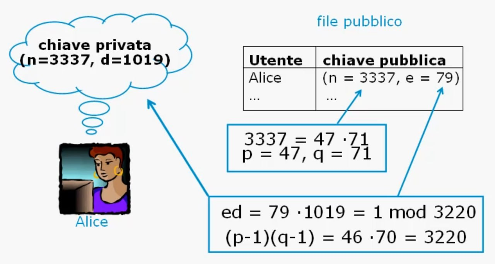
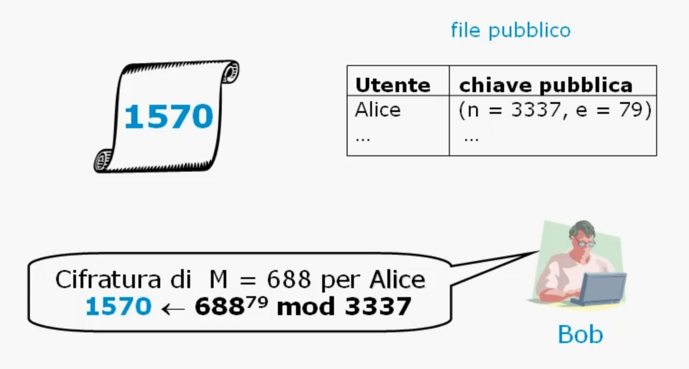
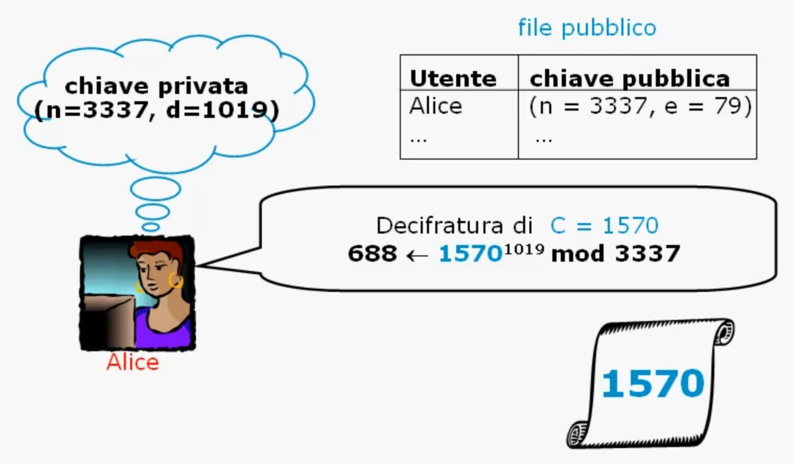
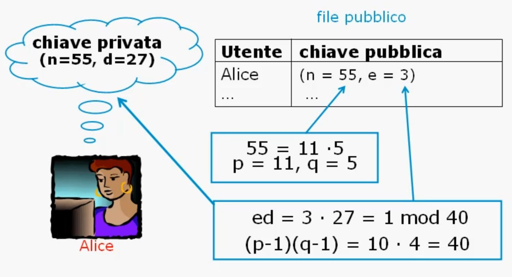
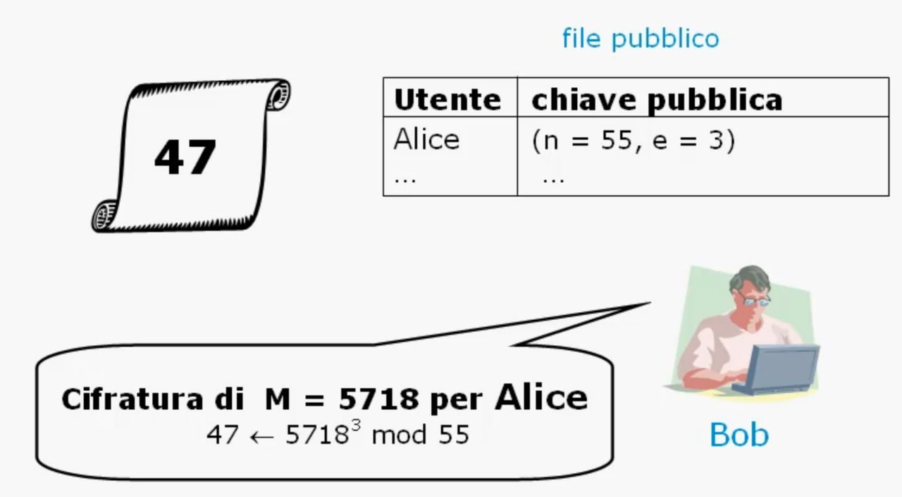

# **Lezione 1: Algoritmo RSA**

### **1. Introduzione e contesto storico**

L’**algoritmo RSA** è il più celebre schema di **cifratura a chiave pubblica**.  
È stato proposto nel **1977** da **Rivest, Shamir e Adleman** del **MIT**, dai cui cognomi deriva il nome **RSA**.

RSA rappresenta una pietra miliare della **crittografia moderna**, perché consente di:

- cifrare e decifrare messaggi senza condividere una chiave segreta,
    
- firmare digitalmente documenti e messaggi,
    
- scambiare in sicurezza chiavi per cifrature simmetriche.
    

---

### **2. Fondamento matematico**

L’algoritmo RSA è basato su operazioni di **esponenziazione modulare** in un **campo finito**:

$$  
C \equiv M^e \pmod{n}  
$$

dove:

- $M$ è il messaggio da cifrare (convertito in un intero),
    
- $e$ è l’esponente di cifratura,
    
- $n$ è il modulo, cioè il prodotto di due numeri primi $p$ e $q$.
    

L’esponenziazione richiede circa $O((\log n)^3)$ operazioni,  
mentre la **sicurezza** dipende dalla **difficoltà della fattorizzazione** di grandi numeri $n = p \cdot q$,  
che è un problema computazionalmente **duro**, stimato in $O(e^\sqrt{{\log n \cdot \log (\log n)}})$ operazioni.

---

### Approfondimento: Complessità della fattorizzazione in RSA

#### Da dove viene $e^{\sqrt{\log n \cdot \log( \log n)}}$

Il cribro/crivello quadratico fattorizza $n$ cercando numeri **B-smooth** (i cui fattori primi sono tutti $< B$). L'algoritmo ha due fasi con costi opposti: la fase di setacciatura costa circa $e^{\log n / \log B}$ (diminuisce al crescere di $B$), mentre la fase di algebra lineare costa circa $B$ (aumenta al crescere di $B$). Il valore ottimale di $B$ si ottiene bilanciando i due costi, imponendo $e^{\log n / \log B} \approx B$: risolvendo questa equazione si ottiene $B^* = e^{\sqrt{\log n \cdot \log \log n}}$, e sostituendo nella complessità totale si arriva alla formula con la radice quadrata. Il termine $\log \log n$ appare come fattore correttivo legato alla densità dei numeri smooth.

---

#### Calcolo concreto per $n$ a 2048 bit

**Dati di partenza:** 

$$n \approx 2^{2048}$$

**Step 1 — calcola $\log n$ (logaritmo naturale):** 

$$\log n = 2048 \cdot \log 2 \approx 2048 \times 0.693 \approx 1419$$

**Step 2 — calcola $\log \log n$:** 

$$\log(\log n) = \log(1419) \approx 7.26$$

**Step 3 — moltiplica e prendi la radice:** 

$$\sqrt{\log n \cdot \log \log n} = \sqrt{1419 \times 7.26} = \sqrt{10302} \approx 101.5$$

**Step 4 — calcola la complessità:** 

$$e^{101.5} \approx 10^{44}$$

**Confronto:**

|Quantità|Ordine di grandezza|
|---|---|
|Operazioni per fattorizzare $n$ a 2048 bit|$\approx 10^{44}$|
|Atomi nell'universo osservabile|$\approx 10^{80}$|
|Età dell'universo in nanosecondi|$\approx 10^{27}$|

$10^{44}$ è già abbondantemente fuori dalla portata di qualunque computer fisicamente realizzabile: anche usando ogni atomo dell'universo come unità computazionale, non basterebbe. Ecco perché RSA a 2048 bit è considerato sicuro.

---

### **3. Generazione delle chiavi RSA**

Ogni utente genera la propria coppia di chiavi seguendo questi passaggi:

1. Si scelgono **due numeri primi grandi** $p$ e $q$.
    
2. Si calcola il **modulo**:  
    $$  
    n = p \cdot q  
    $$
    
3. Si calcola **φ(n)** (funzione di Eulero):  
    $$  
    \varphi(n) = (p-1)(q-1)  
    $$
    
4. Si sceglie un **esponente di cifratura $e$** tale che:  
    $$  
    \gcd(e, \varphi(n)) = 1  
    $$
    
5. Si calcola l’**esponente di decifratura $d$** come inverso moltiplicativo di $e$ modulo $\varphi(n)$:  
    $$  
    e \cdot d \equiv 1 \pmod{\varphi(n)}  
    $$
    

**Chiave pubblica:** $(n, e)$  
**Chiave privata:** $(n, d)$

Vedremo in avanti che è possibile dimostrare che esiste sempre $d$ che soddisfa la relazione di inverso.

---

### **4. Cifratura e decifratura**

#### **Cifratura**

Quando Bob vuole inviare un messaggio $M$ ad Alice:

1. Recupera la chiave pubblica di Alice $(n, e)$.
    
2. Calcola il testo cifrato:  
    $$  
    C = M^e \bmod n  
    $$

#### **Decifratura**

Quando Alice riceve $C$, usa la propria chiave privata $(n, d)$ per ottenere:  
$$  
M = C^d \bmod n  
$$

Solo Alice può decifrare, perché solo lei conosce $d$.

---

### **5. Esempio 1**

#### **Dati**

- $p = 47$, $q = 71$
    
- $n = 47 \cdot 71 = 3337$
    
- $\varphi(n) = (46)(70) = 3220$
    

Scelta:  
$$  
e = 79,\quad \gcd(79, 3220) = 1  
$$

Calcolo di $d$:  
$$  
79 \cdot 1019 \equiv 1 \pmod{3220}  
$$

Dunque:

- **Chiave pubblica:** $(n=3337, e=79)$
    
- **Chiave privata:** $(n=3337, d=1019)$
    

#### **Cifratura**

$$  
C = 688^{79} \bmod 3337 = 1570  
$$

#### **Decifratura**

$$  
M = 1570^{1019} \bmod 3337 = 688  
$$

✅ Il messaggio originale è recuperato correttamente.

---

### **6. Esempio 2 - il problema con mess > n**

#### **Dati**

- $p = 11$, $q = 5$
    
- $n = 11 \cdot 5 = 55$
    
- $\varphi(n) = (10)(4) = 40$
    
- Scelta $e = 3$, $\gcd(3, 40) = 1$
    
- Calcolo $d = 27$, perché:  
    $$  
    3 \cdot 27 \equiv 1 \pmod{40}  
    $$
    

**Chiavi:**

- Pubblica: $(n=55, e=3)$
    
- Privata: $(n=55, d=27)$
    

#### **Cifratura**

$$  
C = 5718^{3} \bmod 55 = 47  
$$

#### **Decifratura**

$$  
M = 47^{27} \bmod 55 = 53 \neq 5718  
$$
Non è l'originale, è l'originale $\mod 55$

Questo accade poiché Bob non ha rispettato la regola di spedire come messaggio un numero $mess$ che rispettasse la diseguaglianza:

$$
0 < mess < n
$$

---

### **7. Soluzione alle dimensioni inadeguate con blocchi binari**

Quando il messaggio è troppo grande - e quindi supera $n$, dobbiamo prendere un accorgimento.

L'idea è scomporre il messaggio in dei blocchi più piccoli $b_i$ tali che:

$$
\forall \ b_i \rightarrow \ < mod\_considerato
$$

D'altronde questo ci è già congeniale con il fatto che possiamo rappresentare qualsiasi numero in binario. Esso viene **suddiviso in blocchi** e ogni blocco viene cifrato come un numero:

Esempio:  convertiamo in bin...

$$
5718 = 001010011110010
$$

$$
\phantom{5718 = {}}\ \underbrace{00101}_{5}\ \underbrace{00111}_{7}\ \underbrace{10010}_{18}
$$

La dimensione del blocco si sceglie come $k = \lfloor \log_2 n \rfloor$ bit, in modo che ogni blocco rappresenti un numero strettamente minore del modulo $n$. Con $n = 55$: $\lfloor \log_2 55 \rfloor = 5$, quindi blocchi da **5 bit** (valore massimo $2^5 - 1 = 31 < 55$ ✓). La stringa di 15 bit si divide così in 3 blocchi da 5 bit: $00101_2 = 5$, $00111_2 = 7$, $10010_2 = 18$.

Si cifra ciascun blocco con la chiave pubblica $(e, n) = (3, 55)$:

$$
\begin{aligned}
15 &\leftarrow 5^3 \bmod 55 \\
13 &\leftarrow 7^3 \bmod 55 \\
2 &\leftarrow 18^3 \bmod 55
\end{aligned}
$$

Cifrato finale: **15, 13, 2**

Decifratura:  
$$
\begin{aligned}
5 &\leftarrow 15^{27} \bmod 55 \\  
7 &\leftarrow 13^{27} \bmod 55 \\  
18 &\leftarrow 2^{27} \bmod 55  
\end{aligned}
$$

Ricostruendo i blocchi, si ottiene il messaggio originale.

---

### **8. Sintesi finale**

- **RSA** è un **cifrario a blocchi**, in cui il messaggio è un numero compreso tra $0$ e $n-1$.
    
- La **funzione one-way** utilizzata è l’**esponenziazione modulare**.
    
- La **sicurezza** dell’algoritmo si fonda sulla **difficoltà della fattorizzazione** di grandi numeri composti.
    
- È utilizzato sia per **cifratura**, sia per **firme digitali** e **scambio sicuro di chiavi**.